# UE5 Knowledge Base Website - Complete Architecture Guide

> A comprehensive guide to maintaining, enhancing, and scaling the UE5 Knowledge Base website. This document covers every aspect of the codebase architecture, patterns, and best practices.

---

## Table of Contents

1. [Project Overview](#1-project-overview)
2. [Technology Stack](#2-technology-stack)
3. [Project Structure](#3-project-structure)
4. [Architecture Deep Dive](#4-architecture-deep-dive)
5. [Data Model & Content System](#5-data-model--content-system)
6. [Component Reference](#6-component-reference)
7. [Routing System](#7-routing-system)
8. [Theming System](#8-theming-system)
9. [Content Rendering](#9-content-rendering)
10. [Search System](#10-search-system)
11. [Testing](#11-testing)
12. [Build & Deployment](#12-build--deployment)
13. [Adding New Content](#13-adding-new-content)
14. [Extending the Application](#14-extending-the-application)
15. [Performance Considerations](#15-performance-considerations)
16. [Troubleshooting](#16-troubleshooting)

---

## 1. Project Overview

### 1.1 Purpose

The UE5 Knowledge Base is a modern React-based documentation website that organizes Unreal Engine 5 architectural references, diagrams, and reusable code patterns for building a Ghost of Tsushima-style melee combat game.

### 1.2 Key Features

| Feature | Description |
|---------|-------------|
| **Topics** | Markdown-based comprehensive guides organized by category |
| **Diagrams** | Interactive Mermaid.js flowcharts with fullscreen viewing |
| **Lego Pieces** | Reusable C++ code snippets (planned) |
| **Collections** | Full HTML-based comprehensive resources |
| **Search** | Fuzzy search with Fuse.js across all content |
| **Tags** | Cross-referenced tagging system with colored chips |
| **Themes** | Dark/Light mode with localStorage persistence |
| **Responsive** | Mobile-first design with collapsible navigation |

### 1.3 Content Categories

```
architecture     → Foundation systems (Character, Lifecycle, Framework)
core-systems     → Combat mechanics (GAS, Animation, Collision)
control          → Player interaction (Input, Camera, AI)
design           → Patterns and principles (Data-driven design)
```

---

## 2. Technology Stack

### 2.1 Core Dependencies

```json
{
  "react": "^19.2.0",           // UI Framework
  "react-dom": "^19.2.0",       // React DOM renderer
  "react-router-dom": "^7.11.0", // Client-side routing
  "@mui/material": "^7.3.6",    // Material UI component library
  "@mui/icons-material": "^7.3.6", // Material icons
  "@emotion/react": "^11.14.0", // CSS-in-JS (MUI dependency)
  "@emotion/styled": "^11.14.1" // Styled components (MUI dependency)
}
```

### 2.2 Content Processing

```json
{
  "react-markdown": "^10.1.0",  // Markdown to React
  "rehype-highlight": "^7.0.2", // Code syntax highlighting
  "rehype-raw": "^7.0.0",       // Raw HTML in markdown
  "highlight.js": "^11.11.1",   // Syntax highlighting engine
  "mermaid": "^11.12.2",        // Diagram rendering
  "dompurify": "^3.3.1",        // HTML sanitization
  "fuse.js": "^7.1.0"           // Fuzzy search
}
```

### 2.3 Development Tools

```json
{
  "vite": "^7.2.4",             // Build tool & dev server
  "typescript": "~5.9.3",       // Type checking
  "vitest": "^4.0.16",          // Unit testing
  "@testing-library/react": "^16.3.1", // React testing utilities
  "eslint": "^9.39.1"           // Code linting
}
```

---

## 3. Project Structure

```
ue5-kb-website/
├── public/
│   └── content/                    # Static content files
│       ├── *.md                    # Topic markdown files
│       ├── *.mermaid               # Diagram source files
│       ├── *.html                  # Collection HTML files
│       └── AnimNotify-FullArchitecture/
│           └── ue5_combat_architecture_v2.html
│
├── src/
│   ├── assets/                     # Static assets (images, SVGs)
│   │
│   ├── components/
│   │   ├── content/                # Content rendering components
│   │   │   ├── CodeBlock.tsx       # Code with copy functionality
│   │   │   ├── HtmlContent.tsx     # Sanitized HTML renderer
│   │   │   ├── MarkdownRenderer.tsx # Markdown to React
│   │   │   ├── MermaidDiagram.tsx  # Mermaid chart renderer
│   │   │   └── TagChip.tsx         # Colored tag chip
│   │   │
│   │   ├── features/               # Feature components
│   │   │   ├── ContentCard.tsx     # Content preview card
│   │   │   └── RelatedContent.tsx  # Related items sidebar
│   │   │
│   │   └── layout/                 # Layout components
│   │       ├── AppShell.tsx        # Main layout wrapper
│   │       ├── Header.tsx          # Top navigation bar
│   │       └── Sidebar.tsx         # Side navigation menu
│   │
│   ├── data/
│   │   ├── content-index.ts        # Master content registry
│   │   └── tags.ts                 # Tag definitions & colors
│   │
│   ├── pages/                      # Route page components
│   │   ├── HomePage.tsx
│   │   ├── TopicsListPage.tsx
│   │   ├── TopicDetailPage.tsx
│   │   ├── DiagramsPage.tsx
│   │   ├── DiagramDetailPage.tsx
│   │   ├── CollectionsPage.tsx
│   │   ├── CollectionDetailPage.tsx
│   │   ├── LegoPiecesPage.tsx
│   │   ├── SearchPage.tsx
│   │   ├── AboutPage.tsx
│   │   └── *.test.tsx              # Page unit tests
│   │
│   ├── test/
│   │   ├── setup.ts                # Vitest setup
│   │   └── test-utils.tsx          # Custom render with providers
│   │
│   ├── theme/
│   │   ├── theme.ts                # MUI theme configuration
│   │   └── ThemeProvider.tsx       # Theme context provider
│   │
│   ├── types/
│   │   └── content.ts              # TypeScript type definitions
│   │
│   ├── App.tsx                     # Root component with routing
│   ├── main.tsx                    # Application entry point
│   ├── index.css                   # Global styles
│   └── App.css                     # App-specific styles
│
├── package.json                    # Dependencies & scripts
├── tsconfig.json                   # TypeScript configuration
├── vite.config.ts                  # Vite configuration
├── vitest.config.ts                # Vitest configuration
└── eslint.config.js                # ESLint configuration
```

---

## 4. Architecture Deep Dive

### 4.1 Application Flow

```
┌─────────────────────────────────────────────────────────────────┐
│                         main.tsx                                │
│  Creates React root, wraps App in StrictMode                    │
└─────────────────────────────────────────────────────────────────┘
                                ↓
┌─────────────────────────────────────────────────────────────────┐
│                          App.tsx                                │
│  ThemeProvider → BrowserRouter → AppShell → Routes              │
└─────────────────────────────────────────────────────────────────┘
                                ↓
┌─────────────────────────────────────────────────────────────────┐
│                       AppShell.tsx                              │
│  Header + Sidebar (Desktop/Mobile Drawer) + Main Content        │
└─────────────────────────────────────────────────────────────────┘
                                ↓
┌─────────────────────────────────────────────────────────────────┐
│                        Page Components                          │
│  Fetch content from public/ → Render with content components    │
└─────────────────────────────────────────────────────────────────┘
```

### 4.2 Provider Hierarchy

```tsx
<StrictMode>
  <ThemeProvider>              {/* Theme context (dark/light) */}
    <MuiThemeProvider>         {/* Material UI theme */}
      <CssBaseline />          {/* CSS reset */}
      <BrowserRouter>          {/* React Router */}
        <AppShell>             {/* Layout */}
          <Routes />           {/* Page routing */}
        </AppShell>
      </BrowserRouter>
    </MuiThemeProvider>
  </ThemeProvider>
</StrictMode>
```

### 4.3 Data Flow Pattern

```
┌──────────────────┐     ┌──────────────────┐     ┌──────────────────┐
│  content-index   │────▶│   Page Component │────▶│ Content Component│
│  (Static Data)   │     │  (Data Fetching) │     │   (Rendering)    │
└──────────────────┘     └──────────────────┘     └──────────────────┘
         │                        │                        │
         ▼                        ▼                        ▼
   ┌──────────┐           ┌──────────────┐         ┌──────────────┐
   │ Metadata │           │ fetch() from │         │ Markdown     │
   │ id, slug │           │ /content/*   │         │ Mermaid      │
   │ tags     │           └──────────────┘         │ HTML         │
   └──────────┘                                    └──────────────┘
```

### 4.4 Component Composition Pattern

The application follows a **composition over inheritance** pattern:

```tsx
// Page structure pattern
<Container maxWidth="lg">
  <Breadcrumbs />           {/* Navigation context */}
  <Grid container spacing={4}>
    <Grid size={{ xs: 12, lg: 8 }}>
      <Box>                 {/* Header section */}
        <Typography />      {/* Title */}
        <TagChip />         {/* Tags */}
      </Box>
      <Box>                 {/* Content section */}
        <ContentRenderer /> {/* Markdown/HTML/Mermaid */}
      </Box>
    </Grid>
    <Grid size={{ xs: 12, lg: 4 }}>
      <RelatedContent />    {/* Sidebar */}
    </Grid>
  </Grid>
</Container>
```

---

## 5. Data Model & Content System

### 5.1 Type Definitions

Located in `src/types/content.ts`:

```typescript
// Content types
export type ContentType = 'topic' | 'lego-piece' | 'diagram' | 'collection';

// Category types
export type Category = 'architecture' | 'core-systems' | 'control' | 'design';

// Base interface for all content
export interface BaseContent {
  id: string;           // Unique identifier (e.g., 'topic-01')
  slug: string;         // URL-friendly name (e.g., 'player-character-architecture')
  title: string;        // Display title
  type: ContentType;    // Content type
  tags: string[];       // Array of tag names
  summary: string;      // Brief description
  relatedItems?: string[]; // Related content IDs
}

// Topic: Markdown-based articles
export interface Topic extends BaseContent {
  type: 'topic';
  category: Category;
  content: string;      // Loaded markdown content
  sourcePath: string;   // File path in public/content/
}

// Diagram: Mermaid flowcharts
export interface Diagram extends BaseContent {
  type: 'diagram';
  category: Category;
  mermaidSource: string; // Loaded mermaid code
  sourcePath: string;
  relatedTopics: string[];
}

// Collection: HTML documents
export interface Collection extends BaseContent {
  type: 'collection';
  htmlContent: string;  // Loaded HTML content
  sourcePath: string;
}

// Lego Piece: Code snippets (planned)
export interface LegoPiece extends BaseContent {
  type: 'lego-piece';
  pieceType: string;    // 'Component', 'Utility', etc.
  codeSnippet: string;
  explanation: string;
  diagram?: string;
  relatedTopics: string[];
}

// Union type
export type ContentItem = Topic | LegoPiece | Diagram | Collection;
```

### 5.2 Content Index Structure

Located in `src/data/content-index.ts`:

```typescript
// Topic definition example
export const topics: Topic[] = [
  {
    id: 'topic-01',
    slug: 'player-character-architecture',
    title: 'Player Character Architecture',
    type: 'topic',
    category: 'architecture',
    tags: ['Character', 'Component', 'GAS', 'Architecture'],
    summary: 'The foundation class that represents the player...',
    content: '',  // Loaded at runtime
    sourcePath: '01-player-character-architecture.md',
    relatedItems: ['topic-02', 'topic-10', 'diagram-01'],
  },
  // ... more topics
];

// Diagram definition example
export const diagrams: Diagram[] = [
  {
    id: 'diagram-01',
    slug: 'gameplay-ability-system-flowchart',
    title: 'Gameplay Ability System Flowchart',
    type: 'diagram',
    category: 'core-systems',
    tags: ['GAS', 'Data-Driven', 'Animation'],
    summary: 'Visual representation of GAS architecture...',
    mermaidSource: '',  // Loaded at runtime
    sourcePath: 'GameplayAbilitySystemFlowchart.mermaid',
    relatedTopics: ['topic-02', 'topic-08'],
  },
  // ... more diagrams
];

// Collection definition example
export const collections: ContentItem[] = [
  {
    id: 'collection-01',
    slug: 'anim-notify-architecture',
    title: 'AnimNotify Combat Architecture',
    type: 'collection',
    tags: ['Animation', 'Combat', 'Hit Detection'],
    summary: 'Comprehensive AnimNotify architecture...',
    htmlContent: '',  // Loaded at runtime
    sourcePath: 'AnimNotify-FullArchitecture/ue5_combat_architecture_v2.html',
    relatedItems: ['topic-03', 'topic-04'],
  },
];
```

### 5.3 Utility Functions

```typescript
// Get all content combined
export const allContent: ContentItem[] = [...topics, ...diagrams, ...collections];

// Query functions
export const getContentById = (id: string): ContentItem | undefined
export const getContentBySlug = (slug: string): ContentItem | undefined
export const getContentByType = (type: string): ContentItem[]
export const getContentByTag = (tag: string): ContentItem[]
export const getContentByCategory = (category: string): ContentItem[]

// Related content algorithm
export const getRelatedContent = (item: ContentItem, limit = 5): ContentItem[]
// 1. Get explicitly related items from relatedItems array
// 2. Find items with shared tags, sorted by match count
// 3. Return combined results up to limit
```

### 5.4 Tag System

Located in `src/data/tags.ts`:

```typescript
// Color mapping for tags
export const tagColors: Record<string, string> = {
  // System tags
  'GAS': '#38bdf8',          // Sky blue
  'Animation': '#a78bfa',     // Purple
  'Combat': '#f87171',        // Red
  'Input': '#4ade80',         // Green
  'AI': '#fbbf24',            // Gold
  
  // Component tags
  'Component': '#3b82f6',     // Blue
  'Timer': '#8b5cf6',         // Violet
  'Delegates': '#ec4899',     // Pink
  
  // Pattern tags
  'Data-Driven': '#84cc16',   // Lime
  'State Machine': '#eab308', // Yellow
  
  // Default fallback
  // Any undefined tag → '#64748b' (gray)
};

// Get color for a tag
export const getTagColor = (tag: string): string => {
  return tagColors[tag] || '#64748b';
};
```

---

## 6. Component Reference

### 6.1 Layout Components

#### AppShell (`src/components/layout/AppShell.tsx`)

**Purpose**: Main layout wrapper that provides consistent structure across all pages.

**Features**:
- Responsive sidebar (permanent on desktop, drawer on mobile)
- Flex layout with header + content area
- Mobile breakpoint detection via `useMediaQuery`

```tsx
interface AppShellProps {
  children: ReactNode;
}

// Key breakpoint: theme.breakpoints.down('md') for mobile
```

#### Header (`src/components/layout/Header.tsx`)

**Purpose**: Top navigation bar with logo, search, and theme toggle.

**Features**:
- Gradient logo with navigation
- Search bar (desktop: inline, mobile: below toolbar)
- Theme toggle button
- Mobile menu hamburger

**Key State**:
```tsx
const [searchValue, setSearchValue] = useState('');
// Search submits to: /search?q={query}
```

#### Sidebar (`src/components/layout/Sidebar.tsx`)

**Purpose**: Navigation menu with collapsible sections.

**Menu Structure**:
```typescript
const menuItems = [
  { title: 'Home', path: '/', icon: <HomeIcon /> },
  { 
    title: 'Topics', 
    path: '/topics', 
    icon: <ArticleIcon />,
    children: [
      { title: 'Architecture', path: '/topics/architecture' },
      { title: 'Core Systems', path: '/topics/core-systems' },
      { title: 'Control Systems', path: '/topics/control' },
      { title: 'Design Patterns', path: '/topics/design' },
    ],
  },
  { title: 'Lego Pieces', path: '/lego-pieces', icon: <ExtensionIcon /> },
  { title: 'Diagrams', path: '/diagrams', icon: <AccountTreeIcon /> },
  { title: 'Collections', path: '/collections', icon: <CollectionsIcon /> },
  { title: 'About', path: '/about', icon: <InfoIcon /> },
];
```

### 6.2 Content Components

#### MarkdownRenderer (`src/components/content/MarkdownRenderer.tsx`)

**Purpose**: Renders Markdown content with custom MUI styling.

**Dependencies**:
- `react-markdown` - Core markdown parsing
- `rehype-highlight` - Syntax highlighting
- `rehype-raw` - HTML support in markdown

**Custom Components**:
```tsx
components={{
  h1: (props) => <Typography variant="h3" />,
  h2: (props) => <Typography variant="h4" />,
  p: (props) => <Typography variant="body1" />,
  code: (props) => <CodeBlock />,  // Custom code block
  blockquote: (props) => <Box />,  // Styled quote
  table: (props) => <Box />,       // Responsive table
}}
```

#### MermaidDiagram (`src/components/content/MermaidDiagram.tsx`)

**Purpose**: Renders Mermaid.js diagrams with fullscreen support.

**Configuration**:
```typescript
mermaid.initialize({
  startOnLoad: false,     // Manual render control
  theme: 'dark',          // Dark theme
  securityLevel: 'loose', // Allow click handlers
  fontFamily: 'Inter, sans-serif',
});
```

**Features**:
- Async rendering with loading state
- Error handling with fallback message
- Fullscreen button (uses browser Fullscreen API)
- Unique ID generation for multiple diagrams

#### CodeBlock (`src/components/content/CodeBlock.tsx`)

**Purpose**: Code display with syntax highlighting and copy functionality.

**Props**:
```typescript
interface CodeBlockProps {
  code: string;
  language?: string;
  inline?: boolean;  // Inline code vs block
}
```

**Features**:
- Language label
- Copy to clipboard button
- Visual feedback on copy (checkmark icon)

#### HtmlContent (`src/components/content/HtmlContent.tsx`)

**Purpose**: Safely render HTML collections.

**Security**:
```typescript
const sanitized = DOMPurify.sanitize(html, {
  ADD_TAGS: ['style'],    // Allow style tags
  ADD_ATTR: ['target'],   // Allow target attribute
});
```

#### TagChip (`src/components/content/TagChip.tsx`)

**Purpose**: Colored, clickable tag chips.

**Props**:
```typescript
interface TagChipProps {
  tag: string;
  size?: 'small' | 'medium';
  clickable?: boolean;  // If true, navigates to search
}
```

**Navigation**: Clicks go to `/search?tag={tagName}`

### 6.3 Feature Components

#### ContentCard (`src/components/features/ContentCard.tsx`)

**Purpose**: Preview card for content items in grids.

**Features**:
- Type-specific icons
- Hover animation (lift + shadow)
- Summary truncation (3 lines)
- Tag display (max 4 + overflow count)

**Icon Mapping**:
```typescript
const iconMap = {
  topic: <ArticleIcon />,
  'lego-piece': <ExtensionIcon />,
  diagram: <AccountTreeIcon />,
  collection: <CollectionsIcon />,
};
```

#### RelatedContent (`src/components/features/RelatedContent.tsx`)

**Purpose**: Sidebar showing related content items.

**Features**:
- List of clickable items
- Tag preview (max 3 per item)
- Hover effect on items

---

## 7. Routing System

### 7.1 Route Configuration

Located in `src/App.tsx`:

```tsx
<Routes>
  {/* Home */}
  <Route path="/" element={<HomePage />} />

  {/* Topics */}
  <Route path="/topics" element={<TopicsListPage />} />
  <Route path="/topics/:category" element={<TopicsListPage />} />
  <Route path="/topic/:slug" element={<TopicDetailPage />} />

  {/* Diagrams */}
  <Route path="/diagrams" element={<DiagramsPage />} />
  <Route path="/diagram/:slug" element={<DiagramDetailPage />} />

  {/* Lego Pieces */}
  <Route path="/lego-pieces" element={<LegoPiecesPage />} />

  {/* Collections */}
  <Route path="/collections" element={<CollectionsPage />} />
  <Route path="/collection/:slug" element={<CollectionDetailPage />} />

  {/* Utility */}
  <Route path="/search" element={<SearchPage />} />
  <Route path="/about" element={<AboutPage />} />
</Routes>
```

### 7.2 URL Patterns

| Pattern | Description | Example |
|---------|-------------|---------|
| `/` | Home page | - |
| `/topics` | Topics list (default category) | - |
| `/topics/:category` | Topics filtered by category | `/topics/core-systems` |
| `/topic/:slug` | Topic detail page | `/topic/gameplay-ability-system` |
| `/diagrams` | Diagrams list | - |
| `/diagram/:slug` | Diagram detail | `/diagram/animation-system-flowchart` |
| `/collections` | Collections list | - |
| `/collection/:slug` | Collection detail | `/collection/anim-notify-architecture` |
| `/lego-pieces` | Lego pieces (placeholder) | - |
| `/search` | Search page | `/search?q=combat` |
| `/search?tag=X` | Tag filter | `/search?tag=GAS` |
| `/about` | About page | - |

### 7.3 Navigation Patterns

```typescript
// Programmatic navigation
const navigate = useNavigate();
navigate('/topics');
navigate(`/topic/${slug}`);
navigate(`/search?q=${encodeURIComponent(query)}`);

// URL parameters
const { slug } = useParams<{ slug: string }>();

// Query parameters
const [searchParams, setSearchParams] = useSearchParams();
const query = searchParams.get('q');
const tag = searchParams.get('tag');
```

---

## 8. Theming System

### 8.1 Theme Configuration

Located in `src/theme/theme.ts`:

```typescript
// Shared theme options
const commonTheme: ThemeOptions = {
  typography: {
    fontFamily: '"Inter", -apple-system, BlinkMacSystemFont, sans-serif',
    h1: { fontWeight: 800, letterSpacing: '-0.05em' },
    h2: { fontWeight: 700, letterSpacing: '-0.03em' },
    body1: { lineHeight: 1.7 },
  },
  shape: {
    borderRadius: 12,  // Default border radius
  },
  components: {
    MuiButton: {
      styleOverrides: {
        root: { textTransform: 'none', fontWeight: 600 },
      },
    },
  },
};
```

### 8.2 Color Palettes

**Dark Theme** (default):
```typescript
palette: {
  mode: 'dark',
  primary: { main: '#38bdf8' },      // Sky blue
  secondary: { main: '#a78bfa' },    // Purple
  success: { main: '#4ade80' },      // Green
  warning: { main: '#fbbf24' },      // Gold
  error: { main: '#f87171' },        // Red
  background: {
    default: '#0f172a',              // Deep slate
    paper: '#1e293b',                // Card background
  },
  text: {
    primary: '#f1f5f9',
    secondary: '#94a3b8',
  },
}
```

**Light Theme**:
```typescript
palette: {
  mode: 'light',
  primary: { main: '#0284c7' },
  secondary: { main: '#7c3aed' },
  background: {
    default: '#f8fafc',
    paper: '#ffffff',
  },
  text: {
    primary: '#0f172a',
    secondary: '#475569',
  },
}
```

### 8.3 Theme Provider

Located in `src/theme/ThemeProvider.tsx`:

```typescript
// Theme context
interface ThemeContextType {
  mode: 'light' | 'dark';
  toggleTheme: () => void;
}

// Usage in components
const { mode, toggleTheme } = useThemeMode();
```

**Features**:
- Persists to `localStorage` as `'theme-mode'`
- Defaults to dark mode
- Provides toggle function via context

---

## 9. Content Rendering

### 9.1 Content Loading Pattern

All detail pages follow this pattern:

```typescript
// In TopicDetailPage, DiagramDetailPage, CollectionDetailPage
useEffect(() => {
  const loadContent = async () => {
    // 1. Get metadata from content-index
    const item = getContentBySlug(slug);
    
    // 2. Fetch actual content from public folder
    const response = await fetch(`/content/${item.sourcePath}`);
    const content = await response.text();
    
    // 3. Update state
    setContent(content);
    setLoading(false);
  };
  
  loadContent();
}, [slug]);
```

### 9.2 Content File Locations

| Type | Location | Extension |
|------|----------|-----------|
| Topics | `public/content/` | `.md` |
| Diagrams | `public/content/` | `.mermaid` |
| Collections | `public/content/` | `.html` |

### 9.3 Rendering Pipeline

**Markdown (Topics)**:
```
Markdown file → fetch() → react-markdown → rehype plugins → MUI components
```

**Mermaid (Diagrams)**:
```
Mermaid file → fetch() → mermaid.render() → SVG → DOM injection
```

**HTML (Collections)**:
```
HTML file → fetch() → DOMPurify.sanitize() → dangerouslySetInnerHTML
```

---

## 10. Search System

### 10.1 Fuse.js Configuration

Located in `src/pages/SearchPage.tsx`:

```typescript
const fuse = new Fuse(allContent, {
  keys: ['title', 'summary', 'tags'],  // Searchable fields
  threshold: 0.3,                       // Match sensitivity (0-1)
  includeScore: true,                   // Include relevance score
});
```

### 10.2 Search Modes

**Text Search** (`/search?q=query`):
```typescript
const results = fuse.search(query);
// Returns ranked results by relevance
```

**Tag Filter** (`/search?tag=TagName`):
```typescript
const results = allContent.filter(item =>
  item.tags.some(t => t.toLowerCase().includes(tag.toLowerCase()))
);
```

### 10.3 Search Integration Points

1. **Header search bar** → Submits to `/search?q=`
2. **TagChip clicks** → Navigate to `/search?tag=`
3. **Direct URL** → Both modes supported

---

## 11. Testing

### 11.1 Test Configuration

**Vitest Setup** (`vitest.config.ts`):
```typescript
export default defineConfig({
  plugins: [react()],
  test: {
    globals: true,
    environment: 'happy-dom',
    setupFiles: ['./src/test/setup.ts'],
  },
});
```

**Test Setup** (`src/test/setup.ts`):
```typescript
import '@testing-library/jest-dom/vitest';
```

### 11.2 Test Utilities

Located in `src/test/test-utils.tsx`:

```typescript
// Custom render with all providers
function AllTheProviders({ children }) {
  return (
    <BrowserRouter>
      <ThemeProvider theme={theme}>
        <CssBaseline />
        {children}
      </ThemeProvider>
    </BrowserRouter>
  );
}

const customRender = (ui, options) => 
  render(ui, { wrapper: AllTheProviders, ...options });

export { customRender as render };
```

### 11.3 Running Tests

```bash
# Run tests once
npm test -- --run

# Run tests in watch mode
npm test

# Run with UI
npm run test:ui

# Run with coverage
npm run test:coverage
```

### 11.4 Test Patterns

```typescript
// Component rendering test
it('should render Grid items for each topic', () => {
  render(<HomePage />);
  expect(screen.getByText('Test Topic 1')).toBeInTheDocument();
});

// Grid layout test
it('should render Grid container', () => {
  const { container } = render(<CollectionsPage />);
  const grids = container.querySelectorAll('[class*="MuiGrid-container"]');
  expect(grids.length).toBeGreaterThan(0);
});

// Content card test
it('should display ContentCard within Grid items', () => {
  render(<DiagramsPage />);
  const card = screen.getByText('Diagram Title').closest('[class*="MuiCard"]');
  expect(card).toBeInTheDocument();
});
```

---

## 12. Build & Deployment

### 12.1 NPM Scripts

```json
{
  "scripts": {
    "dev": "vite",              // Development server (localhost:5173)
    "build": "tsc -b && vite build", // Production build
    "preview": "vite preview",  // Preview production build
    "lint": "eslint .",         // Run linter
    "test": "vitest",           // Run tests
    "test:ui": "vitest --ui",   // Test UI
    "test:coverage": "vitest --coverage"
  }
}
```

### 12.2 Build Process

```bash
# 1. TypeScript compilation check
tsc -b

# 2. Vite production build
vite build

# Output: dist/ folder
#   - index.html
#   - assets/
#     - *.js (bundled JavaScript)
#     - *.css (bundled CSS)
#   - content/ (copied from public/)
```

### 12.3 Deployment to Vercel

The project is configured for Vercel deployment:

```bash
# Automatic deployment
# Push to main branch → Vercel builds and deploys

# Manual deployment
npx vercel

# Production deployment
npx vercel --prod
```

**Vercel Configuration** (auto-detected):
- Build Command: `npm run build`
- Output Directory: `dist`
- Framework: Vite

### 12.4 Environment Variables

No environment variables required for basic functionality.

For custom configurations, create `.env`:
```env
VITE_APP_TITLE=UE5 Knowledge Base
```

---

## 13. Adding New Content

### 13.1 Adding a New Topic

**Step 1**: Create markdown file in `public/content/`:
```markdown
# Topic Title

> Brief summary

## Section 1
Content here...

## Section 2
More content...
```

**Step 2**: Register in `src/data/content-index.ts`:
```typescript
{
  id: 'topic-XX',
  slug: 'url-friendly-name',
  title: 'Display Title',
  type: 'topic',
  category: 'architecture', // or 'core-systems', 'control', 'design'
  tags: ['Tag1', 'Tag2'],
  summary: 'Brief description for cards',
  content: '',
  sourcePath: 'XX-file-name.md',
  relatedItems: ['topic-01', 'diagram-02'],
}
```

### 13.2 Adding a New Diagram

**Step 1**: Create mermaid file in `public/content/`:

```mermaid
flowchart TD
    A[Start] --> B[Process]
    B --> C[End]
    
    style A fill:#1a365d
```


**Step 2**: Register in `src/data/content-index.ts`:
```typescript
{
  id: 'diagram-XX',
  slug: 'diagram-name',
  title: 'Diagram Title',
  type: 'diagram',
  category: 'core-systems',
  tags: ['Tag1', 'Tag2'],
  summary: 'What this diagram shows',
  mermaidSource: '',
  sourcePath: 'DiagramName.mermaid',
  relatedTopics: ['topic-02'],
}
```

### 13.3 Adding a New Tag

**Step 1**: Add color in `src/data/tags.ts`:
```typescript
export const tagColors: Record<string, string> = {
  // ... existing tags
  'NewTag': '#hexcolor',
};
```

### 13.4 Adding a New Collection

**Step 1**: Create HTML file in `public/content/`:
```html
<h1>Collection Title</h1>
<p>Content here...</p>
<pre><code class="language-cpp">
// Code example
</code></pre>
```

**Step 2**: Register in `src/data/content-index.ts`:
```typescript
{
  id: 'collection-XX',
  slug: 'collection-name',
  title: 'Collection Title',
  type: 'collection',
  tags: ['Tag1', 'Tag2'],
  summary: 'Collection description',
  htmlContent: '',
  sourcePath: 'collection-file.html',
  relatedItems: [],
}
```

---

## 14. Extending the Application

### 14.1 Adding a New Page

**Step 1**: Create page component in `src/pages/`:
```tsx
// src/pages/NewPage.tsx
import { Container, Typography } from '@mui/material';

export const NewPage = () => {
  return (
    <Container maxWidth="lg" sx={{ py: 4 }}>
      <Typography variant="h3" fontWeight={700}>
        New Page Title
      </Typography>
      {/* Content here */}
    </Container>
  );
};
```

**Step 2**: Add route in `src/App.tsx`:
```tsx
import { NewPage } from './pages/NewPage';

// In Routes:
<Route path="/new-page" element={<NewPage />} />
```

**Step 3**: Add navigation in `src/components/layout/Sidebar.tsx`:
```typescript
const menuItems = [
  // ... existing items
  { title: 'New Page', path: '/new-page', icon: <NewIcon /> },
];
```

### 14.2 Adding a New Content Type

**Step 1**: Define type in `src/types/content.ts`:
```typescript
export interface NewType extends BaseContent {
  type: 'new-type';
  customField: string;
}

export type ContentItem = Topic | Diagram | Collection | NewType;
```

**Step 2**: Create array in `src/data/content-index.ts`:
```typescript
export const newTypes: NewType[] = [
  { ... }
];

export const allContent = [...topics, ...diagrams, ...collections, ...newTypes];
```

**Step 3**: Create detail page and add routing.

### 14.3 Adding New Components

Follow the existing component patterns:

```tsx
// src/components/features/NewComponent.tsx
import { Box, Typography } from '@mui/material';

interface NewComponentProps {
  data: DataType;
}

export const NewComponent = ({ data }: NewComponentProps) => {
  return (
    <Box sx={{ /* styling */ }}>
      {/* Component content */}
    </Box>
  );
};
```

---

## 15. Performance Considerations

### 15.1 Current Optimizations

- **Code splitting**: Vite automatically splits by route
- **Lazy content loading**: Content fetched only on detail pages
- **Memoization**: Theme values memoized with `useMemo`
- **Tree shaking**: Material UI imports are tree-shakable

### 15.2 Potential Optimizations

**Lazy Loading Pages**:
```tsx
const TopicDetailPage = lazy(() => import('./pages/TopicDetailPage'));

<Route path="/topic/:slug" element={
  <Suspense fallback={<Loading />}>
    <TopicDetailPage />
  </Suspense>
} />
```

**Content Caching**:
```typescript
const contentCache = new Map<string, string>();

const loadContent = async (path: string) => {
  if (contentCache.has(path)) {
    return contentCache.get(path);
  }
  const response = await fetch(`/content/${path}`);
  const content = await response.text();
  contentCache.set(path, content);
  return content;
};
```

**Image Optimization**:
- Use WebP format for images
- Implement lazy loading for images in HTML content

### 15.3 Bundle Size

Current bundle analysis approach:
```bash
# Build with stats
npm run build -- --mode production

# Analyze with rollup-plugin-visualizer (add to vite.config.ts)
```

---

## 16. Troubleshooting

### 16.1 Common Issues

**Mermaid diagrams not rendering**:
- Check browser console for syntax errors
- Ensure mermaid file has valid syntax
- Try simplifying diagram complexity

**Content not loading**:
- Verify file exists in `public/content/`
- Check `sourcePath` in content-index
- Look for fetch errors in Network tab

**Tags not colored**:
- Add tag color in `src/data/tags.ts`
- Default is gray (#64748b)

**Search not finding content**:
- Verify content is in `allContent` array
- Check that searchable fields are populated
- Adjust Fuse.js threshold for fuzzy matching

### 16.2 Development Tips

**Hot Reload Issues**:
```bash
# Clear Vite cache
rm -rf node_modules/.vite
npm run dev
```

**TypeScript Errors**:
```bash
# Full type check
npx tsc --noEmit

# Watch mode
npx tsc --noEmit --watch
```

**Dependency Issues**:
```bash
# Clean install
rm -rf node_modules package-lock.json
npm install
```

### 16.3 Debug Mode

Add debug logging:
```typescript
// Temporary debug in components
useEffect(() => {
  console.log('Content loaded:', content);
  console.log('Related items:', relatedItems);
}, [content, relatedItems]);
```

---

## Appendix A: File Quick Reference

| File | Purpose |
|------|---------|
| `src/App.tsx` | Root component, routing |
| `src/main.tsx` | Entry point |
| `src/types/content.ts` | All TypeScript types |
| `src/data/content-index.ts` | Content registry |
| `src/data/tags.ts` | Tag colors |
| `src/theme/theme.ts` | MUI theme config |
| `src/theme/ThemeProvider.tsx` | Theme context |
| `src/components/layout/AppShell.tsx` | Main layout |
| `src/components/layout/Header.tsx` | Top navigation |
| `src/components/layout/Sidebar.tsx` | Side menu |
| `src/components/content/MarkdownRenderer.tsx` | Markdown rendering |
| `src/components/content/MermaidDiagram.tsx` | Diagram rendering |
| `src/components/features/ContentCard.tsx` | Content cards |
| `src/pages/SearchPage.tsx` | Search functionality |

---

## Appendix B: Icon Reference

Material UI Icons used:
- `HomeIcon` - Home navigation
- `ArticleIcon` - Topics
- `ExtensionIcon` - Lego pieces
- `AccountTreeIcon` - Diagrams
- `CollectionsIcon` - Collections
- `InfoIcon` - About
- `SearchIcon` - Search
- `MenuIcon` - Mobile menu
- `ExpandLess/ExpandMore` - Collapsible sections
- `NavigateNextIcon` - Breadcrumb separator
- `Brightness4Icon/Brightness7Icon` - Theme toggle
- `ContentCopyIcon/CheckIcon` - Code copy
- `FullscreenIcon` - Diagram fullscreen
- `ArrowForwardIcon` - Navigation arrows

---

## Appendix C: CSS Variables Reference

Global styles in `src/index.css`:
```css
* {
  margin: 0;
  padding: 0;
  box-sizing: border-box;
}

body {
  font-family: 'Inter', -apple-system, BlinkMacSystemFont, sans-serif;
}

code {
  font-family: 'JetBrains Mono', 'Fira Code', Consolas, monospace;
}
```

---

## Version History

| Version | Date | Changes |
|---------|------|---------|
| 1.0.0 | 2024-12 | Initial release |

---

*This document should be updated whenever significant architectural changes are made to the project.*
