# Player Character Architecture
> The foundation class that represents the player in the game world — 
> handling physical presence, component composition, and integration with all gameplay systems.

---

## 1. System Overview

The Player Character system solves the fundamental problem of representing the player as a physical entity in the game world. It serves as the central hub that connects input, animation, combat, abilities, and movement into a cohesive playable experience.

In UE5, we inherit from `ACharacter` because it provides built-in support for bipedal humanoid movement, including walking, jumping, crouching, and the `CharacterMovementComponent` with full networking support. This is ideal for a melee combat game where responsive, grounded movement is critical.

For Hattin specifically, our player character must support: sword combat with parrying and dodging, integration with the Gameplay Ability System for special moves, equipment changes (weapons, armor), and seamless animation-driven gameplay where montages control combat timing.

---

## 2. Core Architecture Diagram

### 2.1 UE5 Class Inheritance Hierarchy

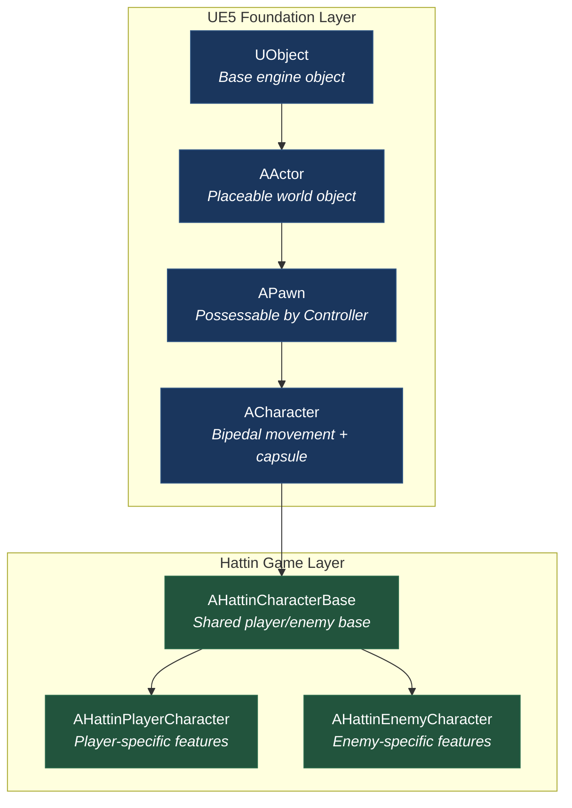

### 2.2 Component Composition Architecture

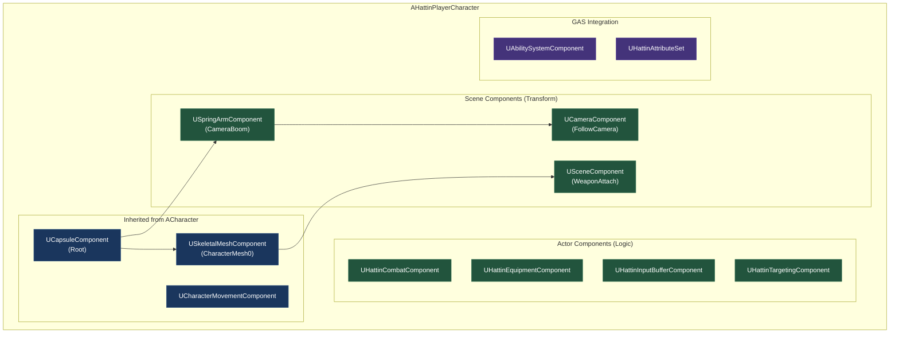

### 2.3 Initialization Flow (Actor Lifecycle)

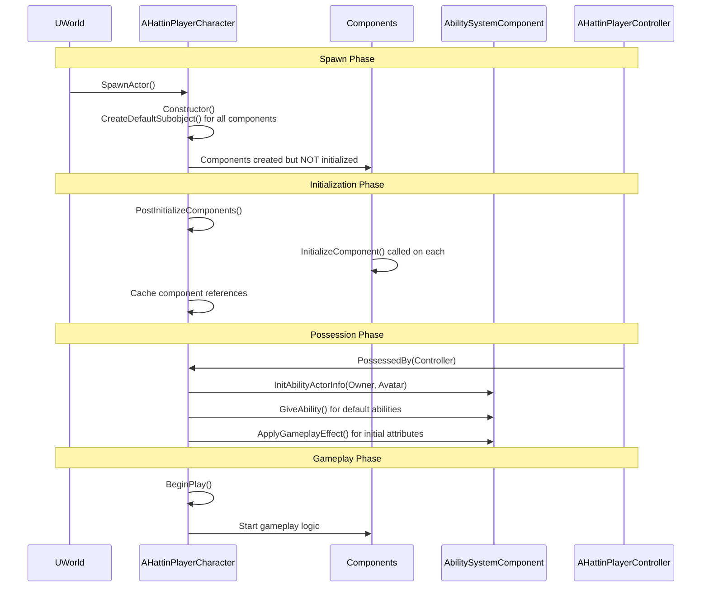

### 2.4 GAS Owner vs Avatar Pattern

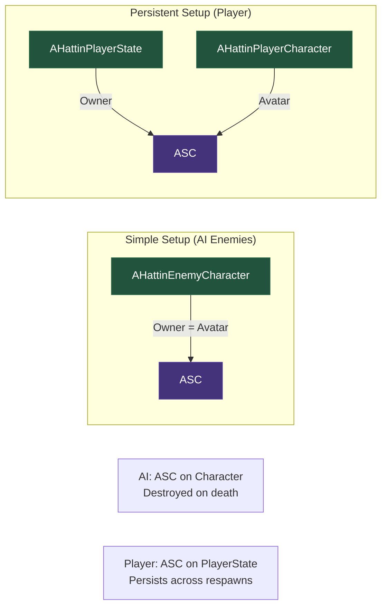

---

## 3. Component Specifications

### 3.1 AHattinCharacterBase

**UE Base**: `ACharacter` | **Your Class**: `AHattinCharacterBase`

**Purpose**: Shared functionality between player and enemy characters (combat interface, damage handling, death)

```cpp
UCLASS(Abstract)
class HATTIN_API AHattinCharacterBase : public ACharacter, public IAbilitySystemInterface
{
    GENERATED_BODY()
    
public:
    AHattinCharacterBase();
    
    // IAbilitySystemInterface
    virtual UAbilitySystemComponent* GetAbilitySystemComponent() const override;
    
    // Combat Interface
    UFUNCTION(BlueprintCallable, Category = "Combat")
    virtual bool CanBeHit() const;
    
    UFUNCTION(BlueprintCallable, Category = "Combat")
    virtual void OnHitReceived(const FHattinHitResult& HitResult);
    
    UFUNCTION(BlueprintCallable, Category = "Combat")
    virtual void OnDeath();
    
protected:
    // Components - created in derived classes or here if shared
    UPROPERTY(VisibleAnywhere, BlueprintReadOnly, Category = "Combat")
    TObjectPtr<UHattinCombatComponent> CombatComponent;
    
    // Weak reference to ASC (actual ASC may be on PlayerState or this actor)
    UPROPERTY()
    TWeakObjectPtr<UAbilitySystemComponent> AbilitySystemComponent;
    
    UPROPERTY()
    TObjectPtr<UHattinAttributeSet> AttributeSet;
    
    // Cached AnimInstance for performance
    UPROPERTY()
    TWeakObjectPtr<UHattinAnimInstance> AnimInstance;
    
    virtual void PostInitializeComponents() override;
    virtual void BeginPlay() override;
};
```

### 3.2 AHattinPlayerCharacter

**UE Base**: `AHattinCharacterBase` | **Your Class**: `AHattinPlayerCharacter`

**Purpose**: Player-specific features — camera, input handling, equipment, HUD data

```cpp
UCLASS()
class HATTIN_API AHattinPlayerCharacter : public AHattinCharacterBase
{
    GENERATED_BODY()
    
public:
    AHattinPlayerCharacter();
    
    // Getters for components
    FORCEINLINE USpringArmComponent* GetCameraBoom() const { return CameraBoom; }
    FORCEINLINE UCameraComponent* GetFollowCamera() const { return FollowCamera; }
    FORCEINLINE UHattinEquipmentComponent* GetEquipmentComponent() const { return EquipmentComponent; }
    FORCEINLINE UHattinInputBufferComponent* GetInputBufferComponent() const { return InputBufferComponent; }
    
protected:
    // Camera components
    UPROPERTY(VisibleAnywhere, BlueprintReadOnly, Category = "Camera")
    TObjectPtr<USpringArmComponent> CameraBoom;
    
    UPROPERTY(VisibleAnywhere, BlueprintReadOnly, Category = "Camera")
    TObjectPtr<UCameraComponent> FollowCamera;
    
    // Player-specific components
    UPROPERTY(VisibleAnywhere, BlueprintReadOnly, Category = "Equipment")
    TObjectPtr<UHattinEquipmentComponent> EquipmentComponent;
    
    UPROPERTY(VisibleAnywhere, BlueprintReadOnly, Category = "Input")
    TObjectPtr<UHattinInputBufferComponent> InputBufferComponent;
    
    UPROPERTY(VisibleAnywhere, BlueprintReadOnly, Category = "Targeting")
    TObjectPtr<UHattinTargetingComponent> TargetingComponent;
    
    // Lifecycle
    virtual void PossessedBy(AController* NewController) override;
    virtual void OnRep_PlayerState() override;
    virtual void SetupPlayerInputComponent(UInputComponent* PlayerInputComponent) override;
    
private:
    // Initialize GAS from PlayerState (multiplayer-ready pattern)
    void InitializeAbilitySystem();
};
```

### 3.3 Component: UHattinCombatComponent

**UE Base**: `UActorComponent` | **Your Class**: `UHattinCombatComponent`

**Purpose**: Manages combat state, hit detection coordination, combo tracking

```cpp
UCLASS(ClassGroup=(Hattin), meta=(BlueprintSpawnableComponent))
class HATTIN_API UHattinCombatComponent : public UActorComponent
{
    GENERATED_BODY()
    
public:
    UHattinCombatComponent();
    
    // Combat State
    UPROPERTY(BlueprintReadOnly, Category = "Combat")
    EHattinCombatState CurrentState;
    
    UPROPERTY(BlueprintReadOnly, Category = "Combat")
    int32 CurrentComboIndex;
    
    UPROPERTY(BlueprintReadOnly, Category = "Combat")
    bool bIsInHitWindow;
    
    // Functions
    UFUNCTION(BlueprintCallable, Category = "Combat")
    void StartAttack(EHattinAttackType AttackType);
    
    UFUNCTION(BlueprintCallable, Category = "Combat")
    void EnableHitWindow();
    
    UFUNCTION(BlueprintCallable, Category = "Combat")
    void DisableHitWindow();
    
    UFUNCTION(BlueprintCallable, Category = "Combat")
    void ResetCombo();
    
    // Called by AnimNotify
    void OnHitWindowStart();
    void OnHitWindowEnd();
    void OnComboWindowStart();
    void OnComboWindowEnd();
    
protected:
    virtual void BeginPlay() override;
    
private:
    // Track already-hit actors this swing
    UPROPERTY()
    TSet<AActor*> HitActorsThisSwing;
    
    // Owner reference
    UPROPERTY()
    TWeakObjectPtr<AHattinCharacterBase> OwnerCharacter;
};
```

### 3.4 Component: UHattinEquipmentComponent

**UE Base**: `UActorComponent` | **Your Class**: `UHattinEquipmentComponent`

**Purpose**: Manages equipped weapon, spawns weapon actor, handles socket attachment

```cpp
UCLASS(ClassGroup=(Hattin), meta=(BlueprintSpawnableComponent))
class HATTIN_API UHattinEquipmentComponent : public UActorComponent
{
    GENERATED_BODY()
    
public:
    UHattinEquipmentComponent();
    
    UPROPERTY(BlueprintReadOnly, Category = "Equipment")
    TObjectPtr<AHattinWeaponActor> CurrentWeapon;
    
    UPROPERTY(BlueprintReadOnly, Category = "Equipment")
    TObjectPtr<UHattinWeaponDataAsset> CurrentWeaponData;
    
    UFUNCTION(BlueprintCallable, Category = "Equipment")
    void EquipWeapon(UHattinWeaponDataAsset* WeaponData);
    
    UFUNCTION(BlueprintCallable, Category = "Equipment")
    void UnequipWeapon();
    
    // Delegate for equipment changes
    DECLARE_DYNAMIC_MULTICAST_DELEGATE_OneParam(FOnWeaponEquipped, UHattinWeaponDataAsset*, WeaponData);
    UPROPERTY(BlueprintAssignable)
    FOnWeaponEquipped OnWeaponEquipped;
    
protected:
    UPROPERTY(EditDefaultsOnly, Category = "Equipment")
    FName WeaponSocketName = TEXT("weapon_r");
    
    virtual void BeginPlay() override;
};
```

### 3.5 Constructor Pattern (CDO-Safe)

```cpp
AHattinPlayerCharacter::AHattinPlayerCharacter()
{
    // Set tick settings
    PrimaryActorTick.bCanEverTick = true;
    PrimaryActorTick.bStartWithTickEnabled = false; // Enable only when needed
    
    // Configure capsule (inherited)
    GetCapsuleComponent()->InitCapsuleSize(42.f, 96.0f);
    
    // Configure CharacterMovement for combat
    GetCharacterMovement()->bOrientRotationToMovement = false; // We use controller rotation
    GetCharacterMovement()->RotationRate = FRotator(0.0f, 500.0f, 0.0f);
    GetCharacterMovement()->MaxWalkSpeed = 500.f;
    GetCharacterMovement()->BrakingDecelerationWalking = 2000.f;
    
    // Don't rotate character to camera
    bUseControllerRotationPitch = false;
    bUseControllerRotationYaw = true; // Face where we look in combat
    bUseControllerRotationRoll = false;
    
    // Create camera boom
    CameraBoom = CreateDefaultSubobject<USpringArmComponent>(TEXT("CameraBoom"));
    CameraBoom->SetupAttachment(RootComponent);
    CameraBoom->TargetArmLength = 300.0f;
    CameraBoom->bUsePawnControlRotation = true;
    CameraBoom->SocketOffset = FVector(0.f, 50.f, 60.f);
    
    // Create follow camera
    FollowCamera = CreateDefaultSubobject<UCameraComponent>(TEXT("FollowCamera"));
    FollowCamera->SetupAttachment(CameraBoom, USpringArmComponent::SocketName);
    FollowCamera->bUsePawnControlRotation = false;
    
    // Create gameplay components (UActorComponent - no attachment needed)
    CombatComponent = CreateDefaultSubobject<UHattinCombatComponent>(TEXT("CombatComponent"));
    EquipmentComponent = CreateDefaultSubobject<UHattinEquipmentComponent>(TEXT("EquipmentComponent"));
    InputBufferComponent = CreateDefaultSubobject<UHattinInputBufferComponent>(TEXT("InputBufferComponent"));
    TargetingComponent = CreateDefaultSubobject<UHattinTargetingComponent>(TEXT("TargetingComponent"));
    
    // Note: ASC created here only if NOT using PlayerState pattern
    // For multiplayer-ready setup, ASC lives on PlayerState
}
```

---

## 4. External Interfaces

### Inputs From Other Systems

| Source System | What It Provides | Interface Point |
|--------------|------------------|-----------------|
| Enhanced Input | Movement vectors, action triggers | `SetupPlayerInputComponent()` |
| GAS | Ability activation, attribute changes | `IAbilitySystemInterface` |
| Animation System | Montage events (hit windows, combos) | `AnimNotify` → CombatComponent |
| AI Perception | Detection stimulus | `UAIPerceptionStimuliSourceComponent` |

### Outputs To Other Systems

| Target System | What This Provides | Interface Point |
|--------------|---------------------|-----------------|
| Camera System | Root transform, target focus | CameraBoom attachment |
| Combat System | Combat state, hit window status | CombatComponent getters |
| GAS | Avatar actor for abilities | `InitAbilityActorInfo()` |
| UI/HUD | Health, stamina, equipment state | Attribute delegates, Equipment delegates |

---

## 5. Data Flow Diagram

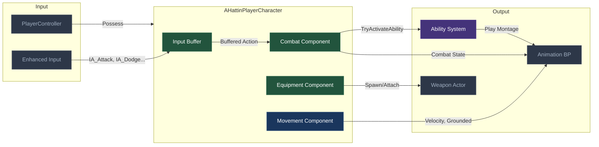

---

## 6. Implementation Patterns

### Pattern: Component-First Composition

**Problem**: Character classes become bloated with unrelated functionality (combat, equipment, targeting, etc.)

**Solution**: Extract distinct functionality into `UActorComponent` subclasses. The Character becomes a thin shell that creates and coordinates components.

**Your Application**: 
- `UHattinCombatComponent` handles all combat state and hit detection
- `UHattinEquipmentComponent` manages weapon spawning and attachment
- `UHattinInputBufferComponent` handles input buffering for combos

```cpp
// Character is thin - delegates to components
void AHattinPlayerCharacter::StartAttack(EHattinAttackType Type)
{
    // Check buffer first
    if (InputBufferComponent->HasBufferedInput(Type))
    {
        CombatComponent->StartAttack(Type);
    }
}
```

### Pattern: Interface Segregation (IAbilitySystemInterface)

**Problem**: Need polymorphic access to ASC without knowing concrete character class

**Solution**: Implement `IAbilitySystemInterface` on all GAS-using actors. External systems call `GetAbilitySystemComponent()` without caring about class hierarchy.

**Your Application**: Both `AHattinPlayerCharacter` and `AHattinEnemyCharacter` implement the interface, allowing combat systems to interact with either uniformly.

```cpp
// In damage calculation - works for any character type
if (IAbilitySystemInterface* Target = Cast<IAbilitySystemInterface>(HitActor))
{
    if (UAbilitySystemComponent* TargetASC = Target->GetAbilitySystemComponent())
    {
        TargetASC->ApplyGameplayEffectToSelf(DamageEffect, 1.0f, Context);
    }
}
```

### Pattern: ASC on PlayerState (Multiplayer-Ready)

**Problem**: When player character dies and respawns, you lose ability cooldowns, buffs, and attribute state

**Solution**: Place `AbilitySystemComponent` on `PlayerState` (persists across respawns). Character becomes the "Avatar" that executes abilities but doesn't own them.

**Your Application**: `AHattinPlayerState` owns the ASC. On possession, `InitAbilityActorInfo(PlayerState, Character)` links them.

```cpp
void AHattinPlayerCharacter::PossessedBy(AController* NewController)
{
    Super::PossessedBy(NewController);
    
    if (AHattinPlayerState* PS = GetPlayerState<AHattinPlayerState>())
    {
        AbilitySystemComponent = PS->GetAbilitySystemComponent();
        AbilitySystemComponent->InitAbilityActorInfo(PS, this); // PS = Owner, this = Avatar
        
        // Get the AttributeSet from PlayerState too
        AttributeSet = PS->GetAttributeSet();
    }
}
```

### Pattern: Cached Component References

**Problem**: `GetComponentByClass()` and `FindComponentByClass()` have overhead when called frequently

**Solution**: Cache component references in `PostInitializeComponents()` when all components are guaranteed to exist

**Your Application**: Cache `AnimInstance`, sibling components, and any frequently-accessed references.

```cpp
void AHattinCharacterBase::PostInitializeComponents()
{
    Super::PostInitializeComponents();
    
    // Cache AnimInstance - used every frame for state checks
    if (GetMesh())
    {
        AnimInstance = Cast<UHattinAnimInstance>(GetMesh()->GetAnimInstance());
    }
}
```

### Anti-Patterns to Avoid

| Anti-Pattern | Problem | Solution |
|-------------|---------|----------|
| **Monolithic Character Class** | 5000+ line Character.cpp with combat, inventory, dialogue, etc. | Extract into components |
| **Tick-Heavy Updates** | Checking combat state every frame in Character::Tick | Use events/delegates, AnimNotifies |
| **Hard References to Player** | Enemy code casts directly to `AHattinPlayerCharacter` | Use interfaces: `ICombatTarget`, `IAbilitySystemInterface` |
| **Gameplay Logic in Constructor** | Spawning actors, accessing World in constructor | Move to `BeginPlay()` or `PossessedBy()` |
| **Forgetting `Super::` Calls** | Override `BeginPlay()` without calling `Super::BeginPlay()` | Always call Super for lifecycle methods |

---

## 7. Quick Reference Card

| Concept | UE5 Class | Hattin Class | File Location |
|---------|-----------|--------------|---------------|
| Base Character | `ACharacter` | `AHattinCharacterBase` | `/Source/Hattin/Character/` |
| Player Character | `ACharacter` | `AHattinPlayerCharacter` | `/Source/Hattin/Character/` |
| Enemy Character | `ACharacter` | `AHattinEnemyCharacter` | `/Source/Hattin/Character/` |
| Combat Component | `UActorComponent` | `UHattinCombatComponent` | `/Source/Hattin/Combat/` |
| Equipment Component | `UActorComponent` | `UHattinEquipmentComponent` | `/Source/Hattin/Equipment/` |
| Input Buffer | `UActorComponent` | `UHattinInputBufferComponent` | `/Source/Hattin/Input/` |
| Targeting Component | `UActorComponent` | `UHattinTargetingComponent` | `/Source/Hattin/Camera/` |
| Player Blueprint | — | `BP_HattinPlayerCharacter` | `/Content/Hattin/Blueprints/Character/` |

---

## 8. Connections Map (Compact)

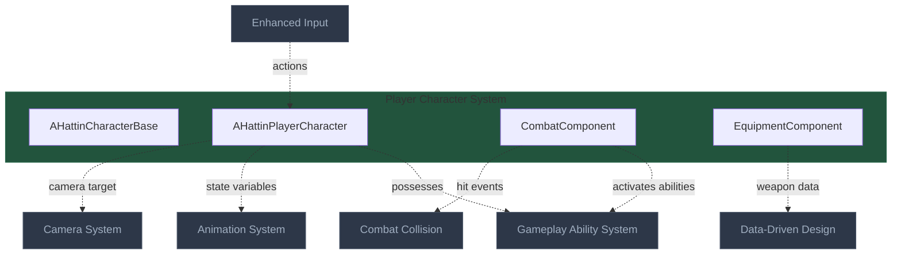

---

## 9. Things Added During Learning

### 9.1 Character Inheritance and Blueprints

This section documents key learnings about the correct approach to C++ and Blueprint inheritance hierarchy in Unreal Engine, specifically for character-based combat systems.

#### 9.1.1 Linear Inheritance Chain (Best Practice)

The correct approach is a **linear inheritance chain** where Blueprints are only created at the final leaves of the hierarchy. This prevents "inheritance forking" and maintains clean code organization.

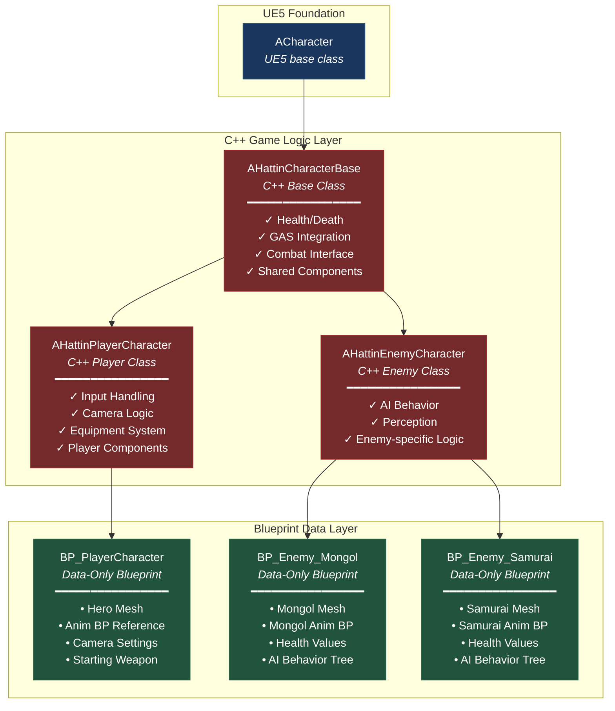

**Key Principle**: Each class has **one direct parent** only. A Blueprint cannot "double-inherit" from both a Blueprint parent and a second C++ class simultaneously.

#### 9.1.2 The Wrong Approach: Mid-Hierarchy Blueprint Base

This diagram shows why creating a `BP_CharacterBase` between C++ classes creates inheritance problems.

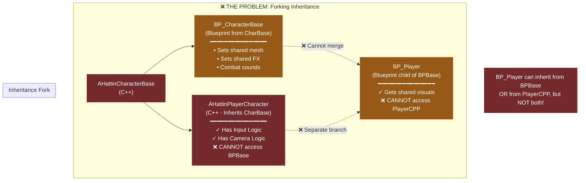

**Problem Explained**:
- If you create `BP_Player` as a child of `BP_CharacterBase`, it cannot access the C++ code in `AHattinPlayerCharacter` (input, camera)
- If you create `BP_Player` as a child of `AHattinPlayerCharacter`, it cannot inherit visual settings from `BP_CharacterBase`
- You're forced to choose one branch, losing functionality from the other

#### 9.1.3 Sharing Data Without Mid-Hierarchy Blueprints

This diagram shows the professional approach to sharing functionality without creating a mid-hierarchy Blueprint base.

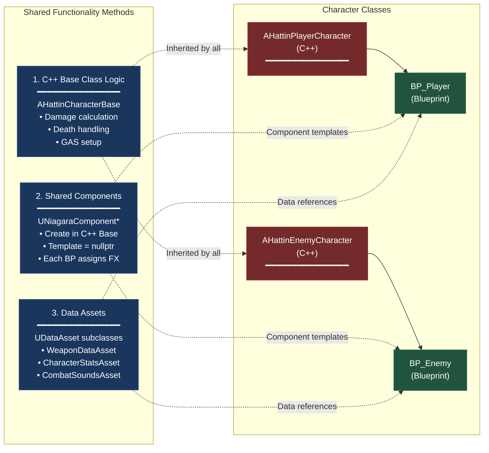

**Three Professional Methods for Sharing**:

1. **Shared C++ Logic**: Put common functionality in `AHattinCharacterBase` (health, combat interface, death)
2. **Component Templates**: Create components in C++ with null templates; Blueprints assign specific assets (particle effects, sounds)
3. **Data Assets**: Create `UDataAsset` subclasses for configuration data; each Blueprint references different data assets

#### 9.1.4 Component Inheritance Rules

Components have different rules than Actors. This diagram clarifies what can and cannot be Blueprinted.

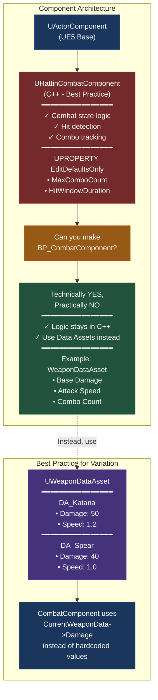

**Component Rule**: You *can* create Blueprint components, but for high-performance systems (combat, movement), keep logic in C++ and use Data Assets for variation.

#### Explanation: Why Linear Inheritance Matters

**The Problem with Mid-Hierarchy Blueprints**

Unreal Engine enforces **single inheritance**—each class can have only one direct parent. When you create a Blueprint (`BP_CharacterBase`) from a C++ class (`AHattinCharacterBase`), then create a second C++ class (`AHattinPlayerCharacter`) that also inherits from `AHattinCharacterBase`, you create a "fork" in the inheritance tree.

If you then want to create `BP_Player`, you face an impossible choice:
- Inherit from `BP_CharacterBase` → Get shared visual settings, but lose all C++ player code (input, camera)
- Inherit from `AHattinPlayerCharacter` → Get player C++ logic, but cannot inherit anything from `BP_CharacterBase`

**The Professional Solution: Data-Only Blueprints**

Instead of trying to share functionality through Blueprint inheritance, professional UE5 developers use three strategies:

1. **C++ Base Class for Logic**: All "behavior" code (damage calculation, death, GAS setup) lives in `AHattinCharacterBase`. Both player and enemy classes inherit this automatically through C++.

2. **Component Templates for Visuals**: Create components in C++ (like `UNiagaraComponent* HitEffectComponent`) but leave the template null. In each Blueprint (`BP_Player`, `BP_Enemy_Mongol`), you assign the specific particle effect. This shares the *structure* (the component exists) while allowing *variation* (different effects per character).

3. **Data Assets for Configuration**: Instead of setting "Hit Sound" in a base Blueprint, create a C++ property `USoundCue* HitSound` and mark it `EditDefaultsOnly`. Then create Data Assets (like `DA_PlayerSounds`, `DA_MongolSounds`) and assign them in each specific Blueprint. This keeps your C++ code clean while allowing designers to configure data without code changes.

**Why Components Should Stay in C++**

While you *can* create Blueprint components (`BP_CombatComponent`), it's an anti-pattern for performance-critical systems. Combat logic executes every frame during fights—Blueprint execution is slower than nativized C++.

The correct approach: Write the combat component in C++ with `UPROPERTY(EditDefaultsOnly)` for tuneable values. If you need variation (like a boss with special combo rules), use a **Data Asset** to feed different parameters into the same C++ component, rather than subclassing in Blueprint.

**Real-World Example: Ghost of Tsushima Style Game**

For Hattin's combat system:
- `AHattinCharacterBase` (C++) contains parry logic, health, and stance system
- `AHattinPlayerCharacter` (C++) adds input handling and camera control
- `AHattinEnemyCharacter` (C++) adds AI perception and behavior tree integration
- `BP_PlayerCharacter` (Blueprint) assigns Jin's mesh, animation blueprint, katana, and starting stats
- `BP_Enemy_Mongol` (Blueprint) assigns Mongol mesh, enemy animations, AI tree, and patrol behavior
- All combat *logic* is shared through C++; only *data* (meshes, sounds, stats) is set in Blueprints

This approach prevents "Blueprint spaghetti" where you lose track of which class defined which variable, and ensures your combat system runs at maximum performance.

---


---

## 10. Data Assets

**UE Base**: `UDataAsset` | **Purpose**: Data-driven configuration and memory efficiency

Data Assets are "static manuals" that define properties for your systems. By separating logic (C++) from data (Data Assets), you allow designers to create infinite variations of items or characters without touching a single line of code.

### 10.1 Data Sharing Pattern

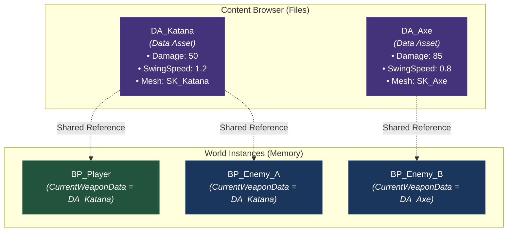


### 10.2 Implementation Example

The `EquipmentComponent` acts as the "Reader" while the `WeaponDataAsset` acts as the "Source".

```textmate
// 1. Define the Data Asset
UCLASS(BlueprintType)
class UWeaponDataAsset : public UDataAsset {
    UPROPERTY(EditDefaultsOnly)
    float BaseDamage;
    
    UPROPERTY(EditDefaultsOnly)
    TSoftObjectPtr<USkeletalMesh> WeaponMesh;
};

// 2. Component uses the data
void UHattinEquipmentComponent::EquipWeapon(UWeaponDataAsset* Data) {
    if (Data) {
        float Damage = Data->BaseDamage; // Logic reads from the "Manual"
        SpawnWeaponMesh(Data->WeaponMesh.LoadSynchronous());
    }
}
```

### How it works in a Professional System:
Most modern UE5 combat systems use a **Hybrid Approach**:

1.  **The Data Asset** holds the **Montage** (the specific swing).
2.  **The Animation Blueprint** holds the **Stance** (how the character stands while holding the Katana).

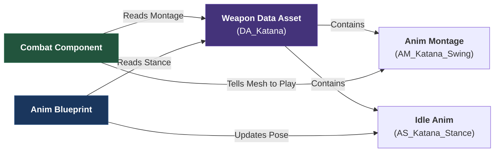


### Summary of where things live:
*   **The Data Asset:** "Which animation should I play for this weapon?"
*   **The .uasset file:** The actual raw animation data imported from Blender/Maya.
*   **The Montage:** The "wrapper" that tells UE5 how fast to play the animation and when to trigger hit sounds/damage.

**Pro-Tip:** In your project, putting the `UAnimMontage*` in the `UWeaponDataAsset` is the cleanest way. It allows you to create a "Spear" later just by making a new Data Asset and plugging in a "Spear_Swing" montage.flowchart TD
subgraph DataAsset["<b>Weapon Data Asset (The Organizer)</b>"]
Stats["• Base Damage: 50<br/>• Crit Chance: 10%"]
Anims["• Stance: AS_Katana_Idle<br/>• Attack: AM_Katana_Combo"]
Visuals["• Mesh: SK_Katana<br/>• Trail FX: NS_SwordTrail"]
Audio["• Impact Sound: SFX_Blade_Hit"]
end

    subgraph Readers["<b>The Readers (Logic)</b>"]
        Combat["<b>Combat Component</b><br/>Reads Stats & Attacks"]
        AnimBP["<b>Animation Blueprint</b><br/>Reads Stance"]
        Equip["<b>Equipment Component</b><br/>Reads Mesh & FX"]
    end

    DataAsset --> Combat
    DataAsset --> AnimBP
    DataAsset --> Equip

    style DataAsset fill:#44337a,stroke:#553c9a,color:#fff
    style Combat fill:#22543d,stroke:#276749,color:#fff
    style AnimBP fill:#1a365d,stroke:#2c5282,color:#fff
    style Equip fill:#742a2a,stroke:#9b2c2c,color:#fff

---

## 11. Scene vs Primitive Components

**Hierarchy**: `UActorComponent` → `USceneComponent` → `UPrimitiveComponent`

This hierarchy defines what a component "is" and "can do" within the 3D world.

### 11.1 Capability Hierarchy

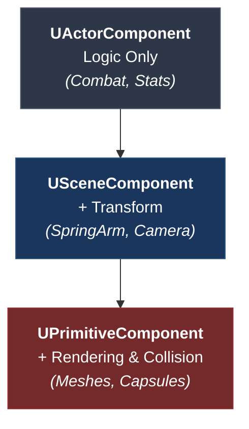


### 11.2 Key Differences

| Feature | Scene Component | Primitive Component |
| :--- | :--- | :--- |
| **Transform** | ✅ Has Position/Rotation/Scale | ✅ Inherits Transform |
| **Attachment** | ✅ Can be a parent/child | ✅ Can be a parent/child |
| **Rendering** | ❌ Invisible Helper | ✅ Visible Geometry |
| **Physics** | ❌ No Collision | ✅ Can block, overlap, and simulate gravity |

**When to use which:**
- Use **Scene Components** for "Anchor Points" (e.g., a socket where a weapon attaches) or "Helpers" (e.g., the Spring Arm for a camera).
- Use **Primitive Components** for "Physical Objects" (e.g., the character's body capsule or the actual sword mesh).


## Summary

The Player Character Architecture establishes:

1. **Inheritance**: `UObject` → `AActor` → `APawn` → `ACharacter` → `AHattinCharacterBase` → `AHattinPlayerCharacter`

2. **Composition**: Character is a thin coordinator; functionality lives in components (`CombatComponent`, `EquipmentComponent`, `InputBufferComponent`)

3. **GAS Integration**: ASC on PlayerState for persistence, Character as Avatar for execution

4. **Lifecycle Awareness**: Components created in Constructor, configured in `PostInitializeComponents`, gameplay in `BeginPlay`

5. **Interface Segregation**: `IAbilitySystemInterface` allows uniform interaction regardless of character type

6. **Linear Blueprint Hierarchy**: C++ defines logic in a clean inheritance chain; Blueprints created only at final leaves as data containers

This architecture supports clean separation of concerns, multiplayer readiness, and the combat-focused gameplay Hattin requires.
