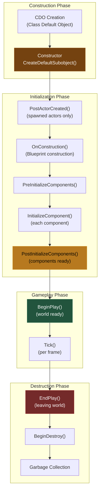
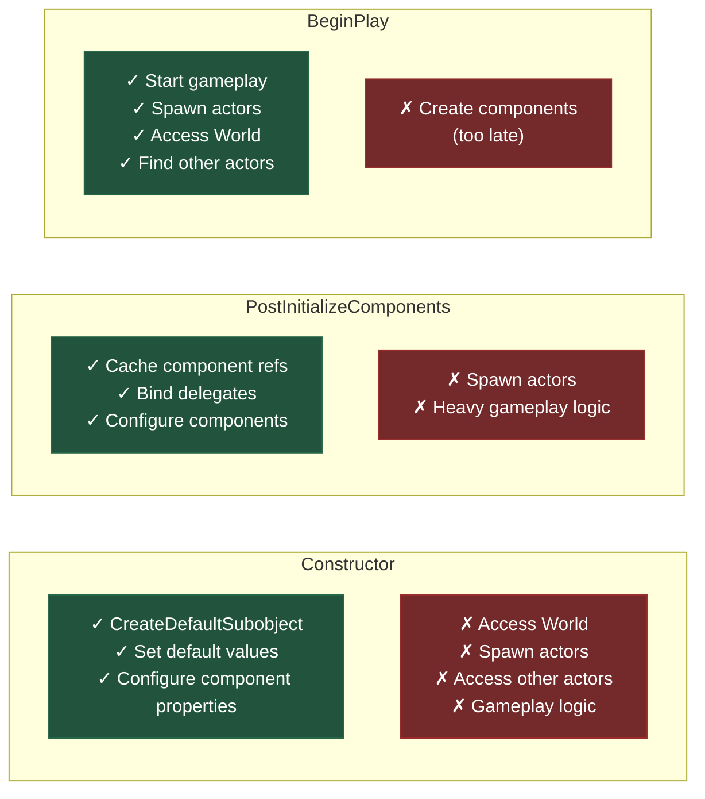
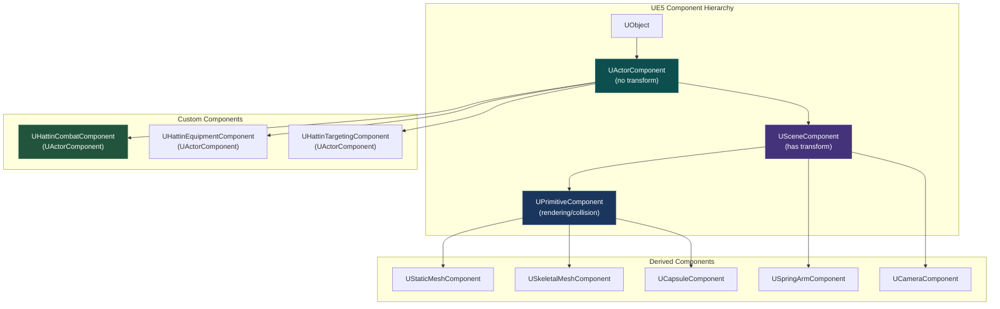
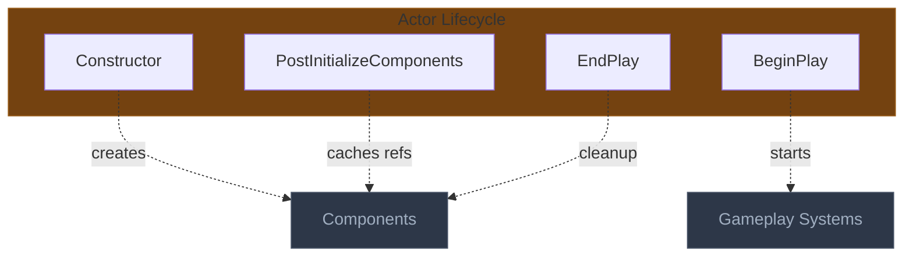
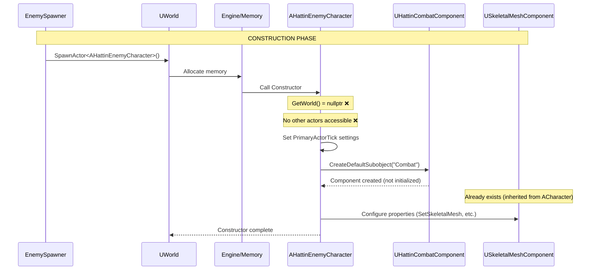
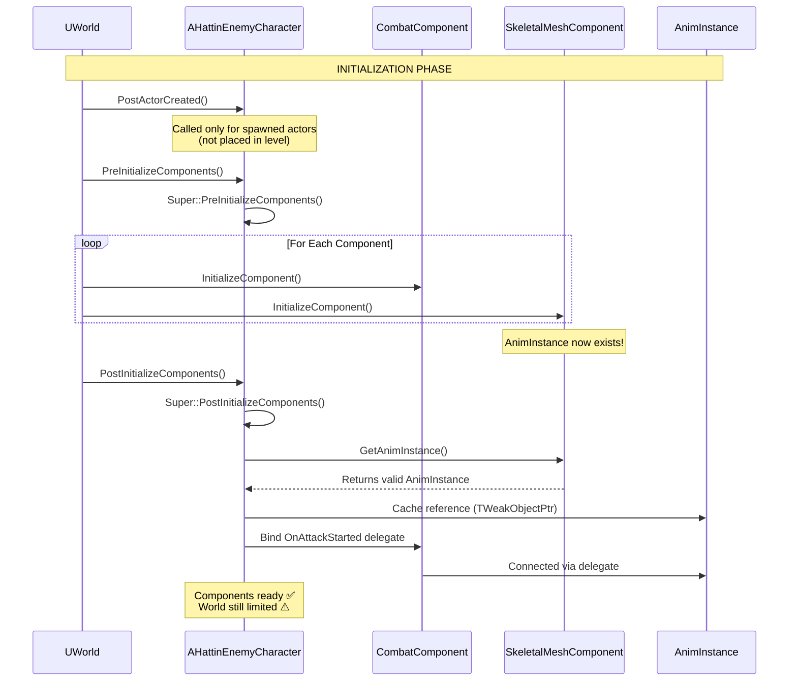
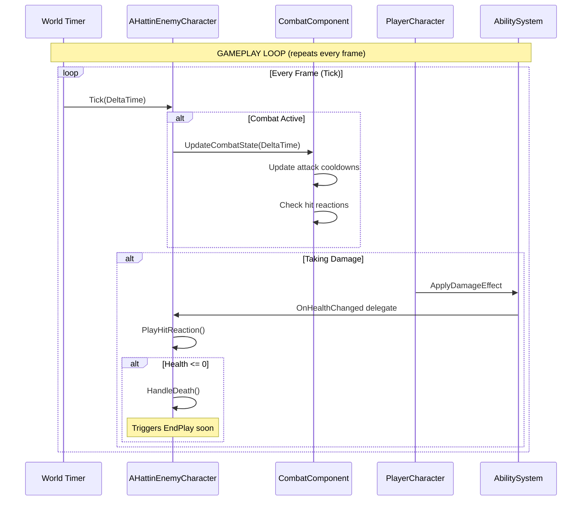

# Actor Lifecycle & Component Pattern Architecture
> The foundational patterns of UE5 object creation — understanding when
> constructors run, when components initialize, and how to safely access
> game systems at each lifecycle stage.

---

## 1. System Overview

Actor Lifecycle management solves the problem of knowing when it's safe to access the World, other Actors, and game systems. UE5 has a specific initialization order, and putting code in the wrong lifecycle method causes crashes, null pointers, or undefined behavior.

The Component Pattern solves the problem of reusability and composition. Rather than deep inheritance hierarchies, functionality is composed from modular components that can be mixed and matched across different Actor types.

For Hattin specifically, understanding lifecycle is critical for: initializing GAS correctly, caching component references safely, spawning actors at runtime, and implementing object pooling for performance.

---

## 2. Core Architecture Diagram

### 2.1 Actor Lifecycle Flow



### 2.2 Safe Operations by Lifecycle Stage



### 2.3 Component Hierarchy



---

## 3. Component Specifications

### 3.1 Component Type Decision Guide

| Need | Component Type | Example |
|------|---------------|---------|
| Pure logic, no position | `UActorComponent` | Combat, Inventory, Stats |
| Needs position, no visuals | `USceneComponent` | Attachment points, targets |
| Visuals or collision | `UPrimitiveComponent` subclass | Mesh, capsule, box |

### 3.2 Constructor Pattern

```cpp
AHattinPlayerCharacter::AHattinPlayerCharacter()
{
    // Set tick BEFORE creating components
    PrimaryActorTick.bCanEverTick = true;
    PrimaryActorTick.bStartWithTickEnabled = false;
    
    // Configure inherited components
    GetCapsuleComponent()->InitCapsuleSize(42.f, 96.0f);
    GetCharacterMovement()->MaxWalkSpeed = 500.f;
    
    // Create scene components (need attachment)
    CameraBoom = CreateDefaultSubobject<USpringArmComponent>(TEXT("CameraBoom"));
    CameraBoom->SetupAttachment(RootComponent);
    CameraBoom->TargetArmLength = 300.0f;
    
    FollowCamera = CreateDefaultSubobject<UCameraComponent>(TEXT("FollowCamera"));
    FollowCamera->SetupAttachment(CameraBoom, USpringArmComponent::SocketName);
    
    // Create actor components (no attachment)
    CombatComponent = CreateDefaultSubobject<UHattinCombatComponent>(TEXT("CombatComponent"));
    EquipmentComponent = CreateDefaultSubobject<UHattinEquipmentComponent>(TEXT("EquipmentComponent"));
    
    // NEVER do this in constructor:
    // - GetWorld() → nullptr
    // - SpawnActor() → crash
    // - FindComponentByClass on other actors → crash
}
```

### 3.3 PostInitializeComponents Pattern

```cpp
void AHattinCharacterBase::PostInitializeComponents()
{
    Super::PostInitializeComponents(); // Always call Super!
    
    // Components are now fully initialized - safe to cache refs
    if (GetMesh())
    {
        AnimInstance = Cast<UHattinAnimInstance>(GetMesh()->GetAnimInstance());
    }
    
    // Bind delegates between components
    if (CombatComponent && AnimInstance.IsValid())
    {
        CombatComponent->OnAttackStarted.AddDynamic(
            AnimInstance.Get(), &UHattinAnimInstance::OnCombatAttackStarted);
    }
}
```

### 3.4 BeginPlay Pattern

```cpp
void AHattinPlayerCharacter::BeginPlay()
{
    Super::BeginPlay(); // Always call Super!
    
    // World is now valid - safe to spawn, find actors
    if (UWorld* World = GetWorld())
    {
        // Can spawn actors now
        if (DefaultWeaponClass)
        {
            AHattinWeaponActor* Weapon = World->SpawnActor<AHattinWeaponActor>(DefaultWeaponClass);
            EquipmentComponent->EquipWeapon(Weapon);
        }
    }
    
    // Enable tick if needed
    SetActorTickEnabled(true);
}
```

### 3.5 Runtime Component Creation

```cpp
void AHattinPlayerCharacter::AddRuntimeComponent()
{
    // Runtime-created components need manual registration
    UStaticMeshComponent* NewMesh = NewObject<UStaticMeshComponent>(this);
    NewMesh->SetupAttachment(GetMesh(), TEXT("socket_name"));
    NewMesh->SetStaticMesh(SomeMesh);
    NewMesh->RegisterComponent(); // REQUIRED for runtime components
    
    // Add to instance components array for proper cleanup
    AddInstanceComponent(NewMesh);
}
```

---

## 4. Implementation Patterns

### Pattern: Deferred Spawning

**Problem**: Need to configure spawned actor before BeginPlay

**Solution**: Use SpawnActorDeferred → Configure → FinishSpawning

```cpp
void AHattinEnemySpawner::SpawnEnemy()
{
    FActorSpawnParameters Params;
    Params.SpawnCollisionHandlingOverride = ESpawnActorCollisionHandlingMethod::AdjustIfPossibleButAlwaysSpawn;
    
    // Deferred spawn - actor exists but BeginPlay not called
    AHattinEnemyCharacter* Enemy = GetWorld()->SpawnActorDeferred<AHattinEnemyCharacter>(
        EnemyClass,
        SpawnTransform,
        nullptr,
        nullptr,
        ESpawnActorCollisionHandlingMethod::AdjustIfPossibleButAlwaysSpawn
    );
    
    // Configure before BeginPlay
    Enemy->SetEnemyData(EnemyDataAsset);
    Enemy->SetPatrolPath(PatrolPath);
    
    // Now finish spawning (calls BeginPlay)
    Enemy->FinishSpawning(SpawnTransform);
}
```

### Pattern: Object Pooling

**Problem**: Frequent spawn/destroy of projectiles causes hitches

**Solution**: Pool and reuse actors

```cpp
AHattinProjectile* UHattinObjectPoolSubsystem::GetProjectile()
{
    for (AHattinProjectile* Pooled : ProjectilePool)
    {
        if (!Pooled->IsActive())
        {
            Pooled->Activate();
            return Pooled;
        }
    }
    
    // Pool exhausted, spawn new
    AHattinProjectile* NewProjectile = GetWorld()->SpawnActor<AHattinProjectile>(ProjectileClass);
    ProjectilePool.Add(NewProjectile);
    return NewProjectile;
}

void AHattinProjectile::Deactivate()
{
    SetActorHiddenInGame(true);
    SetActorEnableCollision(false);
    SetActorTickEnabled(false);
    // Don't destroy - return to pool
}
```

### Pattern: Component Composition

**Problem**: Different character types need overlapping functionality

**Solution**: Extract into components, compose as needed

```cpp
// UHattinHealthComponent can be used by:
// - Player characters
// - Enemy characters  
// - Destructible props
// - Vehicles

UCLASS()
class UHattinHealthComponent : public UActorComponent
{
    // Same health logic, reusable across actor types
};
```

---

## 5. Anti-Patterns to Avoid

| Anti-Pattern | Problem | Solution |
|-------------|---------|----------|
| **World access in Constructor** | World is nullptr | Move to BeginPlay |
| **Spawning in Constructor** | Crash | Move to BeginPlay |
| **Creating components in BeginPlay** | Too late, not serialized | Create in Constructor |
| **Forgetting RegisterComponent** | Runtime components don't work | Always call RegisterComponent |
| **Heavy Tick operations** | Performance | Use timers, events |
| **Forgetting Super:: calls** | Base class logic skipped | Always call Super for lifecycle |

---

## 6. Quick Reference Card

| Lifecycle Method | Safe To Do | NOT Safe |
|-----------------|-----------|----------|
| **Constructor** | CreateDefaultSubobject, set defaults | World access, spawn, gameplay |
| **PostInitializeComponents** | Cache refs, bind delegates | Spawn actors |
| **BeginPlay** | Everything gameplay | Create components |
| **Tick** | Per-frame updates | Heavy operations |
| **EndPlay** | Cleanup, unbind | Access destroyed actors |

| Component Type | Use When |
|---------------|----------|
| `UActorComponent` | Logic only, no position needed |
| `USceneComponent` | Needs transform, attachment |
| `UPrimitiveComponent+` | Needs rendering or collision |

---

## 7. Connections Map (Compact)



---

## Summary

The Actor Lifecycle & Component Pattern architecture establishes:

1. **Constructor**: CreateDefaultSubobject only, set defaults, NO world access
2. **PostInitializeComponents**: Cache references, bind delegates, components ready
3. **BeginPlay**: Start gameplay, spawn actors, world is valid
4. **EndPlay**: Cleanup, unbind, save state
5. **Component Types**: ActorComponent (logic), SceneComponent (transform), PrimitiveComponent (visuals)
6. **Runtime Components**: Must call RegisterComponent() after NewObject
7. **Deferred Spawning**: Configure actors before BeginPlay with SpawnActorDeferred

This understanding prevents null pointer crashes and ensures systems initialize in the correct order.


# Actor Lifecycle & Component Pattern: Complete Example
> A detailed walkthrough of spawning an enemy character — tracing every
> lifecycle method from construction to destruction with diagrams and code.

---

## Bonus Section: Complete Lifecycle Example

This section walks through the complete lifecycle of spawning an enemy character — from the moment `SpawnActor` is called until the enemy is destroyed. Each phase is shown first in a high-level overview, then explored in detail.

### The Scenario

A spawner actor creates an `AHattinEnemyCharacter` at runtime. The enemy has:
- `UHattinCombatComponent` (logic, no transform)
- `USkeletalMeshComponent` (inherited from ACharacter)
- `UWidgetComponent` for health bar (created at runtime in BeginPlay)

We'll trace every lifecycle method and see exactly when each operation is safe.

---

### High-Level Timeline

```mermaid
gantt
    title Enemy Character Lifecycle
    dateFormat X
    axisFormat %s
    
    section Construction
    CDO Created (engine startup)         :cdo, 0, 1
    Constructor runs                      :constructor, 1, 3
    
    section Initialization
    PostActorCreated                      :pac, 3, 4
    PreInitializeComponents               :preinit, 4, 5
    Component InitializeComponent (each)  :compinit, 5, 7
    PostInitializeComponents              :postinit, 7, 9
    
    section Gameplay
    BeginPlay                             :beginplay, 9, 12
    First Tick                            :tick1, 12, 13
    Gameplay Loop (N ticks)               :gameplay, 13, 25
    
    section Destruction
    EndPlay                               :endplay, 25, 27
    BeginDestroy                          :destroy, 27, 28
    Garbage Collection                    :gc, 28, 30
```



**Reading the Timeline:**
- **Construction (0-3)**: Object exists in memory, but no world context
- **Initialization (3-9)**: Components wire up, but still no gameplay
- **Gameplay (9-25)**: Full world access, normal game operation
- **Destruction (25-30)**: Cleanup and memory reclamation

---

### Phase 1: Construction



**What Happens:**
1. `SpawnActor` allocates memory for the enemy
2. Constructor runs — this is pure C++ object construction
3. `CreateDefaultSubobject` creates components but doesn't initialize them
4. Inherited components (Mesh, Capsule, Movement) already exist from parent constructor

**Safe Operations:**
```cpp
AHattinEnemyCharacter::AHattinEnemyCharacter()
{
    // ✅ Configure tick
    PrimaryActorTick.bCanEverTick = true;
    PrimaryActorTick.bStartWithTickEnabled = false; // Enable in BeginPlay
    
    // ✅ Create components
    CombatComponent = CreateDefaultSubobject<UHattinCombatComponent>(TEXT("Combat"));
    
    // ✅ Configure inherited components
    GetMesh()->SetCollisionProfileName(TEXT("Enemy"));
    GetCharacterMovement()->MaxWalkSpeed = 400.f;
    
    // ❌ CRASH: GetWorld()->SpawnActor(...)
    // ❌ CRASH: FindComponentByClass on other actors
    // ❌ UNDEFINED: Gameplay logic
}
```

**Key Insight:** Think of the constructor as "configuring a blueprint" — you're defining what the actor will be, not what it will do.

---

### Phase 2: Initialization



**What Happens:**
1. `PostActorCreated` — only for runtime-spawned actors (not level-placed)
2. Each component's `InitializeComponent` runs
3. `PostInitializeComponents` — all components are now valid and initialized
4. This is the ideal place to cache component references and bind delegates

**Safe Operations:**
```cpp
void AHattinEnemyCharacter::PostInitializeComponents()
{
    Super::PostInitializeComponents(); // ALWAYS call Super!
    
    // ✅ Cache component references
    if (GetMesh())
    {
        CachedAnimInstance = Cast<UHattinAnimInstance>(GetMesh()->GetAnimInstance());
    }
    
    // ✅ Bind delegates between our own components
    if (CombatComponent && CachedAnimInstance.IsValid())
    {
        CombatComponent->OnAttackStarted.AddDynamic(
            CachedAnimInstance.Get(), 
            &UHattinAnimInstance::HandleAttackStarted
        );
    }
    
    // ✅ Configure component relationships
    if (CombatComponent)
    {
        CombatComponent->SetOwnerCharacter(this);
    }
    
    // ⚠️ RISKY: GetWorld() may work but avoid heavy operations
    // ❌ AVOID: SpawnActor, complex world queries
}
```

**Key Insight:** `PostInitializeComponents` is your "wiring phase" — components exist and are initialized, so you can connect them together. But the world isn't fully ready for gameplay.

---

### Phase 3: BeginPlay & First Tick

```mermaid
sequenceDiagram
    participant World as UWorld
    participant Enemy as AHattinEnemyCharacter
    participant Combat as CombatComponent
    participant ASC as AbilitySystemComponent
    participant Widget as HealthBarWidget
    participant AI as AIController
    
    Note over World,AI: GAMEPLAY PHASE START
    
    World->>Enemy: BeginPlay()
    Enemy->>Enemy: Super::BeginPlay()
    
    Note over Enemy: World fully valid ✅<br/>All actors accessible ✅
    
    Enemy->>ASC: InitAbilityActorInfo(this, this)
    Enemy->>ASC: GiveAbility(LightAttackAbility)
    Enemy->>ASC: GiveAbility(HeavyAttackAbility)
    
    rect rgb(50, 80, 50)
        Note over Enemy,Widget: Runtime Component Creation
        Enemy->>Widget: NewObject<UWidgetComponent>(this)
        Enemy->>Widget: SetupAttachment(GetMesh(), "head")
        Enemy->>Widget: SetWidgetClass(HealthBarClass)
        Enemy->>Widget: RegisterComponent()
        Enemy->>Enemy: AddInstanceComponent(Widget)
    end
    
    Enemy->>Enemy: SetActorTickEnabled(true)
    
    World->>AI: Possess(Enemy)
    AI->>AI: RunBehaviorTree()
    
    Note over World,AI: FIRST TICK
    
    World->>Enemy: Tick(DeltaTime)
    Enemy->>Combat: UpdateCombatState()
    Combat->>ASC: Check ability cooldowns
```



**What Happens:**
1. `BeginPlay` marks the start of gameplay — world is fully valid
2. GAS initialization happens here (InitAbilityActorInfo, granting abilities)
3. Runtime components (like health bar widget) are created with `NewObject` + `RegisterComponent`
4. Tick is enabled when ready
5. AI takes control via `Possess`

**Safe Operations:**
```cpp
void AHattinEnemyCharacter::BeginPlay()
{
    Super::BeginPlay(); // ALWAYS call Super!
    
    // ✅ Initialize GAS
    if (AbilitySystemComponent)
    {
        AbilitySystemComponent->InitAbilityActorInfo(this, this);
        
        for (TSubclassOf<UGameplayAbility>& Ability : DefaultAbilities)
        {
            AbilitySystemComponent->GiveAbility(FGameplayAbilitySpec(Ability));
        }
    }
    
    // ✅ Create runtime components
    HealthBarWidget = NewObject<UWidgetComponent>(this);
    HealthBarWidget->SetupAttachment(GetMesh(), TEXT("head_socket"));
    HealthBarWidget->SetWidgetClass(HealthBarWidgetClass);
    HealthBarWidget->SetDrawSize(FVector2D(100, 20));
    HealthBarWidget->RegisterComponent();  // REQUIRED!
    AddInstanceComponent(HealthBarWidget); // For proper cleanup
    
    // ✅ Spawn other actors
    if (UWorld* World = GetWorld())
    {
        WeaponActor = World->SpawnActor<AHattinWeaponActor>(WeaponClass);
        WeaponActor->AttachToComponent(GetMesh(), AttachRules, TEXT("weapon_socket"));
    }
    
    // ✅ Enable tick when ready
    SetActorTickEnabled(true);
    
    // ❌ TOO LATE: CreateDefaultSubobject (only works in constructor)
}
```

**Key Insight:** `BeginPlay` is your "game start" — everything is ready. Create runtime components here with the `NewObject` → `RegisterComponent` → `AddInstanceComponent` pattern.

---

### Phase 4: Gameplay Loop



**What Happens:**
1. `Tick` runs every frame (if enabled)
2. Components can have their own tick (configured separately)
3. Delegates fire in response to gameplay events
4. Death triggers the destruction sequence

**Tick Considerations:**
```cpp
void AHattinEnemyCharacter::Tick(float DeltaTime)
{
    Super::Tick(DeltaTime);
    
    // ✅ Lightweight per-frame updates
    UpdateFacingDirection(DeltaTime);
    
    // ⚠️ AVOID: Heavy operations every frame
    // Instead, use timers:
}

// Better approach for periodic checks:
void AHattinEnemyCharacter::BeginPlay()
{
    Super::BeginPlay();
    
    // Check for nearby threats every 0.5 seconds, not every frame
    GetWorldTimerManager().SetTimer(
        ThreatCheckHandle,
        this,
        &ThisClass::CheckForThreats,
        0.5f,  // Interval
        true   // Looping
    );
}
```

---

### Phase 5: Destruction

```mermaid
sequenceDiagram
    participant Game as GameMode
    participant Enemy as AHattinEnemyCharacter
    participant Combat as CombatComponent
    participant Widget as HealthBarWidget
    participant World as UWorld
    participant GC as Garbage Collector
    
    Note over Game,GC: DESTRUCTION PHASE
    
    Game->>Enemy: Destroy() or Level Unload
    
    World->>Enemy: EndPlay(EEndPlayReason)
    Enemy->>Enemy: Super::EndPlay()
    
    Note over Enemy: Still valid, cleanup time
    
    Enemy->>Combat: Unbind all delegates
    Enemy->>Enemy: Clear timer handles
    Enemy->>Enemy: Save state if needed
    
    rect rgb(80, 50, 50)
        Note over Enemy,Widget: Components auto-destroyed
        World->>Widget: DestroyComponent()
        World->>Combat: DestroyComponent()
    end
    
    World->>Enemy: BeginDestroy()
    Note over Enemy: Actor marked for GC<br/>Do NOT access after this
    
    GC->>Enemy: Release memory
    Note over Enemy: Object no longer exists
```



**What Happens:**
1. `EndPlay` — last chance for cleanup while actor is still valid
2. Reason enum tells you why: `Destroyed`, `LevelTransition`, `EndPlayInEditor`, etc.
3. Components are automatically destroyed (no manual cleanup needed)
4. `BeginDestroy` marks the object for garbage collection
5. Never access an actor after `Destroy()` is called on it

**Safe Operations:**
```cpp
void AHattinEnemyCharacter::EndPlay(const EEndPlayReason::Type EndPlayReason)
{
    // ✅ Unbind delegates to prevent dangling references
    if (CombatComponent)
    {
        CombatComponent->OnAttackStarted.RemoveAll(this);
    }
    
    // ✅ Clear timer handles
    GetWorldTimerManager().ClearTimer(ThreatCheckHandle);
    GetWorldTimerManager().ClearAllTimersForObject(this);
    
    // ✅ Notify other systems
    if (AHattinGameMode* GM = GetWorld()->GetAuthGameMode<AHattinGameMode>())
    {
        GM->OnEnemyDestroyed(this);
    }
    
    // ✅ Save persistent data if needed
    if (EndPlayReason == EEndPlayReason::LevelTransition)
    {
        SaveEnemyState();
    }
    
    // Components are cleaned up automatically - no need to destroy them
    
    Super::EndPlay(EndPlayReason); // Call Super LAST for EndPlay
}
```

**Key Insight:** `EndPlay` is your "last words" — clean up external references, unbind delegates, and notify other systems. Components handle their own destruction.

---

### Complete Code Example

Here's the full enemy character class incorporating all lifecycle phases:

```cpp
// HattinEnemyCharacter.h
UCLASS()
class HATTIN_API AHattinEnemyCharacter : public AHattinCharacterBase
{
    GENERATED_BODY()
    
public:
    AHattinEnemyCharacter();
    
    virtual void PostInitializeComponents() override;
    virtual void BeginPlay() override;
    virtual void Tick(float DeltaTime) override;
    virtual void EndPlay(const EEndPlayReason::Type EndPlayReason) override;
    
protected:
    // Created in Constructor (CreateDefaultSubobject)
    UPROPERTY(VisibleAnywhere)
    TObjectPtr<UHattinCombatComponent> CombatComponent;
    
    // Created at Runtime (NewObject + RegisterComponent)
    UPROPERTY()
    TObjectPtr<UWidgetComponent> HealthBarWidget;
    
    // Cached in PostInitializeComponents
    UPROPERTY()
    TWeakObjectPtr<UHattinAnimInstance> CachedAnimInstance;
    
    // Timer handle (cleared in EndPlay)
    FTimerHandle ThreatCheckHandle;
    
    UPROPERTY(EditDefaultsOnly)
    TSubclassOf<UUserWidget> HealthBarWidgetClass;
    
    UPROPERTY(EditDefaultsOnly)
    TArray<TSubclassOf<UGameplayAbility>> DefaultAbilities;
};

// HattinEnemyCharacter.cpp
AHattinEnemyCharacter::AHattinEnemyCharacter()
{
    // === CONSTRUCTOR: Configure, don't execute ===
    
    PrimaryActorTick.bCanEverTick = true;
    PrimaryActorTick.bStartWithTickEnabled = false;
    
    // Create components
    CombatComponent = CreateDefaultSubobject<UHattinCombatComponent>(TEXT("Combat"));
    
    // Configure inherited components
    GetMesh()->SetCollisionProfileName(TEXT("EnemyMesh"));
    GetCharacterMovement()->MaxWalkSpeed = 400.f;
    GetCharacterMovement()->bOrientRotationToMovement = true;
}

void AHattinEnemyCharacter::PostInitializeComponents()
{
    Super::PostInitializeComponents();
    
    // === POST INIT: Wire components together ===
    
    // Cache AnimInstance reference
    if (GetMesh())
    {
        CachedAnimInstance = Cast<UHattinAnimInstance>(GetMesh()->GetAnimInstance());
    }
    
    // Bind component delegates
    if (CombatComponent && CachedAnimInstance.IsValid())
    {
        CombatComponent->OnAttackStarted.AddDynamic(
            CachedAnimInstance.Get(), 
            &UHattinAnimInstance::HandleAttackStarted
        );
        
        CombatComponent->OnDamageTaken.AddDynamic(
            this, 
            &ThisClass::HandleDamageTaken
        );
    }
}

void AHattinEnemyCharacter::BeginPlay()
{
    Super::BeginPlay();
    
    // === BEGIN PLAY: Start gameplay ===
    
    // Initialize GAS
    if (AbilitySystemComponent)
    {
        AbilitySystemComponent->InitAbilityActorInfo(this, this);
        
        for (const TSubclassOf<UGameplayAbility>& AbilityClass : DefaultAbilities)
        {
            if (AbilityClass)
            {
                AbilitySystemComponent->GiveAbility(FGameplayAbilitySpec(AbilityClass));
            }
        }
    }
    
    // Create runtime health bar widget
    if (HealthBarWidgetClass)
    {
        HealthBarWidget = NewObject<UWidgetComponent>(this);
        HealthBarWidget->SetupAttachment(GetMesh(), TEXT("head_socket"));
        HealthBarWidget->SetWidgetClass(HealthBarWidgetClass);
        HealthBarWidget->SetDrawSize(FVector2D(100.f, 15.f));
        HealthBarWidget->SetWidgetSpace(EWidgetSpace::Screen);
        HealthBarWidget->RegisterComponent();
        AddInstanceComponent(HealthBarWidget);
    }
    
    // Start periodic threat check (not every frame)
    GetWorldTimerManager().SetTimer(
        ThreatCheckHandle,
        this,
        &ThisClass::CheckForThreats,
        0.5f,
        true
    );
    
    // Enable tick
    SetActorTickEnabled(true);
}

void AHattinEnemyCharacter::Tick(float DeltaTime)
{
    Super::Tick(DeltaTime);
    
    // === TICK: Lightweight per-frame updates only ===
    
    // Update facing direction smoothly
    if (CombatComponent && CombatComponent->HasTarget())
    {
        FVector Direction = CombatComponent->GetTargetLocation() - GetActorLocation();
        Direction.Z = 0.f;
        
        if (!Direction.IsNearlyZero())
        {
            FRotator TargetRotation = Direction.Rotation();
            FRotator NewRotation = FMath::RInterpTo(
                GetActorRotation(), 
                TargetRotation, 
                DeltaTime, 
                5.f
            );
            SetActorRotation(NewRotation);
        }
    }
}

void AHattinEnemyCharacter::EndPlay(const EEndPlayReason::Type EndPlayReason)
{
    // === END PLAY: Cleanup external references ===
    
    // Clear timers
    GetWorldTimerManager().ClearTimer(ThreatCheckHandle);
    
    // Unbind delegates
    if (CombatComponent)
    {
        CombatComponent->OnAttackStarted.RemoveAll(this);
        CombatComponent->OnDamageTaken.RemoveAll(this);
    }
    
    // Notify game mode
    if (UWorld* World = GetWorld())
    {
        if (AHattinGameMode* GM = World->GetAuthGameMode<AHattinGameMode>())
        {
            GM->OnEnemyDestroyed(this);
        }
    }
    
    // Call Super LAST for EndPlay
    Super::EndPlay(EndPlayReason);
}
```

---

### Quick Reference: Lifecycle Cheat Sheet

| Phase | Method | World Valid? | Safe Operations |
|-------|--------|--------------|-----------------|
| **Construction** | `Constructor` | ❌ No | `CreateDefaultSubobject`, set defaults |
| **Init** | `PostInitializeComponents` | ⚠️ Limited | Cache refs, bind delegates |
| **Gameplay** | `BeginPlay` | ✅ Yes | Everything — spawn, query, initialize |
| **Gameplay** | `Tick` | ✅ Yes | Lightweight updates |
| **Destruction** | `EndPlay` | ✅ Yes | Cleanup, unbind, notify |

**The Golden Rules:**
1. **Constructor** = Define structure, not behavior
2. **PostInitializeComponents** = Wire components together
3. **BeginPlay** = Start the game
4. **EndPlay** = Clean up external references
5. **Always call Super::** for lifecycle methods