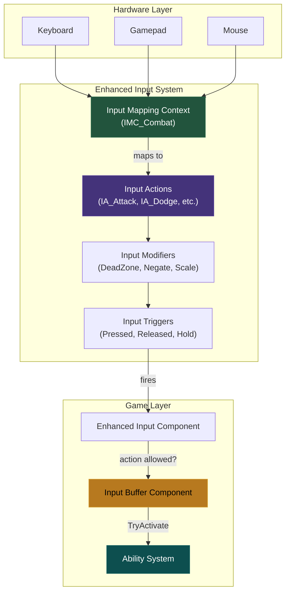
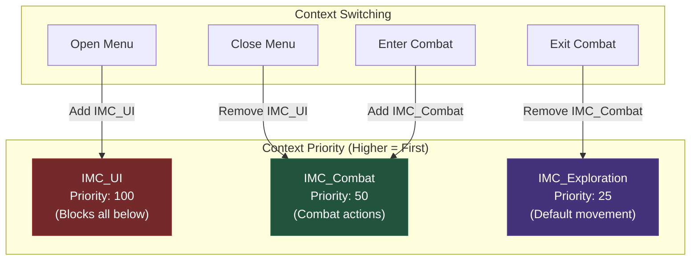
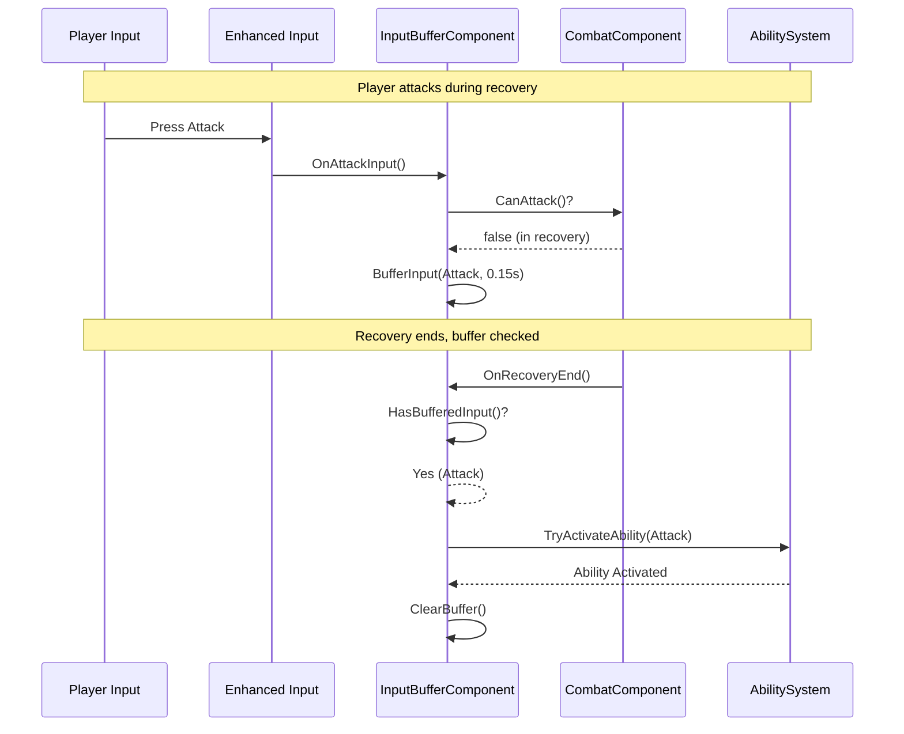
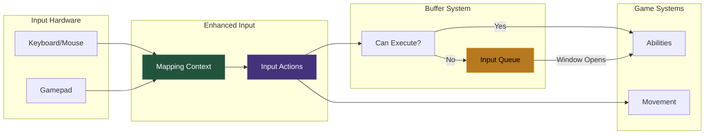
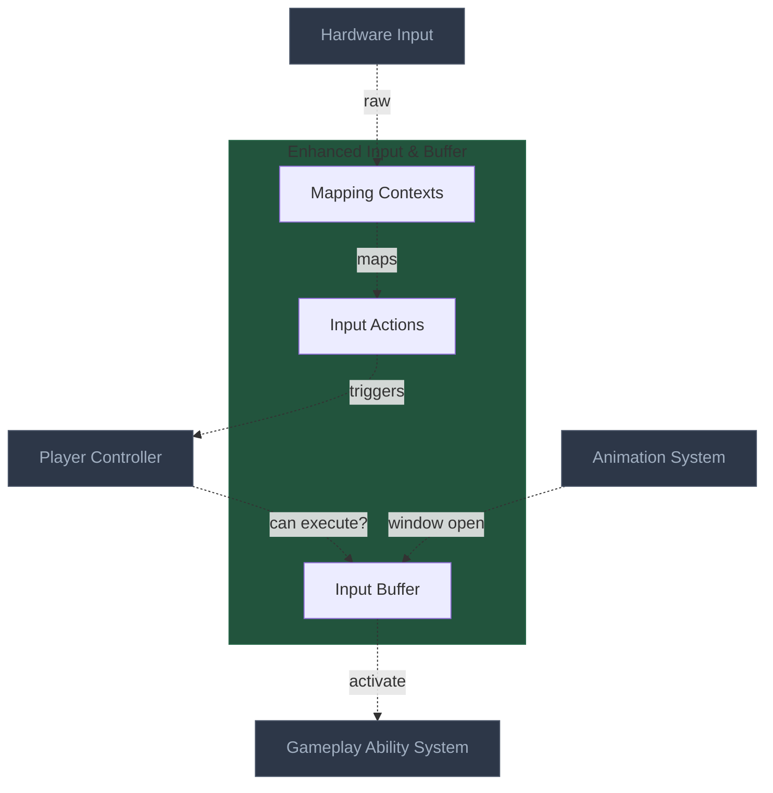

# Enhanced Input & Input Buffering Architecture
> The modern input system that translates player actions into game commands —
> with buffering that makes combat feel responsive even when timing isn't perfect.

---

## 1. System Overview

The Enhanced Input system solves the problem of mapping physical inputs (keys, buttons, sticks) to gameplay actions in a flexible, context-aware manner. Unlike the legacy input system, Enhanced Input uses asset-based Input Actions and Mapping Contexts that can be swapped at runtime.

Input buffering solves a critical combat responsiveness problem: players often input commands slightly before they become valid (attacking during recovery, dodging during hitstun). Without buffering, these inputs are lost. With buffering, inputs are queued and executed at the first valid opportunity.

For Hattin specifically, the input system must: support context switching (exploration vs combat vs UI), buffer attack and dodge inputs during recovery frames, and integrate with GAS for ability activation. The buffer window is typically 100-200ms, enough to feel responsive without causing unintended actions.

---

## 2. Core Architecture Diagram

### 2.1 Enhanced Input Flow



### 2.2 Input Mapping Context Hierarchy



### 2.3 Input Buffer Flow



---

## 3. Component Specifications

### 3.1 Input Action Assets

| Action | Value Type | Trigger | Modifiers |
|--------|-----------|---------|-----------|
| IA_Attack | Bool | Pressed | None |
| IA_HeavyAttack | Bool | Hold (0.3s) | None |
| IA_Dodge | Bool | Pressed | None |
| IA_Parry | Bool | Pressed | None |
| IA_LockOn | Bool | Pressed | None |
| IA_Move | Axis2D | Down | DeadZone(0.2) |
| IA_Look | Axis2D | Down | DeadZone(0.1), Scale |

### 3.2 UHattinInputBufferComponent

**UE Base**: `UActorComponent` | **Your Class**: `UHattinInputBufferComponent`

```cpp
UCLASS(ClassGroup=(Hattin), meta=(BlueprintSpawnableComponent))
class HATTIN_API UHattinInputBufferComponent : public UActorComponent
{
    GENERATED_BODY()
    
public:
    UHattinInputBufferComponent();
    
    UFUNCTION(BlueprintCallable, Category = "Input Buffer")
    void BufferInput(EHattinInputType InputType);
    
    UFUNCTION(BlueprintCallable, Category = "Input Buffer")
    bool HasBufferedInput(EHattinInputType InputType) const;
    
    UFUNCTION(BlueprintCallable, Category = "Input Buffer")
    bool ConsumeBufferedInput(EHattinInputType InputType);
    
    UFUNCTION(BlueprintCallable, Category = "Input Buffer")
    void ClearBuffer();
    
    UFUNCTION(BlueprintCallable, Category = "Input Buffer")
    void OnActionWindowOpen();
    
protected:
    UPROPERTY(EditDefaultsOnly, Category = "Input Buffer")
    float BufferDuration = 0.15f;
    
    UPROPERTY()
    EHattinInputType BufferedInput;
    
    UPROPERTY()
    float BufferExpirationTime;
    
    UPROPERTY()
    bool bHasBufferedInput;
    
    virtual void TickComponent(float DeltaTime, ELevelTick TickType,
        FActorComponentTickFunction* ThisTickFunction) override;
    
private:
    void ExecuteBufferedInput();
    
    UPROPERTY()
    TWeakObjectPtr<AHattinCharacterBase> OwnerCharacter;
};
```

### 3.3 Player Controller Input Setup

```cpp
void AHattinPlayerController::SetupInputComponent()
{
    Super::SetupInputComponent();
    
    UEnhancedInputLocalPlayerSubsystem* Subsystem = 
        ULocalPlayer::GetSubsystem<UEnhancedInputLocalPlayerSubsystem>(GetLocalPlayer());
    
    if (Subsystem)
    {
        Subsystem->ClearAllMappings();
        Subsystem->AddMappingContext(CombatMappingContext, 50);
    }
    
    UEnhancedInputComponent* EIC = Cast<UEnhancedInputComponent>(InputComponent);
    if (EIC)
    {
        EIC->BindAction(IA_Attack, ETriggerEvent::Triggered, this, &ThisClass::OnAttackInput);
        EIC->BindAction(IA_Dodge, ETriggerEvent::Triggered, this, &ThisClass::OnDodgeInput);
        EIC->BindAction(IA_Move, ETriggerEvent::Triggered, this, &ThisClass::OnMoveInput);
        EIC->BindAction(IA_Look, ETriggerEvent::Triggered, this, &ThisClass::OnLookInput);
    }
}

void AHattinPlayerController::OnAttackInput(const FInputActionValue& Value)
{
    if (AHattinPlayerCharacter* Character = GetPawn<AHattinPlayerCharacter>())
    {
        UHattinCombatComponent* Combat = Character->GetCombatComponent();
        UHattinInputBufferComponent* Buffer = Character->GetInputBufferComponent();
        
        if (Combat && Combat->CanStartAttack())
        {
            if (UAbilitySystemComponent* ASC = Character->GetAbilitySystemComponent())
            {
                ASC->TryActivateAbilityByClass(UGA_LightAttack::StaticClass());
            }
        }
        else if (Buffer)
        {
            Buffer->BufferInput(EHattinInputType::Attack);
        }
    }
}
```

---

## 4. External Interfaces

### Inputs From Other Systems

| Source System | What It Provides | Interface Point |
|--------------|------------------|-----------------|
| Hardware | Raw input events | Enhanced Input Subsystem |
| UI System | Context switching | Add/Remove Mapping Context |
| Combat Component | Can-attack state | Buffer decision logic |
| Animation System | Recovery end notification | `OnActionWindowOpen()` |

### Outputs To Other Systems

| Target System | What This Provides | Interface Point |
|--------------|---------------------|-----------------|
| GAS | Ability activation requests | `TryActivateAbilityByClass` |
| Character Movement | Move/Look vectors | Direct CMC input |
| Camera System | Look input | Controller rotation |

---

## 5. Data Flow Diagram



---

## 6. Implementation Patterns

### Pattern: Context-Based Input Switching

**Problem**: Different game states need different input mappings

**Solution**: Add/remove Input Mapping Contexts at runtime

```cpp
void AHattinPlayerController::OpenPauseMenu()
{
    if (UEnhancedInputLocalPlayerSubsystem* Subsystem = GetEnhancedInputSubsystem())
    {
        Subsystem->AddMappingContext(UIMappingContext, 100); // Blocks all below
    }
}
```

### Pattern: Buffered Input with Priority

**Problem**: Multiple inputs buffered, which executes first?

**Solution**: Priority system where dodge > parry > attack

```cpp
int32 UHattinInputBufferComponent::GetInputPriority(EHattinInputType InputType) const
{
    switch (InputType)
    {
        case EHattinInputType::Dodge:       return 100; // Highest
        case EHattinInputType::Parry:       return 80;
        case EHattinInputType::HeavyAttack: return 60;
        case EHattinInputType::Attack:      return 40;  // Lowest
        default: return 0;
    }
}
```

### Pattern: Hold vs Tap Detection

**Problem**: Same button for light and heavy attack

**Solution**: Use Hold trigger with threshold (0.3s)

### Anti-Patterns to Avoid

| Anti-Pattern | Problem | Solution |
|-------------|---------|----------|
| **Legacy input system** | Deprecated | Use Enhanced Input |
| **Input logic in Character** | Tight coupling | Handle in Controller |
| **Infinite buffer duration** | Stale inputs | Always expire (150ms) |
| **Buffering all inputs** | Movement buffers | Only buffer combat |

---

## 7. Quick Reference Card

| Concept | UE5 Class | Hattin Asset/Class | Location |
|---------|-----------|-------------------|----------|
| Attack Action | `UInputAction` | `IA_Attack` | `/Content/Hattin/Input/Actions/` |
| Move Action | `UInputAction` | `IA_Move` | `/Content/Hattin/Input/Actions/` |
| Combat Context | `UInputMappingContext` | `IMC_Combat` | `/Content/Hattin/Input/Contexts/` |
| Input Buffer | `UActorComponent` | `UHattinInputBufferComponent` | `/Source/Hattin/Input/` |

**Buffer Settings:** Duration 150ms, Dodge priority 100, Attack priority 40

---

## 8. Connections Map (Compact)



---

## Summary

The Enhanced Input & Input Buffering architecture establishes:

1. **Input Actions**: Asset-based actions with typed values and triggers
2. **Mapping Contexts**: Priority-based contexts swapped at runtime
3. **Input Buffer**: Queues inputs during invalid windows (150ms default)
4. **GAS Integration**: Buffered inputs activate abilities
5. **Context Switching**: UI blocks combat, combat blocks exploration

This ensures combat feels responsive even when players input commands slightly early.
