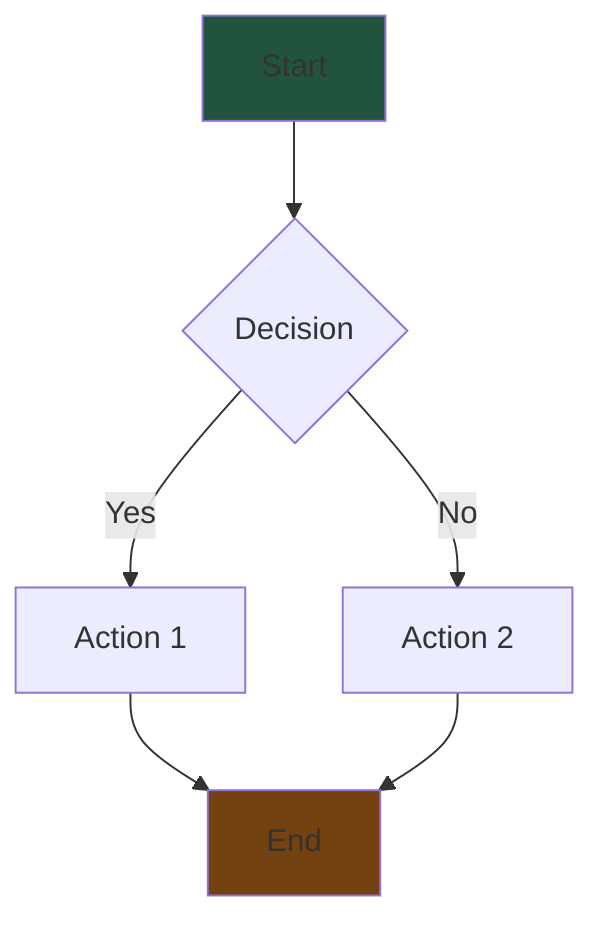

# Quick Start: Adding Content to UE5 Knowledge Base

> A step-by-step guide for adding new content to the knowledge base.

---

## Content Type Decision Tree

```
What are you adding?
        │
        ├─► Written guide/tutorial?
        │         │
        │         └─► Add a TOPIC (Markdown)
        │
        ├─► Visual flowchart/diagram?
        │         │
        │         └─► Add a DIAGRAM (Mermaid)
        │
        ├─► Reusable code snippet?
        │         │
        │         └─► Add a LEGO PIECE (TypeScript)
        │
        └─► Complex HTML document?
                  │
                  └─► Add a COLLECTION (HTML)
```

---

## Adding a Topic (5 minutes)

### Step 1: Create the markdown file
```bash
# Create file in public/content/
touch public/content/11-your-topic-name.md
```

### Step 2: Write your content
```markdown
# Your Topic Title

> Brief one-line summary that appears on cards

## Section 1

Your content here with **bold**, `code`, and lists:

- Item 1
- Item 2

## Code Examples

\`\`\`cpp
void AMyClass::MyFunction()
{
    // Your code here
}
\`\`\`

## Section 2

More content...
```

### Step 3: Register in content-index.ts
```typescript
// In src/data/content-index.ts, add to topics array:
{
  id: 'topic-11',
  slug: 'your-topic-name',                    // URL-friendly
  title: 'Your Topic Title',
  type: 'topic',
  category: 'core-systems',                   // or: architecture, control, design
  tags: ['Combat', 'GAS'],                    // Existing tags from tags.ts
  summary: 'Brief one-line summary that appears on cards',
  content: '',
  sourcePath: '11-your-topic-name.md',
  relatedItems: ['topic-02', 'diagram-01'],   // Related content IDs
}
```

---

## Adding a Diagram (3 minutes)

### Step 1: Create the mermaid file
```bash
touch public/content/YourDiagramName.mermaid
```

### Step 2: Write mermaid syntax


### Step 3: Register in content-index.ts
```typescript
// In src/data/content-index.ts, add to diagrams array:
{
  id: 'diagram-15',
  slug: 'your-diagram-name',
  title: 'Your Diagram Title',
  type: 'diagram',
  category: 'core-systems',
  tags: ['GAS', 'Combat'],
  summary: 'What this diagram shows',
  mermaidSource: '',
  sourcePath: 'YourDiagramName.mermaid',
  relatedTopics: ['topic-02'],
}
```

---

## Adding a New Tag (1 minute)

```typescript
// In src/data/tags.ts, add to tagColors:
export const tagColors: Record<string, string> = {
  // ... existing tags
  'YourNewTag': '#38bdf8',    // Pick a hex color
};
```

**Color suggestions:**
- Blues: `#38bdf8`, `#3b82f6`, `#0284c7`
- Purples: `#a78bfa`, `#8b5cf6`, `#7c3aed`
- Greens: `#4ade80`, `#22c55e`, `#84cc16`
- Reds: `#f87171`, `#ef4444`, `#dc2626`
- Yellows: `#fbbf24`, `#eab308`

---

## Testing Your Changes

```bash
# Start dev server
npm run dev

# Navigate to your content
# Topics:   http://localhost:5173/topic/your-topic-name
# Diagrams: http://localhost:5173/diagram/your-diagram-name

# Run tests
npm test -- --run
```

---

## Common Mistakes

❌ **Wrong:** Forgetting to add `sourcePath`
```typescript
{
  id: 'topic-11',
  // Missing sourcePath - content won't load!
}
```

✅ **Right:** Include all required fields
```typescript
{
  id: 'topic-11',
  sourcePath: '11-your-topic-name.md',
  // ...
}
```

---

❌ **Wrong:** Using tags not in tags.ts
```typescript
tags: ['MyNewTag'],  // Will render gray
```

✅ **Right:** Add new tags to tags.ts first
```typescript
// tags.ts
'MyNewTag': '#38bdf8',

// content-index.ts
tags: ['MyNewTag'],  // Now has color!
```

---

❌ **Wrong:** Spaces in slug
```typescript
slug: 'my topic name',  // Will break URLs
```

✅ **Right:** Use hyphens
```typescript
slug: 'my-topic-name',
```

---

## File Locations Quick Reference

| What | Where |
|------|-------|
| Markdown topics | `public/content/*.md` |
| Mermaid diagrams | `public/content/*.mermaid` |
| HTML collections | `public/content/FolderName/*.html` |
| Content registry | `src/data/content-index.ts` |
| Tag colors | `src/data/tags.ts` |
| Type definitions | `src/types/content.ts` |

---

## Need Help?

1. Check existing content for examples
2. Read `ARCHITECTURE.md` for detailed docs
3. Read `FLOW.md` for data flow diagrams
