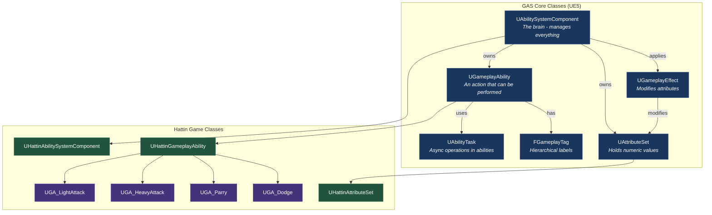
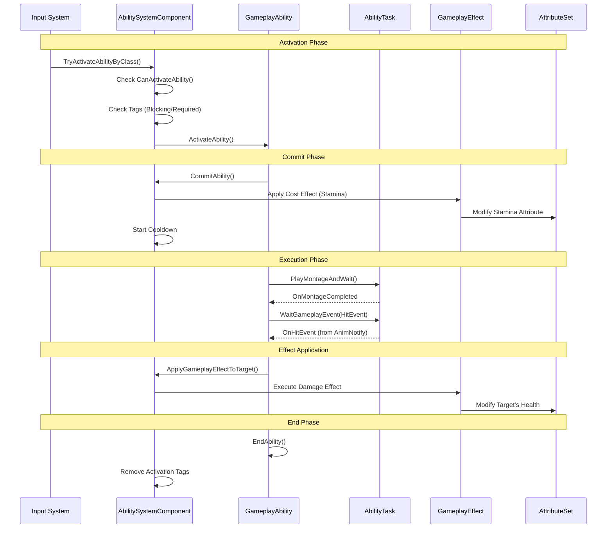
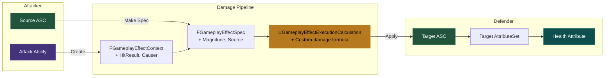
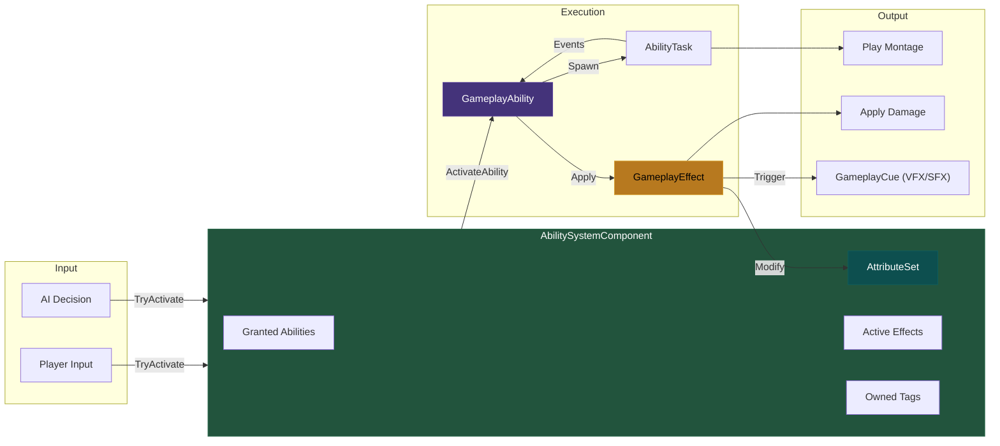
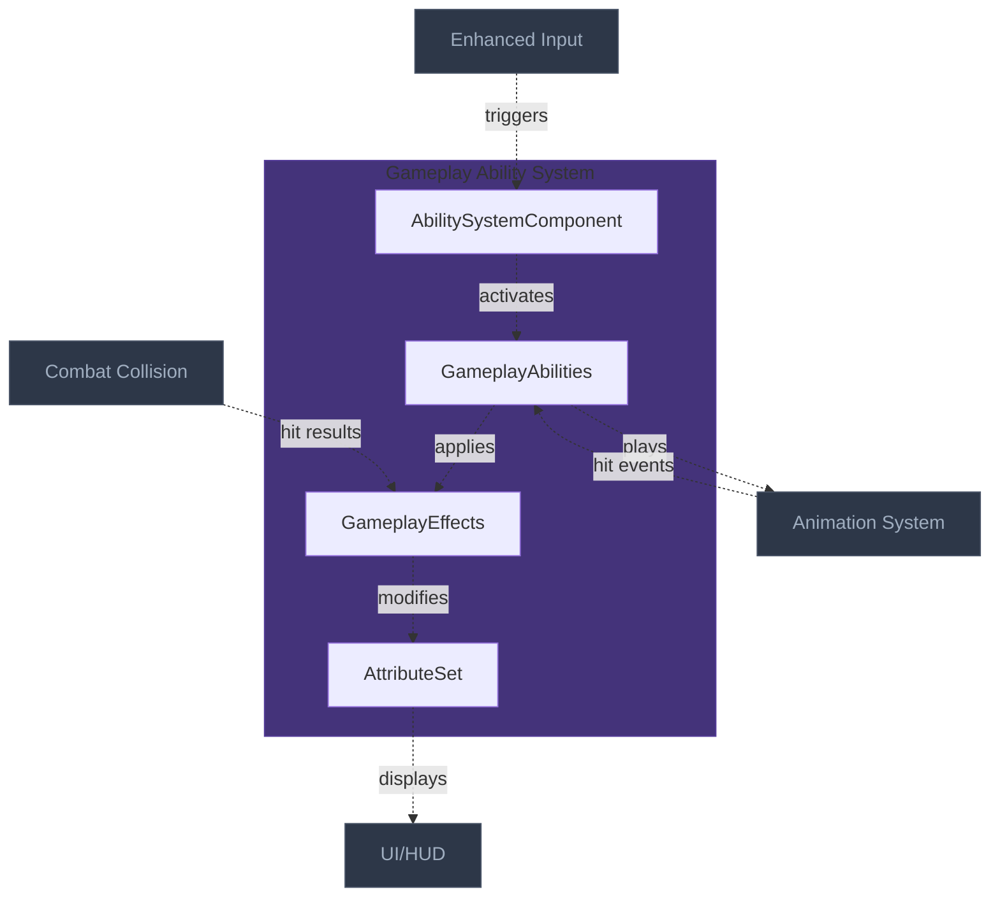

# Gameplay Ability System (GAS) Architecture
> The ability and attribute framework that powers all combat actions — 
> attacks, blocks, dodges, and special moves all flow through GAS for consistent,
> replicable, and data-driven gameplay.

---

## 1. System Overview

The Gameplay Ability System (GAS) solves the problem of implementing complex, replicable gameplay actions with costs, cooldowns, and effects. Rather than writing custom systems for each ability, GAS provides a unified framework that handles activation, prediction, replication, and effect application.

For combat games, GAS is essential because it provides out-of-the-box support for: ability costs (stamina drain), cooldowns, ability blocking/cancellation via tags, and a pipeline for applying damage through GameplayEffects rather than direct value manipulation.

For Hattin specifically, every combat action is a GameplayAbility: light attacks, heavy attacks, parries, dodges, and special moves. Attributes (Health, Stamina, Poise) drive the combat math. GameplayEffects handle damage, buffs, and debuffs. GameplayTags control what can interrupt what.

---

## 2. Core Architecture Diagram

### 2.1 GAS Core Component Relationships



### 2.2 Ability Activation Flow



### 2.3 Gameplay Tag Hierarchy for Hattin

```mermaid
flowchart TD
    subgraph ABILITY["🗡️ Ability Tags"]
        A["Ability"] --> AC["Ability.Combat"]
        AC --> ACA["Attack"]
        AC --> ACD["Defend"]
        AC --> ACM["Movement"]
        ACA --> ACAL["Attack.Light"]
        ACA --> ACAH["Attack.Heavy"]
        ACD --> ACDP["Defend.Parry"]
        ACD --> ACDB["Defend.Block"]
        ACM --> ACMD["Movement.Dodge"]
    end

    style A fill:#44337a,stroke:#553c9a,color:#fff
    style AC fill:#553c9a,stroke:#6b46c1,color:#fff
    

```

```mermaid
flowchart TD
    subgraph STATE["⚔️ State Tags"]
        S["State"] --> SC["State.Combat"]
        SC --> SCA["Combat.Attacking"]
        SC --> SCR["Combat.Recovering"]
        SC --> SCI["Combat.Invincible"]
        SC --> SCS["Combat.Staggered"]
    end

    style S fill:#744210,stroke:#975a16,color:#fff
    style SC fill:#975a16,stroke:#b7791f,color:#fff
    

```

```mermaid
flowchart TD
    subgraph EFFECT["✨ Effect Tags"]
        E["Effect"] --> ED["Effect.Damage"]
        E --> EB["Effect.Buff"]
        E --> EDe["Effect.Debuff"]
        ED --> EDP["Damage.Physical"]
        ED --> EDF["Damage.Fire"]
        EB --> EBA["Buff.AttackPower"]
        EDe --> EDeP["Debuff.Poison"]
    end

    style E fill:#0d4f4f,stroke:#0f5e5e,color:#fff
    style ED fill:#0f5e5e,stroke:#14b8a6,color:#fff
    

```







### 2.4 Damage Pipeline Flow



---

## 3. Component Specifications

### 3.1 UHattinAttributeSet

**UE Base**: `UAttributeSet` | **Your Class**: `UHattinAttributeSet`

**Purpose**: Holds all combat-relevant attributes for characters

```cpp
UCLASS()
class HATTIN_API UHattinAttributeSet : public UAttributeSet
{
    GENERATED_BODY()
    
public:
    UHattinAttributeSet();
    
    // Replication
    virtual void GetLifetimeReplicatedProps(TArray<FLifetimeProperty>& OutLifetimeProps) const override;
    
    // Attribute change callbacks
    virtual void PreAttributeChange(const FGameplayAttribute& Attribute, float& NewValue) override;
    virtual void PostGameplayEffectExecute(const FGameplayEffectModCallbackData& Data) override;
    
    // ============================================
    // VITAL ATTRIBUTES
    // ============================================
    
    UPROPERTY(BlueprintReadOnly, ReplicatedUsing = OnRep_Health, Category = "Vital")
    FGameplayAttributeData Health;
    ATTRIBUTE_ACCESSORS(UHattinAttributeSet, Health)
    
    UPROPERTY(BlueprintReadOnly, ReplicatedUsing = OnRep_MaxHealth, Category = "Vital")
    FGameplayAttributeData MaxHealth;
    ATTRIBUTE_ACCESSORS(UHattinAttributeSet, MaxHealth)
    
    UPROPERTY(BlueprintReadOnly, ReplicatedUsing = OnRep_Stamina, Category = "Vital")
    FGameplayAttributeData Stamina;
    ATTRIBUTE_ACCESSORS(UHattinAttributeSet, Stamina)
    
    UPROPERTY(BlueprintReadOnly, ReplicatedUsing = OnRep_MaxStamina, Category = "Vital")
    FGameplayAttributeData MaxStamina;
    ATTRIBUTE_ACCESSORS(UHattinAttributeSet, MaxStamina)
    
    // ============================================
    // COMBAT ATTRIBUTES
    // ============================================
    
    UPROPERTY(BlueprintReadOnly, ReplicatedUsing = OnRep_Poise, Category = "Combat")
    FGameplayAttributeData Poise;
    ATTRIBUTE_ACCESSORS(UHattinAttributeSet, Poise)
    
    UPROPERTY(BlueprintReadOnly, ReplicatedUsing = OnRep_MaxPoise, Category = "Combat")
    FGameplayAttributeData MaxPoise;
    ATTRIBUTE_ACCESSORS(UHattinAttributeSet, MaxPoise)
    
    UPROPERTY(BlueprintReadOnly, ReplicatedUsing = OnRep_AttackPower, Category = "Combat")
    FGameplayAttributeData AttackPower;
    ATTRIBUTE_ACCESSORS(UHattinAttributeSet, AttackPower)
    
    UPROPERTY(BlueprintReadOnly, ReplicatedUsing = OnRep_Defense, Category = "Combat")
    FGameplayAttributeData Defense;
    ATTRIBUTE_ACCESSORS(UHattinAttributeSet, Defense)
    
    // ============================================
    // META ATTRIBUTES (not replicated, used in calculations)
    // ============================================
    
    UPROPERTY(BlueprintReadOnly, Category = "Meta")
    FGameplayAttributeData IncomingDamage;
    ATTRIBUTE_ACCESSORS(UHattinAttributeSet, IncomingDamage)
    
protected:
    UFUNCTION()
    void OnRep_Health(const FGameplayAttributeData& OldHealth);
    
    UFUNCTION()
    void OnRep_MaxHealth(const FGameplayAttributeData& OldMaxHealth);
    
    // ... similar OnRep functions for other attributes
    
    // Clamp values
    void ClampAttributes(const FGameplayAttribute& Attribute, float& NewValue);
};
```

### 3.2 UHattinGameplayAbility (Base Class)

**UE Base**: `UGameplayAbility` | **Your Class**: `UHattinGameplayAbility`

**Purpose**: Base class for all Hattin abilities with common combat functionality

```cpp
UCLASS(Abstract)
class HATTIN_API UHattinGameplayAbility : public UGameplayAbility
{
    GENERATED_BODY()
    
public:
    UHattinGameplayAbility();
    
    // Activation
    virtual bool CanActivateAbility(const FGameplayAbilitySpecHandle Handle,
        const FGameplayAbilityActorInfo* ActorInfo,
        const FGameplayTagContainer* SourceTags,
        const FGameplayTagContainer* TargetTags,
        FGameplayTagContainer* OptionalRelevantTags) const override;
    
    // Get typed avatar
    UFUNCTION(BlueprintCallable, Category = "Hattin|Ability")
    AHattinCharacterBase* GetHattinCharacterFromActorInfo() const;
    
    // Get animation instance
    UFUNCTION(BlueprintCallable, Category = "Hattin|Ability")
    UHattinAnimInstance* GetHattinAnimInstance() const;
    
protected:
    // Activation policy
    UPROPERTY(EditDefaultsOnly, BlueprintReadOnly, Category = "Hattin|Ability")
    EHattinAbilityActivationPolicy ActivationPolicy;
    
    // Cost and cooldown effects
    UPROPERTY(EditDefaultsOnly, BlueprintReadOnly, Category = "Hattin|Ability")
    TSubclassOf<UGameplayEffect> CostGameplayEffectClass;
    
    UPROPERTY(EditDefaultsOnly, BlueprintReadOnly, Category = "Hattin|Ability")
    TSubclassOf<UGameplayEffect> CooldownGameplayEffectClass;
    
    // Animation montage for this ability
    UPROPERTY(EditDefaultsOnly, BlueprintReadOnly, Category = "Hattin|Animation")
    TObjectPtr<UAnimMontage> AbilityMontage;
    
    // Gameplay cue tags for visual/audio feedback
    UPROPERTY(EditDefaultsOnly, BlueprintReadOnly, Category = "Hattin|Cues")
    FGameplayTag ActivationCueTag;
    
    // Helper: Play montage and wait for events
    UFUNCTION(BlueprintCallable, Category = "Hattin|Ability")
    UAbilityTask_PlayMontageAndWait* PlayAbilityMontage(FName StartSection = NAME_None);
};
```

### 3.3 Combat Ability Example: UGA_LightAttack

**UE Base**: `UHattinGameplayAbility` | **Your Class**: `UGA_LightAttack`

```cpp
UCLASS()
class HATTIN_API UGA_LightAttack : public UHattinGameplayAbility
{
    GENERATED_BODY()
    
public:
    UGA_LightAttack();
    
    virtual void ActivateAbility(
        const FGameplayAbilitySpecHandle Handle,
        const FGameplayAbilityActorInfo* ActorInfo,
        const FGameplayAbilityActivationInfo ActivationInfo,
        const FGameplayEventData* TriggerEventData) override;
    
protected:
    // Damage effect to apply on hit
    UPROPERTY(EditDefaultsOnly, Category = "Damage")
    TSubclassOf<UGameplayEffect> DamageEffect;
    
    // Combo data
    UPROPERTY(EditDefaultsOnly, Category = "Combo")
    int32 ComboIndex = 0;
    
    UPROPERTY(EditDefaultsOnly, Category = "Combo")
    FName NextComboSection;
    
    // Event handlers
    UFUNCTION()
    void OnMontageCompleted();
    
    UFUNCTION()
    void OnMontageCancelled();
    
    UFUNCTION()
    void OnHitEventReceived(FGameplayEventData Payload);
    
private:
    // Apply damage to hit target
    void ApplyDamageToTarget(AActor* Target, const FHitResult& HitResult);
};

// Implementation
void UGA_LightAttack::ActivateAbility(...)
{
    if (!CommitAbility(Handle, ActorInfo, ActivationInfo))
    {
        EndAbility(Handle, ActorInfo, ActivationInfo, true, true);
        return;
    }
    
    // Play montage
    UAbilityTask_PlayMontageAndWait* MontageTask = PlayAbilityMontage();
    MontageTask->OnCompleted.AddDynamic(this, &UGA_LightAttack::OnMontageCompleted);
    MontageTask->OnCancelled.AddDynamic(this, &UGA_LightAttack::OnMontageCancelled);
    MontageTask->ReadyForActivation();
    
    // Wait for hit event from AnimNotify
    UAbilityTask_WaitGameplayEvent* HitTask = UAbilityTask_WaitGameplayEvent::WaitGameplayEvent(
        this, 
        FGameplayTag::RequestGameplayTag(TEXT("Event.Combat.Hit")));
    HitTask->EventReceived.AddDynamic(this, &UGA_LightAttack::OnHitEventReceived);
    HitTask->ReadyForActivation();
}
```

### 3.4 GameplayEffect: GE_Damage

**Purpose**: Base damage effect using execution calculation

```cpp
// GE_Damage.h - Configured in Blueprint/Editor
// Duration Policy: Instant
// Modifiers: None (handled by execution)
// Executions: UHattinDamageExecution

UCLASS()
class HATTIN_API UHattinDamageExecution : public UGameplayEffectExecutionCalculation
{
    GENERATED_BODY()
    
public:
    UHattinDamageExecution();
    
    virtual void Execute_Implementation(
        const FGameplayEffectCustomExecutionParameters& ExecutionParams,
        FGameplayEffectCustomExecutionOutput& OutExecutionOutput) const override;
};

// Implementation
void UHattinDamageExecution::Execute_Implementation(...) const
{
    // Capture attributes
    float SourceAttack = 0.f;
    float TargetDefense = 0.f;
    float BaseDamage = 0.f;
    
    ExecutionParams.AttemptCalculateCapturedAttributeMagnitude(
        SourceAttackDef, FAggregatorEvaluateParameters(), SourceAttack);
    ExecutionParams.AttemptCalculateCapturedAttributeMagnitude(
        TargetDefenseDef, FAggregatorEvaluateParameters(), TargetDefense);
    
    // Get base damage from SetByCaller
    const FGameplayEffectSpec& Spec = ExecutionParams.GetOwningSpec();
    BaseDamage = Spec.GetSetByCallerMagnitude(
        FGameplayTag::RequestGameplayTag(TEXT("Data.Damage")), false, 0.f);
    
    // Calculate final damage
    float FinalDamage = (BaseDamage + SourceAttack) * (100.f / (100.f + TargetDefense));
    FinalDamage = FMath::Max(FinalDamage, 0.f);
    
    // Output to IncomingDamage (meta attribute handles final application)
    if (FinalDamage > 0.f)
    {
        OutExecutionOutput.AddOutputModifier(
            FGameplayModifierEvaluatedData(
                UHattinAttributeSet::GetIncomingDamageAttribute(),
                EGameplayModOp::Additive,
                FinalDamage));
    }
}
```

### 3.5 GameplayEffect: GE_StaminaCost_Light

**Purpose**: Stamina cost for light attack (configured as Cost on ability)

| Property | Value |
|----------|-------|
| Duration Policy | Instant |
| Modifier | Stamina: -15 (Additive) |
| Application Requirements | Stamina >= 15 |

### 3.6 Common AbilityTasks for Combat

| Task | Purpose | Usage |
|------|---------|-------|
| `PlayMontageAndWait` | Play animation, wait for completion/cancellation | Core of all combat abilities |
| `WaitGameplayEvent` | Wait for event from AnimNotify (hit window) | Trigger damage application |
| `WaitInputRelease` | Detect hold vs tap for heavy attacks | Charge attacks |
| `WaitDelay` | Timer during ability | Recovery frames |
| `WaitTargetData` | Get targeting information | Aimed abilities |

---

## 4. External Interfaces

### Inputs From Other Systems

| Source System | What It Provides | Interface Point |
|--------------|------------------|-----------------|
| Enhanced Input | Ability activation triggers | Input → ASC::TryActivateAbility |
| Animation System | Hit window events via AnimNotify | AnimNotify → ASC::HandleGameplayEvent |
| Combat Collision | Hit results from traces | HitResult → GameplayEffectContext |
| Data System | Weapon damage values | DataAsset → SetByCaller magnitude |

### Outputs To Other Systems

| Target System | What This Provides | Interface Point |
|--------------|---------------------|-----------------|
| Animation System | Montage playback | AbilityTask_PlayMontageAndWait |
| UI/HUD | Attribute values, cooldowns | ASC delegates, Attribute delegates |
| Combat Component | Ability state (attacking, recovering) | Gameplay Tags |
| AI System | Can-be-interrupted state | Gameplay Tags queries |

---

## 5. Data Flow Diagram



---

## 6. Implementation Patterns

### Pattern: Tag-Based Ability Blocking

**Problem**: Light attacks shouldn't activate while already attacking; dodge should cancel attacks

**Solution**: Use `AbilityTags`, `BlockAbilitiesWithTag`, and `CancelAbilitiesWithTag`

```cpp
// In GA_LightAttack constructor
AbilityTags.AddTag(FGameplayTag::RequestGameplayTag("Ability.Combat.Attack"));
ActivationOwnedTags.AddTag(FGameplayTag::RequestGameplayTag("State.Combat.Attacking"));
BlockAbilitiesWithTag.AddTag(FGameplayTag::RequestGameplayTag("Ability.Combat.Attack"));

// Dodge can cancel attacks
// In GA_Dodge constructor
CancelAbilitiesWithTag.AddTag(FGameplayTag::RequestGameplayTag("Ability.Combat.Attack"));
```

### Pattern: Effect-Based Damage Pipeline

**Problem**: Need consistent damage application with modifiers

**Solution**: Never modify Health directly. Always apply GameplayEffect with Execution.

```cpp
// WRONG - bypasses GAS
Target->Health -= Damage;

// CORRECT - uses damage pipeline
FGameplayEffectSpecHandle SpecHandle = ASC->MakeOutgoingSpec(DamageEffectClass, 1, Context);
SpecHandle.Data->SetSetByCallerMagnitude(DamageTag, BaseDamage);
ASC->ApplyGameplayEffectSpecToTarget(*SpecHandle.Data.Get(), TargetASC);
```

### Pattern: Montage-Driven Abilities

**Problem**: Combat timing must match animations exactly

**Solution**: Use `PlayMontageAndWait` + `WaitGameplayEvent` from AnimNotify

```cpp
void UGA_LightAttack::ActivateAbility(...)
{
    // Montage controls timing
    UAbilityTask_PlayMontageAndWait* MontageTask = PlayAbilityMontage();
    
    // AnimNotify sends event when hit window is active
    UAbilityTask_WaitGameplayEvent* HitTask = WaitGameplayEvent(HitEventTag);
    HitTask->EventReceived.AddDynamic(this, &ThisClass::OnHit);
}
```

### Pattern: Attribute Clamping

**Problem**: Health can go negative, stamina can exceed max

**Solution**: Clamp in `PreAttributeChange` and handle death in `PostGameplayEffectExecute`

```cpp
void UHattinAttributeSet::PreAttributeChange(const FGameplayAttribute& Attribute, float& NewValue)
{
    Super::PreAttributeChange(Attribute, NewValue);
    
    if (Attribute == GetHealthAttribute())
    {
        NewValue = FMath::Clamp(NewValue, 0.f, GetMaxHealth());
    }
    else if (Attribute == GetStaminaAttribute())
    {
        NewValue = FMath::Clamp(NewValue, 0.f, GetMaxStamina());
    }
}

void UHattinAttributeSet::PostGameplayEffectExecute(const FGameplayEffectModCallbackData& Data)
{
    // Handle IncomingDamage meta attribute
    if (Data.EvaluatedData.Attribute == GetIncomingDamageAttribute())
    {
        float LocalDamage = GetIncomingDamage();
        SetIncomingDamage(0.f); // Reset meta attribute
        SetHealth(GetHealth() - LocalDamage);
        
        if (GetHealth() <= 0.f)
        {
            // Broadcast death event
            if (AHattinCharacterBase* Character = Cast<AHattinCharacterBase>(GetOwningActor()))
            {
                Character->OnDeath();
            }
        }
    }
}
```

### Anti-Patterns to Avoid

| Anti-Pattern | Problem | Solution |
|-------------|---------|----------|
| **Bypassing GAS for damage** | Inconsistent, no modifiers, no replication | Always use GameplayEffects |
| **Hardcoding ability logic** | Can't tune without code changes | Use DataAssets + SetByCaller |
| **Ignoring ability instancing** | Shared state between activations | Set proper InstancingPolicy |
| **Tight coupling to character class** | Abilities only work on one type | Use `GetAvatarActorFromActorInfo()` + interfaces |
| **Forgetting CommitAbility** | Costs/cooldowns not applied | Always call CommitAbility early |

---

## 7. Quick Reference Card

| Concept | UE5 Class | Hattin Class/Asset | Location |
|---------|-----------|-------------------|----------|
| Ability System | `UAbilitySystemComponent` | `UHattinAbilitySystemComponent` | `/Source/Hattin/GAS/` |
| Attribute Set | `UAttributeSet` | `UHattinAttributeSet` | `/Source/Hattin/GAS/` |
| Base Ability | `UGameplayAbility` | `UHattinGameplayAbility` | `/Source/Hattin/GAS/Abilities/` |
| Light Attack | `UGameplayAbility` | `UGA_LightAttack` | `/Source/Hattin/GAS/Abilities/` |
| Heavy Attack | `UGameplayAbility` | `UGA_HeavyAttack` | `/Source/Hattin/GAS/Abilities/` |
| Parry | `UGameplayAbility` | `UGA_Parry` | `/Source/Hattin/GAS/Abilities/` |
| Dodge | `UGameplayAbility` | `UGA_Dodge` | `/Source/Hattin/GAS/Abilities/` |
| Damage Effect | `UGameplayEffect` | `GE_Damage` | `/Content/Hattin/GAS/Effects/` |
| Damage Calc | `UGameplayEffectExecutionCalculation` | `UHattinDamageExecution` | `/Source/Hattin/GAS/` |
| Tags | — | `DefaultGameplayTags.ini` | `/Config/` |

---

## 8. Connections Map (Compact)



---

## Summary

The Gameplay Ability System architecture establishes:

1. **AbilitySystemComponent**: Central manager on Character/PlayerState that owns abilities, attributes, and effects

2. **AttributeSet**: Defines Health, Stamina, Poise, AttackPower, Defense with proper replication and clamping

3. **GameplayAbilities**: All combat actions are abilities with costs, cooldowns, and tag-based blocking

4. **GameplayEffects**: All attribute modifications flow through effects, never direct manipulation

5. **AbilityTasks**: Async operations (montage playback, event waiting) enable complex multi-frame abilities

6. **GameplayTags**: Hierarchical labeling system controls activation, blocking, and state queries

7. **Damage Pipeline**: Source → Effect → Execution → Meta Attribute → Final Health modification

This architecture ensures combat is data-driven, network-ready, and easily extensible.
