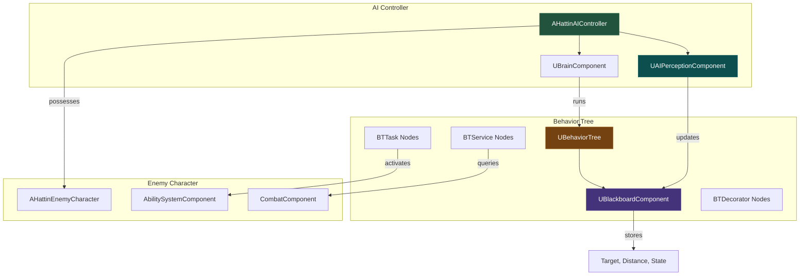
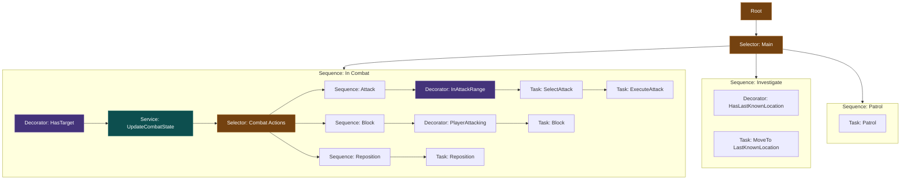
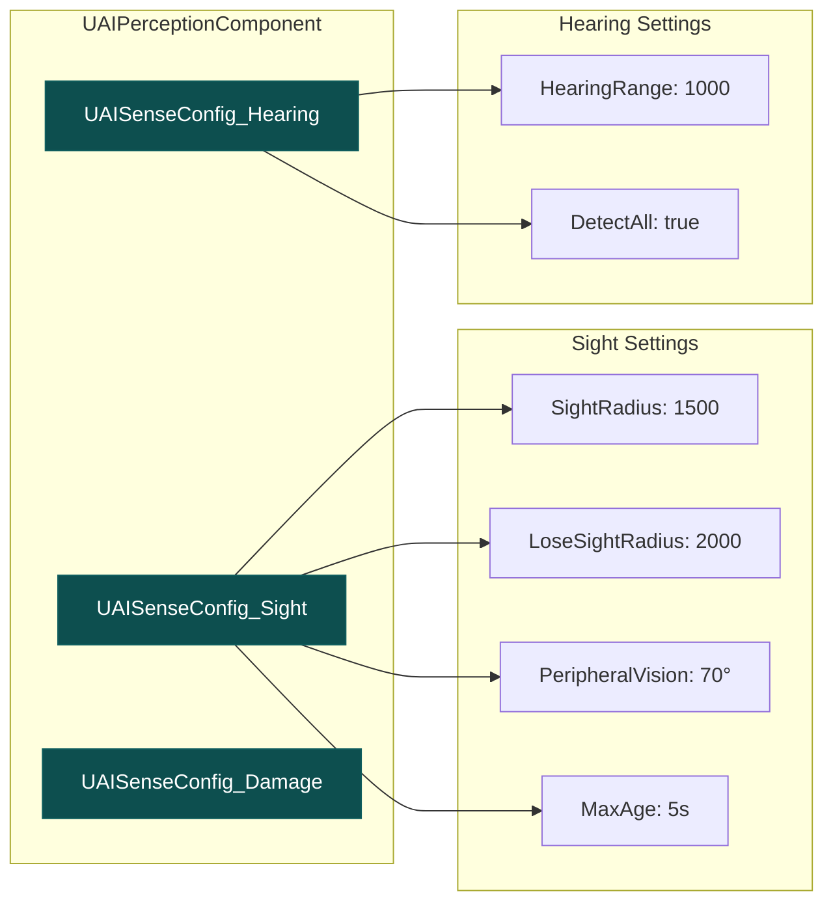
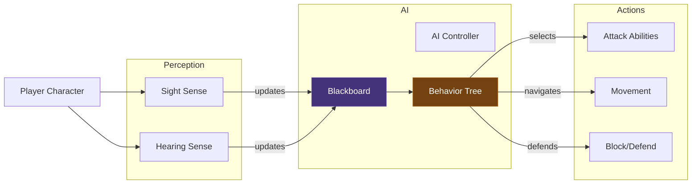
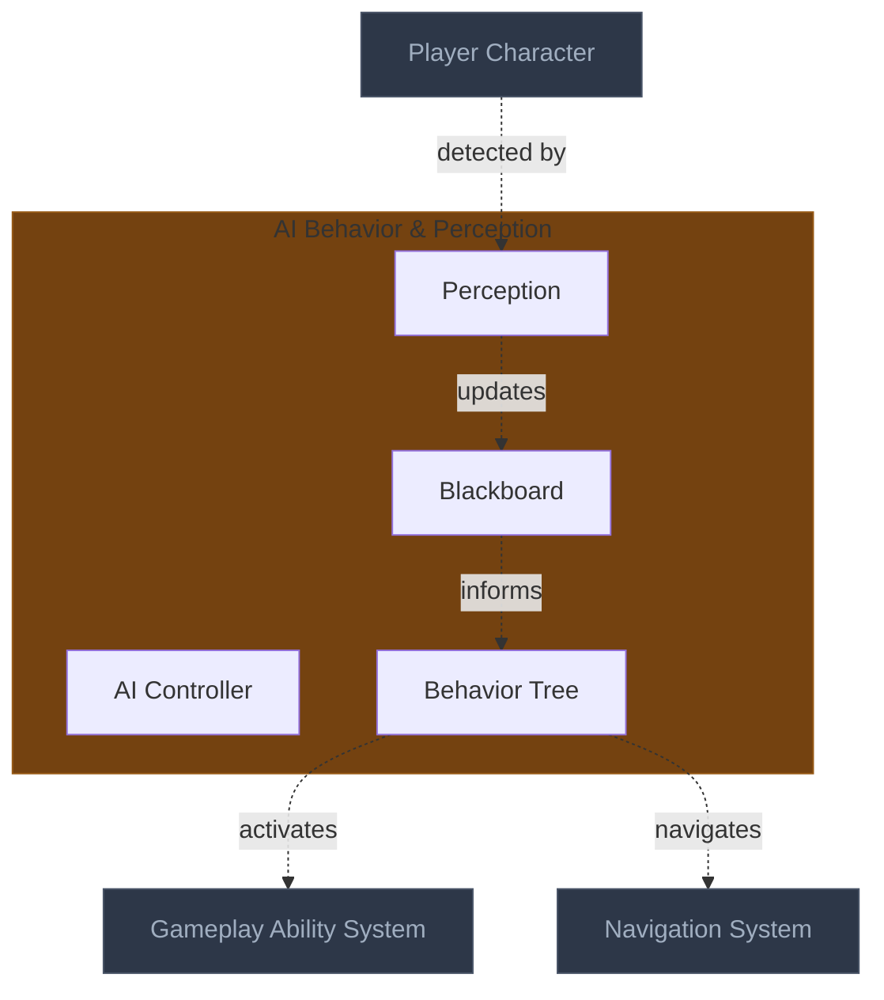

# AI Behavior Tree & Perception Architecture
> The decision-making system for enemy AI — using Behavior Trees for action selection
> and AI Perception for detecting the player, creating reactive, intelligent opponents.

---

## 1. System Overview

The AI system solves the problem of creating believable enemy combatants that react to player actions, make tactical decisions, and coordinate in groups. Behavior Trees provide a hierarchical, modular approach to AI decision-making that's easier to debug and extend than state machines.

AI Perception provides a unified way for AI to detect stimuli (sight, hearing, damage) without hard-coding detection logic. Combined with Blackboard data storage, the AI can remember information and make decisions based on what it knows.

For Hattin specifically, enemies must: detect the player through sight and hearing, select appropriate attacks based on range and player state, coordinate attacks in groups (limiting simultaneous attackers), and react to player actions (block when player attacks, back off when player parries).

---

## 2. Core Architecture Diagram

### 2.1 AI System Overview



### 2.2 Behavior Tree Structure



### 2.3 Perception Configuration



---

## 3. Component Specifications

### 3.1 AHattinAIController

**UE Base**: `AAIController` | **Your Class**: `AHattinAIController`

```cpp
UCLASS()
class HATTIN_API AHattinAIController : public AAIController
{
    GENERATED_BODY()
    
public:
    AHattinAIController();
    
    virtual void OnPossess(APawn* InPawn) override;
    virtual void OnUnPossess() override;
    
protected:
    UPROPERTY(EditDefaultsOnly, Category = "AI")
    TObjectPtr<UBehaviorTree> CombatBehaviorTree;
    
    UPROPERTY(EditDefaultsOnly, Category = "AI")
    TObjectPtr<UBlackboardData> CombatBlackboard;
    
    UPROPERTY(VisibleAnywhere, Category = "AI")
    TObjectPtr<UAIPerceptionComponent> PerceptionComponent;
    
    UFUNCTION()
    void OnTargetPerceptionUpdated(AActor* Actor, FAIStimulus Stimulus);
    
private:
    void SetupPerception();
    void UpdateBlackboardTarget(AActor* Target);
};
```

### 3.2 Blackboard Keys

| Key Name | Type | Purpose |
|----------|------|---------|
| TargetActor | Object (AActor) | Current combat target |
| CanSeeTarget | Bool | Perception sight status |
| DistanceToTarget | Float | Calculated by service |
| PlayerCombatState | Enum | Idle/Attacking/Recovering/Blocking |
| SelfCombatState | Enum | AI's current state |
| LastKnownLocation | Vector | Where target was last seen |
| AttackToken | Bool | Has permission to attack |

### 3.3 Custom BT Nodes

**BTTask_SelectAttack**
```cpp
UCLASS()
class HATTIN_API UBTTask_SelectAttack : public UBTTaskNode
{
    GENERATED_BODY()
    
public:
    virtual EBTNodeResult::Type ExecuteTask(UBehaviorTreeComponent& OwnerComp, uint8* NodeMemory) override;
    
protected:
    UPROPERTY(EditAnywhere, Category = "Attack")
    FBlackboardKeySelector SelectedAttackKey;
};
```

**BTService_UpdateCombatState**
```cpp
UCLASS()
class HATTIN_API UBTService_UpdateCombatState : public UBTService
{
    GENERATED_BODY()
    
public:
    UBTService_UpdateCombatState();
    
protected:
    virtual void TickNode(UBehaviorTreeComponent& OwnerComp, uint8* NodeMemory, float DeltaSeconds) override;
    
    UPROPERTY(EditAnywhere, Category = "Blackboard")
    FBlackboardKeySelector DistanceKey;
    
    UPROPERTY(EditAnywhere, Category = "Blackboard")
    FBlackboardKeySelector PlayerStateKey;
};
```

**BTDecorator_InAttackRange**
```cpp
UCLASS()
class HATTIN_API UBTDecorator_InAttackRange : public UBTDecorator
{
    GENERATED_BODY()
    
protected:
    virtual bool CalculateRawConditionValue(UBehaviorTreeComponent& OwnerComp, uint8* NodeMemory) const override;
    
    UPROPERTY(EditAnywhere, Category = "Range")
    float AttackRange = 200.f;
    
    UPROPERTY(EditAnywhere, Category = "Blackboard")
    FBlackboardKeySelector DistanceKey;
};
```

---

## 4. External Interfaces

### Inputs From Other Systems

| Source System | What It Provides | Interface Point |
|--------------|------------------|-----------------|
| Player Character | Position, combat state | Perception + Tag queries |
| Combat Component | Attack availability | Service reads combat state |
| Group Coordinator | Attack tokens | Blackboard key |

### Outputs To Other Systems

| Target System | What This Provides | Interface Point |
|--------------|---------------------|-----------------|
| GAS | Ability activation | BTTask calls TryActivateAbility |
| Character Movement | Navigation requests | MoveTo tasks |
| Animation | Combat state for AnimBP | Via character state |

---

## 5. Data Flow Diagram



---

## 6. Implementation Patterns

### Pattern: Perception-Driven State Transitions

**Problem**: AI needs to switch from patrol to combat when player detected

**Solution**: Perception component fires event, updates Blackboard, BT reacts

```cpp
void AHattinAIController::OnTargetPerceptionUpdated(AActor* Actor, FAIStimulus Stimulus)
{
    if (Stimulus.WasSuccessfullySensed())
    {
        Blackboard->SetValueAsObject(TEXT("TargetActor"), Actor);
        Blackboard->SetValueAsBool(TEXT("CanSeeTarget"), true);
    }
    else
    {
        Blackboard->SetValueAsVector(TEXT("LastKnownLocation"), Actor->GetActorLocation());
        Blackboard->SetValueAsBool(TEXT("CanSeeTarget"), false);
    }
}
```

### Pattern: Group Attack Coordination

**Problem**: All enemies attacking simultaneously looks bad and is unfair

**Solution**: Token system limits concurrent attackers

```cpp
// Group coordinator grants tokens
bool UHattinGroupCoordinator::RequestAttackToken(AHattinAIController* Requester)
{
    if (ActiveAttackers.Num() < MaxConcurrentAttackers)
    {
        ActiveAttackers.Add(Requester);
        Requester->GetBlackboard()->SetValueAsBool(TEXT("AttackToken"), true);
        return true;
    }
    return false;
}
```

### Anti-Patterns to Avoid

| Anti-Pattern | Problem | Solution |
|-------------|---------|----------|
| **Tick-based logic** | Performance, hard to debug | Use BT services with intervals |
| **Direct player reference** | Tight coupling | Go through Blackboard |
| **Monolithic BT tasks** | Hard to reuse | Single-responsibility nodes |
| **Hardcoded values** | Can't tune | Use Blackboard keys |

---

## 7. Quick Reference Card

| Concept | UE5 Class | Hattin Class | Location |
|---------|-----------|--------------|----------|
| AI Controller | `AAIController` | `AHattinAIController` | `/Source/Hattin/AI/` |
| Behavior Tree | `UBehaviorTree` | `BT_CombatEnemy` | `/Content/Hattin/AI/` |
| Blackboard | `UBlackboardData` | `BB_Combat` | `/Content/Hattin/AI/` |
| Attack Task | `UBTTaskNode` | `UBTTask_ExecuteAttack` | `/Source/Hattin/AI/Tasks/` |
| Combat Service | `UBTService` | `UBTService_UpdateCombatState` | `/Source/Hattin/AI/Services/` |

---

## 8. Connections Map (Compact)



---

## Summary

The AI Behavior Tree & Perception architecture establishes:

1. **AI Controller**: Owns perception and runs behavior tree
2. **Perception Component**: Sight (1500 units), Hearing (1000 units) detection
3. **Blackboard**: Stores target, distance, player state, attack tokens
4. **Behavior Tree**: Selector-based decision tree (Combat > Investigate > Patrol)
5. **Group Coordination**: Token system limits concurrent attackers

This creates reactive AI that detects players, makes tactical decisions, and coordinates in groups.
