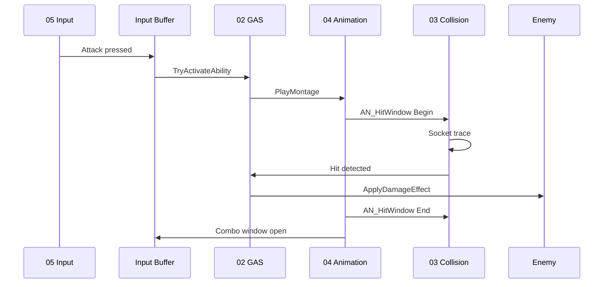

# Hattin UE5 Architecture Bible
## Complete System Reference for Melee Combat Game Development

---

## Overview

This architecture bible documents 10 interconnected systems for building a Ghost of Tsushima-style melee combat game in Unreal Engine 5. Each document provides architectural diagrams, component specifications, implementation patterns, and quick reference cards.

**Project**: Hattin (Battle of Hattin era, 1187 CE)  
**Engine**: Unreal Engine 5  
**Combat Style**: Third-person melee with lock-on targeting

---

## System Documents

| # | System | Key Classes | Primary Purpose |
|---|--------|-------------|-----------------|
| 01 | [Player Character Architecture](01-player-character-architecture.md) | `AHattinPlayerCharacter`, `AHattinCharacterBase` | Character hierarchy, component composition, GAS integration |
| 02 | [Gameplay Ability System](02-gameplay-ability-system.md) | `UAbilitySystemComponent`, `UGameplayAbility`, `UAttributeSet` | Combat abilities, damage pipeline, attribute management |
| 03 | [Combat Collision & Hit Detection](03-combat-collision-hit-detection.md) | `UHattinMeleeTraceComponent`, `UAN_HitWindow` | Socket-based weapon tracing, frame interpolation, parry detection |
| 04 | [Animation Blueprint & Montage](04-animation-blueprint-montage-system.md) | `UHattinAnimInstance`, `UAnimMontage` | State machines, montage slots, AnimNotifies |
| 05 | [Enhanced Input & Buffering](05-enhanced-input-buffering.md) | `UInputAction`, `UHattinInputBufferComponent` | Context-based input, combat input buffering |
| 06 | [AI Behavior Tree & Perception](06-ai-behavior-tree-perception.md) | `AHattinAIController`, `UBehaviorTree`, `UAIPerceptionComponent` | Enemy decision-making, player detection |
| 07 | [Camera System](07-camera-system.md) | `UHattinCameraManager`, `USpringArmComponent` | Lock-on targeting, combat framing, camera effects |
| 08 | [Data-Driven Design](08-data-driven-design.md) | `UHattinWeaponDataAsset`, `UDataTable` | Asset-based configuration, soft references |
| 09 | [Game Framework](09-game-framework.md) | `AHattinGameMode`, `AHattinGameState`, `AHattinPlayerState` | Match flow, spawning, persistent state |
| 10 | [Actor Lifecycle & Components](10-actor-lifecycle-component-pattern.md) | `AActor`, `UActorComponent` | Initialization order, component patterns |

---

## Master Architecture Diagram

```mermaid
flowchart TD
    subgraph CORE["Core Systems"]
        CHAR["01 Player Character"]
        GAS["02 GAS"]
        COLLISION["03 Combat Collision"]
    end
    
    subgraph PRESENTATION["Presentation"]
        ANIM["04 Animation"]
        CAMERA["07 Camera"]
    end
    
    subgraph CONTROL["Control Systems"]
        INPUT["05 Input & Buffer"]
        AI["06 AI Behavior"]
    end
    
    subgraph FOUNDATION["Foundation"]
        DATA["08 Data-Driven"]
        FRAMEWORK["09 Game Framework"]
        LIFECYCLE["10 Actor Lifecycle"]
    end
    
    INPUT -->|"activates"| GAS
    GAS -->|"plays montage"| ANIM
    ANIM -->|"hit windows"| COLLISION
    COLLISION -->|"damage events"| GAS
    
    AI -->|"activates"| GAS
    CAMERA -->|"tracks"| CHAR
    
    DATA -->|"configures"| GAS
    DATA -->|"configures"| CHAR
    FRAMEWORK -->|"spawns"| CHAR
    LIFECYCLE -->|"initializes"| CHAR
    
    style CORE fill:#22543d,stroke:#276749
    style PRESENTATION fill:#44337a,stroke:#553c9a
    style CONTROL fill:#744210,stroke:#975a16
    style FOUNDATION fill:#1a365d,stroke:#2c5282
```



---

## Combat Loop Flow



---

## Key Architectural Decisions

### 1. GAS Owner vs Avatar (System 02)
- **Player**: ASC on PlayerState (persists across respawns)
- **AI**: ASC on Character (destroyed with character)

### 2. Component-First Design (System 01)
- Thin characters, fat components
- `UHattinCombatComponent`, `UHattinEquipmentComponent`, etc.
- Reusable across character types

### 3. Socket-Based Hit Detection (System 03)
- Trace between weapon sockets (Root → Mid → Tip)
- Frame interpolation prevents missed hits at low FPS
- Two-pass detection: ParryBox first, then Hurtbox

### 4. Montage Slots (System 04)
- UpperBody: Attacks while legs move
- FullBody: Dodges, reactions
- Additive: Breathing, flinches

### 5. Input Buffering (System 05)
- 150ms buffer window
- Priority system: Dodge > Parry > Attack
- Executes when recovery ends

### 6. Data-Driven Configuration (System 08)
- Weapon stats in DataAssets
- Attack data in DataTables
- Soft references for async loading

---

## File Structure

```
Source/Hattin/
├── Character/
│   ├── HattinCharacterBase.h/cpp
│   ├── HattinPlayerCharacter.h/cpp
│   └── HattinEnemyCharacter.h/cpp
├── GAS/
│   ├── HattinAbilitySystemComponent.h/cpp
│   ├── HattinAttributeSet.h/cpp
│   ├── Abilities/
│   └── Effects/
├── Combat/
│   ├── HattinCombatComponent.h/cpp
│   ├── HattinMeleeTraceComponent.h/cpp
│   └── HattinEquipmentComponent.h/cpp
├── Animation/
│   ├── HattinAnimInstance.h/cpp
│   └── Notifies/
├── Input/
│   └── HattinInputBufferComponent.h/cpp
├── AI/
│   ├── HattinAIController.h/cpp
│   ├── Tasks/
│   ├── Services/
│   └── Decorators/
├── Camera/
│   └── HattinCameraManager.h/cpp
├── Data/
│   ├── HattinWeaponDataAsset.h/cpp
│   └── HattinEnemyDataAsset.h/cpp
└── Framework/
    ├── HattinGameMode.h/cpp
    ├── HattinGameState.h/cpp
    ├── HattinPlayerState.h/cpp
    └── HattinGameInstance.h/cpp

Content/Hattin/
├── Blueprints/Character/
├── Animation/
│   ├── Montages/
│   └── BlendSpaces/
├── Input/
│   ├── Actions/
│   └── Contexts/
├── AI/
├── Data/
│   ├── Weapons/
│   ├── Enemies/
│   └── Tables/
└── GAS/Effects/
```

---

## Implementation Order

**Phase 1: Foundation**
1. Actor Lifecycle (10) - Understand initialization
2. Game Framework (09) - Setup framework classes
3. Player Character (01) - Basic character with movement

**Phase 2: Combat Core**
4. GAS (02) - Ability system and attributes
5. Animation (04) - AnimBP and montages
6. Collision (03) - Hit detection

**Phase 3: Control**
7. Input (05) - Enhanced Input with buffering
8. Camera (07) - Lock-on and combat camera

**Phase 4: Content**
9. Data-Driven (08) - Weapon and enemy data
10. AI (06) - Enemy behavior

---

## Quick Reference: Class Prefixes

| Prefix | Type | Example |
|--------|------|---------|
| `A` | Actor | `AHattinPlayerCharacter` |
| `U` | UObject/Component | `UHattinCombatComponent` |
| `F` | Struct | `FHattinTraceConfig` |
| `E` | Enum | `EHattinCombatState` |
| `I` | Interface | `IAbilitySystemInterface` |
| `GA_` | Gameplay Ability | `UGA_LightAttack` |
| `GE_` | Gameplay Effect | `GE_Damage` |
| `BT` | Behavior Tree Node | `UBTTask_ExecuteAttack` |
| `AN_` | AnimNotify | `UAN_HitWindow` |
| `IA_` | Input Action | `IA_Attack` |
| `IMC_` | Input Mapping Context | `IMC_Combat` |

---

## Summary

This architecture bible provides a complete technical foundation for building a melee combat game in UE5. Each system is designed to be modular and work together through well-defined interfaces. Follow the implementation order, reference the quick cards during development, and use the Mermaid diagrams as visual guides.

**Total Documents**: 10  
**Core Pattern**: Component composition over inheritance  
**Combat Pipeline**: Input → GAS → Animation → Collision → Damage  
**Data Philosophy**: Data-driven configuration, soft references
