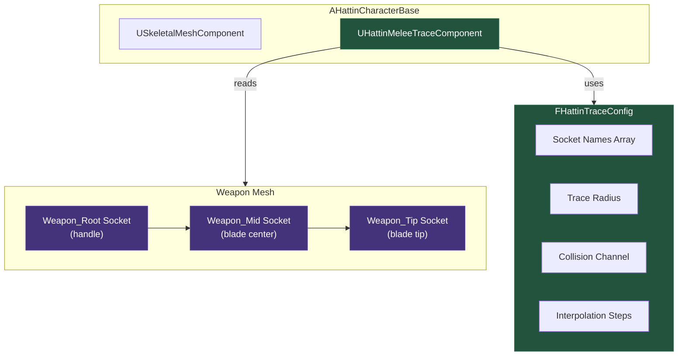
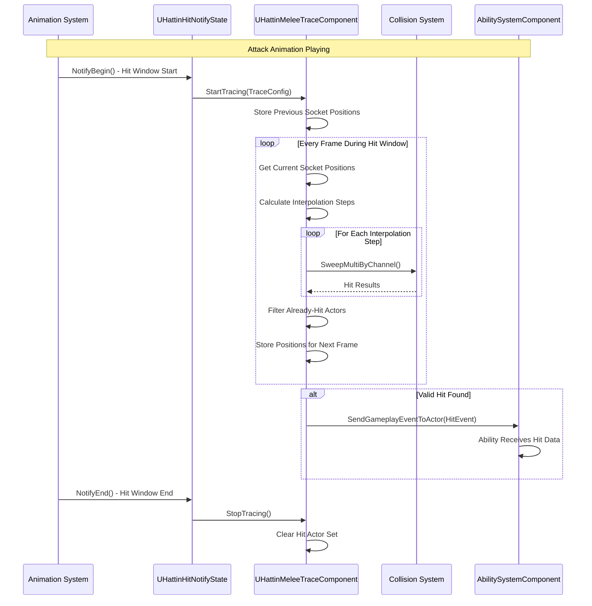
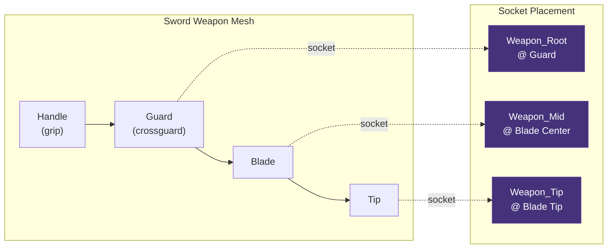
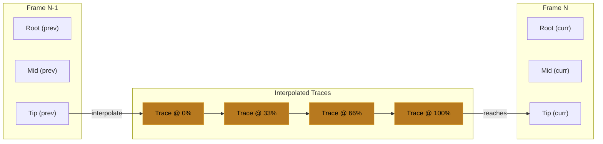
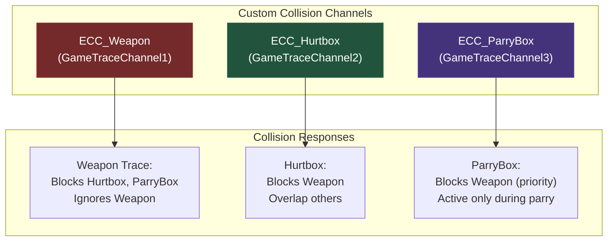
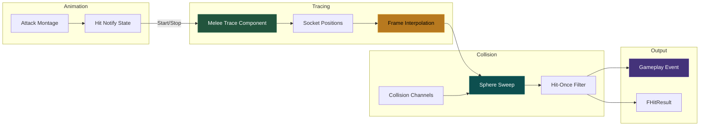
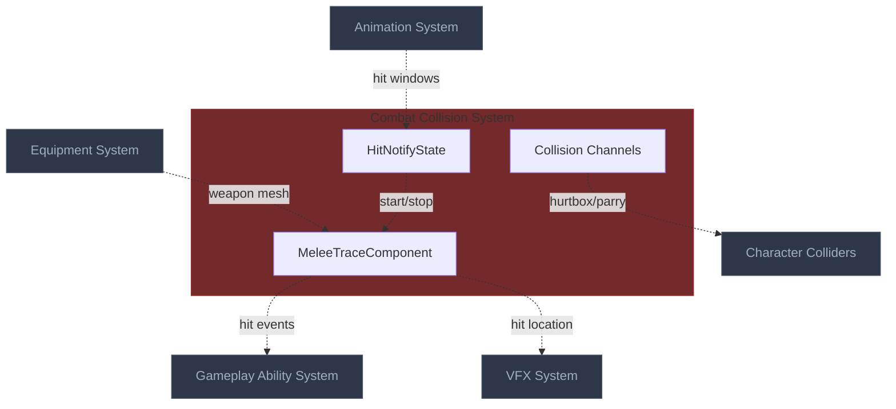

# Combat Collision & Hit Detection Architecture
> The system that determines when weapon meets target — using socket-based traces,
> frame interpolation, and AnimNotify-driven hit windows to ensure accurate, responsive melee combat.

---

## 1. System Overview

The Combat Collision system solves the fundamental challenge of determining when a melee weapon hits a target. Unlike projectiles with clear trajectories, melee weapons move through complex animation arcs where traditional collision detection fails at low framerates or with fast attacks.

The core approach uses socket-to-socket tracing along the weapon's length, performed every frame during active hit windows defined by AnimNotifyStates. Frame interpolation handles fast swings that might otherwise "teleport" through targets. A hit-once-per-swing mechanism prevents duplicate damage.

For Hattin specifically, the system must handle: swords of varying lengths, parry-box detection (separate from hurtboxes), directional hit reactions, and integration with GAS for damage application.

---

## 2. Core Architecture Diagram

### 2.1 Trace Component Architecture



### 2.2 Hit Detection Flow



### 2.3 Socket Layout on Weapon



### 2.4 Frame Interpolation Concept



### 2.5 Collision Channel Configuration



---

## 3. Component Specifications

### 3.1 UHattinMeleeTraceComponent

**UE Base**: `UActorComponent` | **Your Class**: `UHattinMeleeTraceComponent`

**Purpose**: Performs socket-based weapon tracing during combat

```cpp
UCLASS(ClassGroup=(Hattin), meta=(BlueprintSpawnableComponent))
class HATTIN_API UHattinMeleeTraceComponent : public UActorComponent
{
    GENERATED_BODY()
    
public:
    UHattinMeleeTraceComponent();
    
    // Start/Stop tracing
    UFUNCTION(BlueprintCallable, Category = "Combat|Trace")
    void StartTracing(const FHattinTraceConfig& Config);
    
    UFUNCTION(BlueprintCallable, Category = "Combat|Trace")
    void StopTracing();
    
    UFUNCTION(BlueprintCallable, Category = "Combat|Trace")
    bool IsTracing() const { return bIsTracing; }
    
    // Events
    DECLARE_DYNAMIC_MULTICAST_DELEGATE_TwoParams(FOnHitDetected, const FHitResult&, HitResult, AActor*, HitActor);
    UPROPERTY(BlueprintAssignable, Category = "Combat|Trace")
    FOnHitDetected OnHitDetected;
    
protected:
    virtual void TickComponent(float DeltaTime, ELevelTick TickType, 
        FActorComponentTickFunction* ThisTickFunction) override;
    
private:
    // State
    UPROPERTY()
    bool bIsTracing = false;
    
    UPROPERTY()
    FHattinTraceConfig CurrentConfig;
    
    // Previous frame socket positions (for interpolation)
    UPROPERTY()
    TArray<FVector> PreviousSocketPositions;
    
    // Actors hit this swing (prevent duplicate hits)
    UPROPERTY()
    TSet<TWeakObjectPtr<AActor>> HitActorsThisSwing;
    
    // Owner mesh reference
    UPROPERTY()
    TWeakObjectPtr<USkeletalMeshComponent> TraceMesh;
    
    // Internal methods
    void PerformTrace();
    TArray<FVector> GetSocketPositions() const;
    int32 CalculateInterpolationSteps(const TArray<FVector>& Current, const TArray<FVector>& Previous) const;
    void ProcessHitResults(const TArray<FHitResult>& HitResults);
};
```

### 3.2 FHattinTraceConfig

**Purpose**: Configuration data for a trace operation

```cpp
USTRUCT(BlueprintType)
struct HATTIN_API FHattinTraceConfig
{
    GENERATED_BODY()
    
    // Socket names to trace between
    UPROPERTY(EditAnywhere, BlueprintReadWrite)
    TArray<FName> SocketNames = { TEXT("Weapon_Root"), TEXT("Weapon_Mid"), TEXT("Weapon_Tip") };
    
    // Radius of sphere traces
    UPROPERTY(EditAnywhere, BlueprintReadWrite)
    float TraceRadius = 5.0f;
    
    // Collision channel to trace against
    UPROPERTY(EditAnywhere, BlueprintReadWrite)
    TEnumAsByte<ECollisionChannel> TraceChannel = ECC_GameTraceChannel2; // Hurtbox
    
    // Minimum interpolation steps per frame
    UPROPERTY(EditAnywhere, BlueprintReadWrite)
    int32 MinInterpolationSteps = 3;
    
    // Maximum interpolation steps per frame
    UPROPERTY(EditAnywhere, BlueprintReadWrite)
    int32 MaxInterpolationSteps = 10;
    
    // Distance threshold for adding interpolation steps
    UPROPERTY(EditAnywhere, BlueprintReadWrite)
    float InterpolationDistanceThreshold = 50.0f;
    
    // Debug draw
    UPROPERTY(EditAnywhere, BlueprintReadWrite)
    bool bDrawDebug = false;
    
    UPROPERTY(EditAnywhere, BlueprintReadWrite)
    float DebugDrawDuration = 0.1f;
};
```

### 3.3 UHattinHitNotifyState (AnimNotifyState)

**UE Base**: `UAnimNotifyState` | **Your Class**: `UHattinHitNotifyState`

**Purpose**: Defines hit window timing in animation montages

```cpp
UCLASS()
class HATTIN_API UHattinHitNotifyState : public UAnimNotifyState
{
    GENERATED_BODY()
    
public:
    UHattinHitNotifyState();
    
    virtual void NotifyBegin(USkeletalMeshComponent* MeshComp, UAnimSequenceBase* Animation,
        float TotalDuration, const FAnimNotifyEventReference& EventReference) override;
    
    virtual void NotifyEnd(USkeletalMeshComponent* MeshComp, UAnimSequenceBase* Animation,
        const FAnimNotifyEventReference& EventReference) override;
    
    virtual FString GetNotifyName_Implementation() const override;
    
protected:
    // Trace configuration for this hit window
    UPROPERTY(EditAnywhere, BlueprintReadOnly, Category = "Trace")
    FHattinTraceConfig TraceConfig;
    
    // Gameplay Event to send on hit
    UPROPERTY(EditAnywhere, BlueprintReadOnly, Category = "Combat")
    FGameplayTag HitEventTag;
    
    // Damage multiplier for this hit window (for multi-hit attacks)
    UPROPERTY(EditAnywhere, BlueprintReadOnly, Category = "Combat")
    float DamageMultiplier = 1.0f;
    
private:
    // Get the trace component from the owner
    UHattinMeleeTraceComponent* GetTraceComponent(USkeletalMeshComponent* MeshComp) const;
};

// Implementation
void UHattinHitNotifyState::NotifyBegin(USkeletalMeshComponent* MeshComp, ...)
{
    if (UHattinMeleeTraceComponent* TraceComp = GetTraceComponent(MeshComp))
    {
        TraceComp->StartTracing(TraceConfig);
        
        // Bind to hit events
        TraceComp->OnHitDetected.AddDynamic(this, &UHattinHitNotifyState::HandleHit);
    }
}

void UHattinHitNotifyState::NotifyEnd(USkeletalMeshComponent* MeshComp, ...)
{
    if (UHattinMeleeTraceComponent* TraceComp = GetTraceComponent(MeshComp))
    {
        TraceComp->StopTracing();
        TraceComp->OnHitDetected.RemoveAll(this);
    }
}
```

### 3.4 Trace Implementation Detail

```cpp
void UHattinMeleeTraceComponent::PerformTrace()
{
    if (!TraceMesh.IsValid()) return;
    
    TArray<FVector> CurrentPositions = GetSocketPositions();
    
    // Calculate interpolation steps based on movement distance
    int32 Steps = CalculateInterpolationSteps(CurrentPositions, PreviousSocketPositions);
    
    // Perform interpolated traces
    for (int32 Step = 0; Step <= Steps; ++Step)
    {
        float Alpha = (float)Step / (float)Steps;
        
        // Interpolate each socket position
        TArray<FVector> InterpolatedPositions;
        for (int32 i = 0; i < CurrentPositions.Num(); ++i)
        {
            FVector InterpPos = FMath::Lerp(PreviousSocketPositions[i], CurrentPositions[i], Alpha);
            InterpolatedPositions.Add(InterpPos);
        }
        
        // Perform sphere sweep between each adjacent socket pair
        for (int32 i = 0; i < InterpolatedPositions.Num() - 1; ++i)
        {
            FVector Start = InterpolatedPositions[i];
            FVector End = InterpolatedPositions[i + 1];
            
            TArray<FHitResult> HitResults;
            FCollisionQueryParams QueryParams;
            QueryParams.AddIgnoredActor(GetOwner());
            QueryParams.bReturnPhysicalMaterial = true;
            
            bool bHit = GetWorld()->SweepMultiByChannel(
                HitResults,
                Start,
                End,
                FQuat::Identity,
                CurrentConfig.TraceChannel,
                FCollisionShape::MakeSphere(CurrentConfig.TraceRadius),
                QueryParams
            );
            
            if (bHit)
            {
                ProcessHitResults(HitResults);
            }
            
            // Debug draw
            if (CurrentConfig.bDrawDebug)
            {
                DrawDebugCapsule(GetWorld(), (Start + End) / 2, 
                    FVector::Dist(Start, End) / 2, CurrentConfig.TraceRadius,
                    FQuat::FindBetweenVectors(FVector::UpVector, (End - Start).GetSafeNormal()),
                    bHit ? FColor::Red : FColor::Green, false, CurrentConfig.DebugDrawDuration);
            }
        }
    }
    
    // Store for next frame
    PreviousSocketPositions = CurrentPositions;
}

void UHattinMeleeTraceComponent::ProcessHitResults(const TArray<FHitResult>& HitResults)
{
    for (const FHitResult& Hit : HitResults)
    {
        AActor* HitActor = Hit.GetActor();
        if (!HitActor) continue;
        
        // Check if already hit this swing
        TWeakObjectPtr<AActor> WeakActor = HitActor;
        if (HitActorsThisSwing.Contains(WeakActor)) continue;
        
        // Check parry first (higher priority than hurtbox)
        // TODO: Separate parry check pass
        
        // Mark as hit
        HitActorsThisSwing.Add(WeakActor);
        
        // Broadcast hit event
        OnHitDetected.Broadcast(Hit, HitActor);
        
        // Send gameplay event to ability system
        if (AActor* Owner = GetOwner())
        {
            FGameplayEventData Payload;
            Payload.Target = HitActor;
            Payload.Instigator = Owner;
            Payload.ContextHandle = // Create context with hit result
            
            UAbilitySystemBlueprintLibrary::SendGameplayEventToActor(
                Owner, 
                FGameplayTag::RequestGameplayTag(TEXT("Event.Combat.Hit")),
                Payload
            );
        }
    }
}
```

### 3.5 Collision Channel Setup (DefaultEngine.ini)

```ini
[/Script/Engine.CollisionProfile]
+DefaultChannelResponses=(Channel=ECC_GameTraceChannel1,DefaultResponse=ECR_Ignore,bTraceType=True,bStaticObject=False,Name="Weapon")
+DefaultChannelResponses=(Channel=ECC_GameTraceChannel2,DefaultResponse=ECR_Block,bTraceType=False,bStaticObject=False,Name="Hurtbox")
+DefaultChannelResponses=(Channel=ECC_GameTraceChannel3,DefaultResponse=ECR_Block,bTraceType=False,bStaticObject=False,Name="ParryBox")

+Profiles=(Name="HattinHurtbox",CollisionEnabled=QueryOnly,ObjectTypeName="Hurtbox",CustomResponses=((Channel="Weapon",Response=ECR_Block)),HelpMessage="Hurtbox for combat hit detection")
+Profiles=(Name="HattinParryBox",CollisionEnabled=NoCollision,ObjectTypeName="ParryBox",CustomResponses=((Channel="Weapon",Response=ECR_Block)),HelpMessage="Parry box active only during parry window")
```

---

## 4. External Interfaces

### Inputs From Other Systems

| Source System | What It Provides | Interface Point |
|--------------|------------------|-----------------|
| Animation System | Hit window timing | `UHattinHitNotifyState` |
| Equipment System | Current weapon mesh/sockets | `EquipmentComponent → TraceMesh` |
| Combat Component | Combat state (is attacking) | State check before tracing |

### Outputs To Other Systems

| Target System | What This Provides | Interface Point |
|--------------|---------------------|-----------------|
| GAS | Hit event with target and context | `SendGameplayEventToActor` |
| Parry System | Hit against parry box | Separate channel query |
| VFX/Audio | Hit location, surface type | `FHitResult` data |
| Animation | Hit reaction direction | Hit normal from trace |

---

## 5. Data Flow Diagram



---

## 6. Implementation Patterns

### Pattern: Socket-to-Socket Sweep

**Problem**: Single-point traces miss targets; overlap events don't provide hit location

**Solution**: Trace between adjacent sockets along weapon length using sphere sweeps

```cpp
// Trace from Root→Mid and Mid→Tip
for (int32 i = 0; i < SocketPositions.Num() - 1; ++i)
{
    FVector Start = SocketPositions[i];
    FVector End = SocketPositions[i + 1];
    
    GetWorld()->SweepMultiByChannel(HitResults, Start, End, ...);
}
```

### Pattern: Frame Interpolation

**Problem**: At 30 FPS, fast attack moves 50cm between frames, skipping targets

**Solution**: Interpolate between previous and current positions, trace each step

```cpp
int32 UHattinMeleeTraceComponent::CalculateInterpolationSteps(
    const TArray<FVector>& Current, 
    const TArray<FVector>& Previous) const
{
    float MaxDistance = 0.f;
    for (int32 i = 0; i < Current.Num(); ++i)
    {
        MaxDistance = FMath::Max(MaxDistance, FVector::Dist(Current[i], Previous[i]));
    }
    
    int32 Steps = FMath::CeilToInt(MaxDistance / CurrentConfig.InterpolationDistanceThreshold);
    return FMath::Clamp(Steps, CurrentConfig.MinInterpolationSteps, CurrentConfig.MaxInterpolationSteps);
}
```

### Pattern: Hit-Once-Per-Swing

**Problem**: Fast traces can hit same actor multiple times in one swing

**Solution**: Track hit actors in TSet, clear on swing end

```cpp
void UHattinMeleeTraceComponent::ProcessHitResults(const TArray<FHitResult>& HitResults)
{
    for (const FHitResult& Hit : HitResults)
    {
        TWeakObjectPtr<AActor> WeakActor = Hit.GetActor();
        
        // Skip if already hit this swing
        if (HitActorsThisSwing.Contains(WeakActor)) continue;
        
        HitActorsThisSwing.Add(WeakActor);
        // ... process hit
    }
}

void UHattinMeleeTraceComponent::StopTracing()
{
    bIsTracing = false;
    HitActorsThisSwing.Empty(); // Clear for next swing
}
```

### Pattern: Separate Parry Detection

**Problem**: Need to check if attack was parried before applying damage

**Solution**: Two-pass collision: first check ParryBox channel, then Hurtbox

```cpp
void UHattinMeleeTraceComponent::PerformTrace()
{
    // First pass: Check for parry
    TArray<FHitResult> ParryHits;
    GetWorld()->SweepMultiByChannel(ParryHits, Start, End, ..., ECC_ParryBox, ...);
    
    if (ParryHits.Num() > 0)
    {
        // Parry successful! Send parry event instead of hit
        OnParryDetected.Broadcast(ParryHits[0]);
        return; // Don't check hurtbox
    }
    
    // Second pass: Check for hurtbox
    TArray<FHitResult> HurtboxHits;
    GetWorld()->SweepMultiByChannel(HurtboxHits, Start, End, ..., ECC_Hurtbox, ...);
    
    ProcessHitResults(HurtboxHits);
}
```

### Anti-Patterns to Avoid

| Anti-Pattern | Problem | Solution |
|-------------|---------|----------|
| **Using Tick for all tracing** | Traces when not attacking, wastes performance | Only trace during hit windows via AnimNotify |
| **Overlap events for melee** | No hit location, normal, or surface data | Use traces with `FHitResult` |
| **Single-point traces** | Miss targets, inaccurate | Socket-to-socket sweeps |
| **Ignoring frame rate variance** | Misses at low FPS | Frame interpolation |
| **Hard-coded socket names** | Can't support different weapons | Configurable via `FHattinTraceConfig` |

---

## 7. Quick Reference Card

| Concept | UE5 Class | Hattin Class/Asset | Location |
|---------|-----------|-------------------|----------|
| Trace Component | `UActorComponent` | `UHattinMeleeTraceComponent` | `/Source/Hattin/Combat/` |
| Trace Config | `FTableRowBase` | `FHattinTraceConfig` | `/Source/Hattin/Combat/` |
| Hit Notify | `UAnimNotifyState` | `UHattinHitNotifyState` | `/Source/Hattin/Animation/` |
| Weapon Channel | `ECollisionChannel` | `ECC_Weapon` (Channel1) | `/Config/DefaultEngine.ini` |
| Hurtbox Channel | `ECollisionChannel` | `ECC_Hurtbox` (Channel2) | `/Config/DefaultEngine.ini` |
| Parry Channel | `ECollisionChannel` | `ECC_ParryBox` (Channel3) | `/Config/DefaultEngine.ini` |
| Debug Command | — | `Hattin.Combat.DrawTraces 1` | Console |

---

## 8. Connections Map (Compact)



---

## Summary

The Combat Collision & Hit Detection architecture establishes:

1. **Socket-Based Tracing**: Weapon sockets at Root, Mid, and Tip positions define the blade volume

2. **AnimNotify-Driven Windows**: `UHattinHitNotifyState` controls exactly when tracing is active

3. **Frame Interpolation**: Handles fast attacks at low framerates by interpolating between frames

4. **Hit-Once-Per-Swing**: `TSet<AActor*>` prevents duplicate hits in a single attack

5. **Custom Collision Channels**: Separate channels for Weapon, Hurtbox, and ParryBox enable priority-based detection

6. **GAS Integration**: Hits send `GameplayEvent` with full `FHitResult` context to abilities

This architecture ensures melee combat feels precise and responsive regardless of framerate or attack speed.
