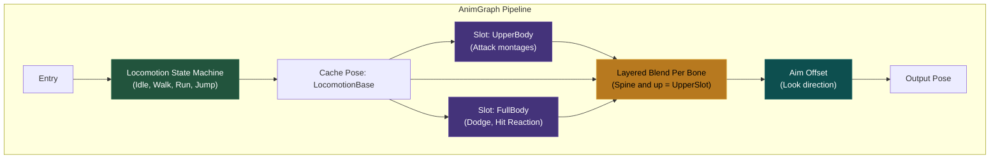
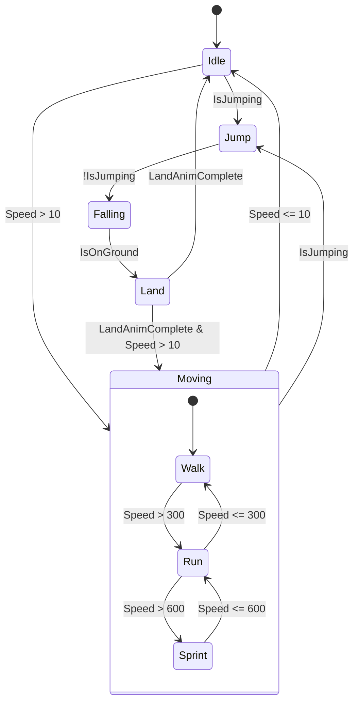
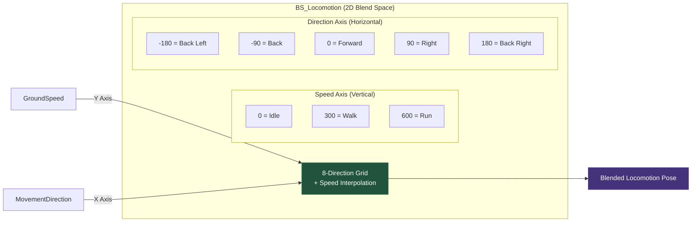
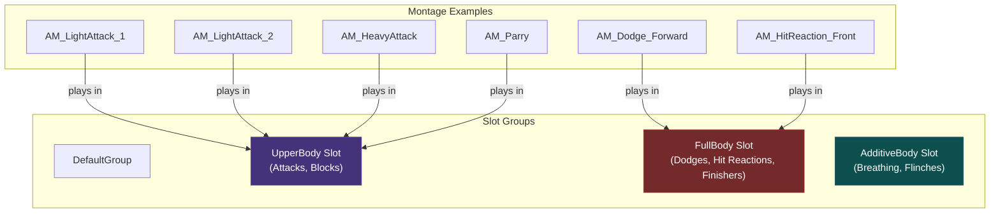
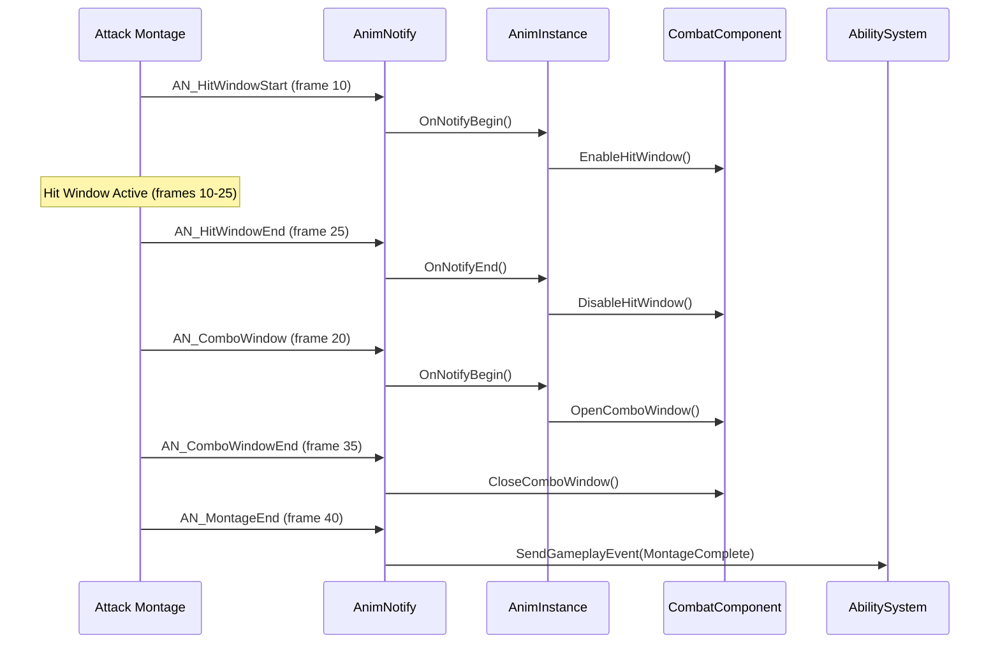
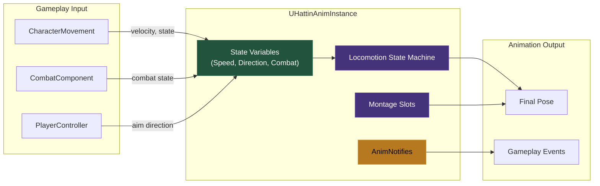
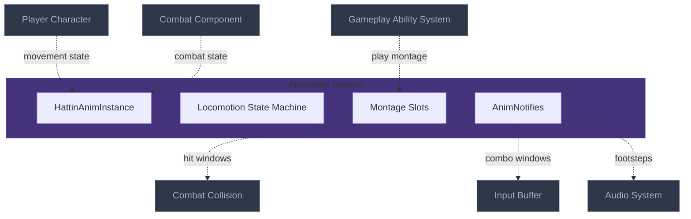

# Animation Blueprint & Montage System Architecture
> The visual state machine that drives character animation — blending locomotion,
> combat actions, and hit reactions into fluid, responsive movement through
> state machines, blend spaces, and montage slots.

---

## 1. System Overview

The Animation Blueprint system solves the problem of translating gameplay state into visual motion. Rather than playing animations directly from gameplay code, the AnimInstance acts as a data-driven interpreter that reads character state and produces the appropriate blended pose each frame.

For combat games, the animation system must handle: locomotion (idle, walk, run, strafe), combat stances, attack montages that interrupt locomotion, hit reactions, and smooth blending between all states. The key insight is separating "what pose to show" (AnimBP's job) from "what action to perform" (Gameplay's job).

For Hattin specifically, combat actions are montages played through slots, allowing upper-body attacks while maintaining lower-body locomotion. State machines handle grounded vs. airborne, while blend spaces handle directional movement. AnimNotifies trigger gameplay events (hit windows, combo windows, footsteps).

---

## 2. Core Architecture Diagram

### 2.1 AnimGraph High-Level Flow



### 2.2 Locomotion State Machine



### 2.3 Blend Space Configuration



### 2.4 Montage Slot System



### 2.5 AnimNotify Integration



---

## 3. Component Specifications

### 3.1 UHattinAnimInstance

**UE Base**: `UAnimInstance` | **Your Class**: `UHattinAnimInstance`

**Purpose**: Custom AnimInstance with combat-specific state variables and thread-safe updates

```cpp[uclass-generatedbody,tweakobjectptr]
UCLASS()
class HATTIN_API UHattinAnimInstance : public UAnimInstance
{
    GENERATED_BODY()

public:
    UHattinAnimInstance();

    // Thread-safe update (runs on worker thread)
    virtual void NativeThreadSafeUpdateAnimation(float DeltaSeconds) override;

    // Main thread update (use sparingly)
    virtual void NativeUpdateAnimation(float DeltaSeconds) override;

    // Initialization
    virtual void NativeInitializeAnimation() override;

    // ============================================
    // LOCOMOTION VARIABLES (BlueprintReadOnly)
    // ============================================

    UPROPERTY(BlueprintReadOnly, Category = "Locomotion")
    float GroundSpeed;

    UPROPERTY(BlueprintReadOnly, Category = "Locomotion")
    float MovementDirection; // -180 to 180

    UPROPERTY(BlueprintReadOnly, Category = "Locomotion")
    bool bIsMoving;

    UPROPERTY(BlueprintReadOnly, Category = "Locomotion")
    bool bIsInAir;

    UPROPERTY(BlueprintReadOnly, Category = "Locomotion")
    bool bIsCrouching;

    UPROPERTY(BlueprintReadOnly, Category = "Locomotion")
    FVector Velocity;

    // ============================================
    // COMBAT VARIABLES (BlueprintReadOnly)
    // ============================================

    UPROPERTY(BlueprintReadOnly, Category = "Combat")
    bool bIsInCombat;

    UPROPERTY(BlueprintReadOnly, Category = "Combat")
    bool bIsAttacking;

    UPROPERTY(BlueprintReadOnly, Category = "Combat")
    bool bIsBlocking;

    UPROPERTY(BlueprintReadOnly, Category = "Combat")
    EHattinCombatStance CurrentStance;

    // ============================================
    // AIM OFFSET VARIABLES
    // ============================================

    UPROPERTY(BlueprintReadOnly, Category = "AimOffset")
    float AimYaw;   // -90 to 90

    UPROPERTY(BlueprintReadOnly, Category = "AimOffset")
    float AimPitch; // -90 to 90

protected:
    // Cached references
    UPROPERTY()
    TWeakObjectPtr<AHattinCharacterBase> OwnerCharacter;

    UPROPERTY()
    TWeakObjectPtr<UCharacterMovementComponent> MovementComponent;

    UPROPERTY()
    TWeakObjectPtr<UHattinCombatComponent> CombatComponent;

private:
    // Thread-safe calculations
    void UpdateLocomotionVariables(float DeltaSeconds);
    void UpdateCombatVariables(float DeltaSeconds);
    void UpdateAimOffsetVariables(float DeltaSeconds);

    float CalculateMovementDirection() const;
};
```

### 3.2 AnimInstance Implementation

```cpp[superfunction,castt-safe-type-casting,findcomponentbyclass,fvector-math-basics]
void UHattinAnimInstance::NativeInitializeAnimation()
{
    Super::NativeInitializeAnimation();

    // Cache references (main thread only)
    if (APawn* Owner = TryGetPawnOwner())
    {
        OwnerCharacter = Cast<AHattinCharacterBase>(Owner);

        if (OwnerCharacter.IsValid())
        {
            MovementComponent = OwnerCharacter->GetCharacterMovement();
            CombatComponent = OwnerCharacter->FindComponentByClass<UHattinCombatComponent>();
        }
    }
}

void UHattinAnimInstance::NativeThreadSafeUpdateAnimation(float DeltaSeconds)
{
    Super::NativeThreadSafeUpdateAnimation(DeltaSeconds);

    // All variable updates here run on worker thread
    // IMPORTANT: Only read data, never modify game state

    UpdateLocomotionVariables(DeltaSeconds);
    UpdateCombatVariables(DeltaSeconds);
    UpdateAimOffsetVariables(DeltaSeconds);
}

void UHattinAnimInstance::UpdateLocomotionVariables(float DeltaSeconds)
{
    if (!MovementComponent.IsValid()) return;

    Velocity = MovementComponent->Velocity;
    GroundSpeed = Velocity.Size2D();
    bIsMoving = GroundSpeed > 10.f;
    bIsInAir = MovementComponent->IsFalling();
    bIsCrouching = MovementComponent->IsCrouching();

    MovementDirection = CalculateMovementDirection();
}

float UHattinAnimInstance::CalculateMovementDirection() const
{
    if (!OwnerCharacter.IsValid() || GroundSpeed < 10.f) return 0.f;

    FVector VelocityNorm = Velocity.GetSafeNormal2D();
    FVector ForwardVector = OwnerCharacter->GetActorForwardVector();

    // Calculate angle between velocity and forward
    float Angle = FMath::Atan2(
        FVector::CrossProduct(ForwardVector, VelocityNorm).Z,
        FVector::DotProduct(ForwardVector, VelocityNorm)
    );

    return FMath::RadiansToDegrees(Angle);
}
```

### 3.3 Custom AnimNotifyState: UAN_HitWindow

**UE Base**: `UAnimNotifyState` | **Your Class**: `UAN_HitWindow`

**Purpose**: Defines hit detection window within attack montages

```cpp[uclass-generatedbody,uproperty-reflection,virtual-vs-override]
UCLASS()
class HATTIN_API UAN_HitWindow : public UAnimNotifyState
{
    GENERATED_BODY()

public:
    UAN_HitWindow();

    virtual void NotifyBegin(USkeletalMeshComponent* MeshComp, UAnimSequenceBase* Animation,
        float TotalDuration, const FAnimNotifyEventReference& EventReference) override;

    virtual void NotifyEnd(USkeletalMeshComponent* MeshComp, UAnimSequenceBase* Animation,
        const FAnimNotifyEventReference& EventReference) override;

    virtual FString GetNotifyName_Implementation() const override { return TEXT("Hit Window"); }

#if WITH_EDITORONLY_DATA
    virtual FLinearColor GetEditorColor() override { return FLinearColor::Red; }
#endif

protected:
    UPROPERTY(EditAnywhere, BlueprintReadOnly, Category = "Hit Window")
    FHattinTraceConfig TraceConfig;

    UPROPERTY(EditAnywhere, BlueprintReadOnly, Category = "Hit Window")
    float DamageMultiplier = 1.0f;
};
```

### 3.4 Custom AnimNotify: UAN_ComboWindow

**Purpose**: Opens window for combo input during attack montage

```cpp[uclass-generatedbody,uproperty-reflection,virtual-vs-override]
UCLASS()
class HATTIN_API UAN_ComboWindowState : public UAnimNotifyState
{
    GENERATED_BODY()

public:
    virtual void NotifyBegin(USkeletalMeshComponent* MeshComp, UAnimSequenceBase* Animation,
        float TotalDuration, const FAnimNotifyEventReference& EventReference) override;

    virtual void NotifyEnd(USkeletalMeshComponent* MeshComp, UAnimSequenceBase* Animation,
        const FAnimNotifyEventReference& EventReference) override;

    virtual FString GetNotifyName_Implementation() const override { return TEXT("Combo Window"); }

#if WITH_EDITORONLY_DATA
    virtual FLinearColor GetEditorColor() override { return FLinearColor::Green; }
#endif

protected:
    // Which combo this leads to
    UPROPERTY(EditAnywhere, BlueprintReadOnly, Category = "Combo")
    FName NextComboSectionName;

    // Which input triggers this combo
    UPROPERTY(EditAnywhere, BlueprintReadOnly, Category = "Combo")
    EHattinAttackType RequiredInput;
};
```

### 3.5 Montage Structure Example

**AM_LightAttack_Combo (Montage with Sections)**

| Section | Frames | Description |
|---------|--------|-------------|
| `Attack1` | 0-40 | First swing |
| `Attack2` | 41-80 | Second swing |
| `Attack3` | 81-130 | Finishing swing |

**Notify Track Layout:**

```
Frame:    0    10   20   25   30   35   40   50   60   65   70   75   80
          |----|----|----|----|----|----|----|----|----|----|----|----|
Attack1:  [    ][HIT WINDOW   ][COMBO WINDOW    ][    ]
Attack2:                                         [    ][HIT WINDOW   ][COMBO]
Attack3:                                                              [HIT..]

Legend:
[HIT WINDOW]   = AN_HitWindow (damage active)
[COMBO WINDOW] = AN_ComboWindow (can chain next attack)
```

### 3.6 Slot Configuration

```cpp
// DefaultSlotGroups.h - Define slot groups
// Configured in Animation Blueprint's Slot Manager

// Slot: DefaultSlot.UpperBody
// - Used for: Attacks, blocks that only affect upper body
// - Blend: Layered blend from spine up

// Slot: DefaultSlot.FullBody  
// - Used for: Dodges, hit reactions, finishers
// - Blend: Overrides entire pose

// Slot: DefaultSlot.Additive
// - Used for: Breathing, hit flinches, weapon sway
// - Blend: Additive on top of base pose
```

---

## 4. External Interfaces

### Inputs From Other Systems

| Source System | What It Provides | Interface Point |
|--------------|------------------|-----------------|
| Character Movement | Velocity, IsInAir, IsCrouching | `NativeThreadSafeUpdateAnimation` reads CMC |
| Combat Component | Combat state (attacking, blocking) | AnimInstance queries CombatComponent |
| GAS | Montage playback requests | `UAbilityTask_PlayMontageAndWait` |
| Camera | Look direction for aim offset | Controller rotation |

### Outputs To Other Systems

| Target System | What This Provides | Interface Point |
|--------------|---------------------|-----------------|
| Combat Collision | Hit window start/end | `UAN_HitWindow` → TraceComponent |
| Input Buffer | Combo window timing | `UAN_ComboWindow` → BufferComponent |
| GAS | Montage events (completed, cancelled) | Montage callbacks to ability |
| Audio | Footstep, whoosh timing | AnimNotify_PlaySound |

---

## 5. Data Flow Diagram



---

## 6. Implementation Patterns

### Pattern: Thread-Safe Animation Updates

**Problem**: Event Graph runs on game thread, blocking other gameplay

**Solution**: Use `NativeThreadSafeUpdateAnimation` which runs on worker thread

```cpp
// CORRECT: Thread-safe update
void UHattinAnimInstance::NativeThreadSafeUpdateAnimation(float DeltaSeconds)
{
    // Only READ data here, never modify game state
    GroundSpeed = MovementComponent->Velocity.Size2D();
}

// WRONG: Event Graph or NativeUpdateAnimation for frequent updates
// This blocks the game thread
```

### Pattern: Layered Montage Slots

**Problem**: Attack animations override leg movement

**Solution**: Use UpperBody slot with LayeredBlendPerBone from spine up

```
AnimGraph Setup:
1. Cache locomotion pose
2. Play UpperBody slot (returns locomotion if no montage)
3. LayeredBlendPerBone:
   - Base Pose: Cached locomotion
   - Blend Pose: UpperBody slot output
   - Blend Mask: Spine and above = 1.0, below = 0.0
```

### Pattern: Section-Based Combos

**Problem**: Need smooth combo transitions without interrupting animations

**Solution**: Single montage with sections, use `Montage_JumpToSection` during combo window

```cpp[montageplay-delegates]
void UHattinCombatComponent::TryCombo()
{
    if (!bComboWindowOpen) return;

    UAnimInstance* AnimInstance = Character->GetMesh()->GetAnimInstance();

    // Jump to next section within same montage
    AnimInstance->Montage_JumpToSection(NextComboSection, CurrentMontage);

    bComboWindowOpen = false;
}
```

### Pattern: AnimNotify for Gameplay Events

**Problem**: Need frame-precise gameplay triggers (hit windows, sounds)

**Solution**: Custom AnimNotifyState classes that call into gameplay components

```cpp[findcomponentbyclass,getworld-entry-point]
void UAN_HitWindow::NotifyBegin(USkeletalMeshComponent* MeshComp, ...)
{
    if (AActor* Owner = MeshComp->GetOwner())
    {
        if (UHattinMeleeTraceComponent* TraceComp = Owner->FindComponentByClass<UHattinMeleeTraceComponent>())
        {
            TraceComp->StartTracing(TraceConfig);
        }
    }
}
```

### Pattern: Blend Space for Directional Movement

**Problem**: Need 8-directional movement with speed interpolation

**Solution**: 2D Blend Space with Direction (-180 to 180) and Speed axes

```
Blend Space Grid (BS_CombatLocomotion):

Speed↑
600 |  RunBL  |  RunB   |  RunBR  |  RunR   |  RunFR  |  RunF   |  RunFL  |  RunL
300 |  WalkBL |  WalkB  |  WalkBR |  WalkR  |  WalkFR |  WalkF  |  WalkFL |  WalkL  
  0 |         |         |         |  Idle   |         |         |         |
    +---------+---------+---------+---------+---------+---------+---------+--------→ Direction
    -180     -135      -90       -45        0        45        90       135      180
```

### Anti-Patterns to Avoid

| Anti-Pattern | Problem | Solution |
|-------------|---------|----------|
| **Logic in Event Graph** | Blocks game thread every tick | Use `NativeThreadSafeUpdateAnimation` |
| **Casting in AnimBP tick** | Expensive, every frame | Cache references in `NativeInitializeAnimation` |
| **Playing montages from AnimBP** | Wrong responsibility | Gameplay plays montages, AnimBP just displays |
| **Hard-coded blend times** | Can't tune without rebuild | Use variables exposed to Blueprint |
| **Monolithic state machine** | Hard to debug and modify | Nested state machines (Locomotion, Combat, etc.) |

---

## 7. Quick Reference Card

| Concept | UE5 Class | Hattin Class/Asset | Location |
|---------|-----------|-------------------|----------|
| Anim Instance | `UAnimInstance` | `UHattinAnimInstance` | `/Source/Hattin/Animation/` |
| Hit Window Notify | `UAnimNotifyState` | `UAN_HitWindow` | `/Source/Hattin/Animation/` |
| Combo Window Notify | `UAnimNotifyState` | `UAN_ComboWindow` | `/Source/Hattin/Animation/` |
| Locomotion BlendSpace | `UBlendSpace` | `BS_CombatLocomotion` | `/Content/Hattin/Animation/` |
| Player AnimBP | `UAnimInstance` | `ABP_HattinPlayer` | `/Content/Hattin/Animation/` |
| Light Attack Montage | `UAnimMontage` | `AM_LightAttack_Combo` | `/Content/Hattin/Animation/Montages/` |
| Dodge Montage | `UAnimMontage` | `AM_Dodge_Directional` | `/Content/Hattin/Animation/Montages/` |

---

## 8. Connections Map (Compact)



---

## Summary

The Animation Blueprint & Montage System architecture establishes:

1. **Custom AnimInstance**: `UHattinAnimInstance` with thread-safe updates for locomotion and combat variables

2. **State Machine Structure**: Nested state machines for Locomotion (Idle → Moving → Airborne) with clear transitions

3. **Blend Space**: 2D directional movement with speed interpolation for responsive strafing

4. **Montage Slots**: UpperBody (attacks), FullBody (dodges/reactions), Additive (flinches) with layer blending

5. **AnimNotifies**: Custom notify states for hit windows, combo windows, and gameplay events

6. **Section-Based Combos**: Single montage with multiple sections, jump between sections for combo chains

This architecture ensures animations are responsive, data-driven, and cleanly integrated with gameplay systems.
