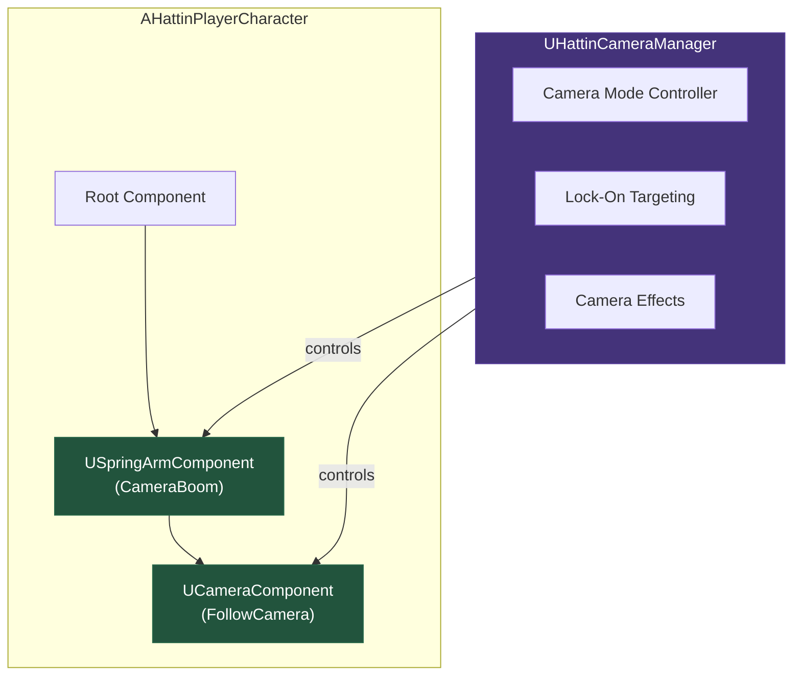
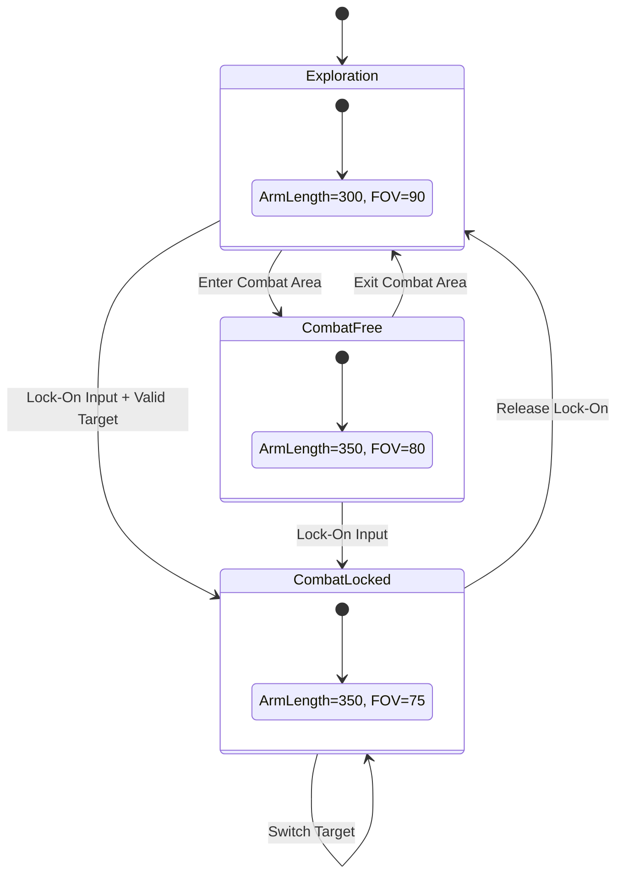
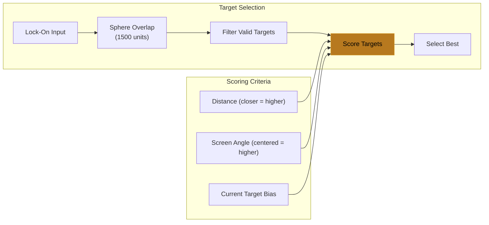

# Camera System Architecture
> The third-person camera that frames combat — with lock-on targeting,
> mode switching between exploration and combat, and effects like hit shake.

---

## 1. System Overview

The Camera System solves the problem of keeping the player oriented in a 3D combat space while providing cinematic framing. The camera must balance player control (looking around freely) with automatic assistance (framing targets during combat).

For melee combat, lock-on targeting is essential — it keeps enemies centered while allowing the player to focus on timing rather than manual aiming. The system provides smooth transitions between camera modes and applies effects (shake, zoom) for impact feedback.

For Hattin specifically, the camera must: provide clear visibility in exploration, tighten framing in combat, lock onto targets with player override capability, and enhance hit feedback through shake.

---

## 2. Core Architecture Diagram

### 2.1 Camera Component Stack



### 2.2 Camera Mode State Machine



### 2.3 Lock-On Target Selection



---

## 3. Component Specifications

### 3.1 Camera Mode Settings

| Mode | Arm Length | Socket Offset | FOV | Lag Speed |
|------|-----------|---------------|-----|-----------|
| Exploration | 300 | (0, 50, 60) | 90 | 10 |
| Combat Free | 350 | (0, 60, 70) | 80 | 12 |
| Combat Locked | 350 | (0, 75, 80) | 75 | 15 |

### 3.2 UHattinCameraManager

**UE Base**: `UActorComponent` | **Your Class**: `UHattinCameraManager`

```cpp
UCLASS(ClassGroup=(Hattin), meta=(BlueprintSpawnableComponent))
class HATTIN_API UHattinCameraManager : public UActorComponent
{
    GENERATED_BODY()
    
public:
    UHattinCameraManager();
    
    UFUNCTION(BlueprintCallable, Category = "Camera")
    void SetCameraMode(EHattinCameraMode NewMode);
    
    UFUNCTION(BlueprintCallable, Category = "Camera")
    void SetLockOnTarget(AActor* Target);
    
    UFUNCTION(BlueprintCallable, Category = "Camera")
    void ClearLockOnTarget();
    
    UFUNCTION(BlueprintCallable, Category = "Camera")
    void SwitchLockOnTarget(float Direction);
    
    UFUNCTION(BlueprintCallable, Category = "Camera")
    void ApplyCameraShake(TSubclassOf<UCameraShakeBase> ShakeClass, float Scale = 1.0f);
    
protected:
    UPROPERTY(EditDefaultsOnly, Category = "Camera|Modes")
    FHattinCameraModeSettings ExplorationSettings;
    
    UPROPERTY(EditDefaultsOnly, Category = "Camera|Modes")
    FHattinCameraModeSettings CombatLockedSettings;
    
    UPROPERTY(EditDefaultsOnly, Category = "Camera|Lock-On")
    float LockOnRadius = 1500.f;
    
    UPROPERTY(EditDefaultsOnly, Category = "Camera|Lock-On")
    float LockOnRotationSpeed = 8.f;
    
    UPROPERTY()
    TWeakObjectPtr<AActor> LockedTarget;
    
    UPROPERTY()
    EHattinCameraMode CurrentMode;
    
    virtual void TickComponent(float DeltaTime, ELevelTick TickType, 
        FActorComponentTickFunction* ThisTickFunction) override;
    
private:
    void UpdateLockOnRotation(float DeltaTime);
    AActor* FindBestLockOnTarget() const;
    float ScoreTarget(AActor* Target) const;
    
    UPROPERTY()
    TWeakObjectPtr<USpringArmComponent> CameraBoom;
    
    UPROPERTY()
    TWeakObjectPtr<UCameraComponent> FollowCamera;
};
```

### 3.3 Camera Shake Configuration

| Shake Type | Duration | Pitch | Yaw | Usage |
|------------|----------|-------|-----|-------|
| Hit Impact | 0.2s | 2° | 1° | Taking damage |
| Parry Success | 0.15s | 1° | 0.5° | Successful parry |
| Heavy Attack | 0.25s | 1.5° | 1° | Landing heavy hit |

---

## 4. External Interfaces

### Inputs From Other Systems

| Source System | What It Provides | Interface Point |
|--------------|------------------|-----------------|
| Enhanced Input | Lock-on toggle, look input | Input bindings |
| Combat Component | Combat state for mode | State queries |
| GAS | Damage events for shake | Attribute delegates |

### Outputs To Other Systems

| Target System | What This Provides | Interface Point |
|--------------|---------------------|-----------------|
| Player Controller | Rotation target | Controller rotation |
| Character | Face direction (when locked) | Character rotation |
| UI | Target indicator position | Screen projection |

---

## 5. Implementation Patterns

### Pattern: Mode-Based Settings Blend

**Problem**: Hard camera cuts are jarring

**Solution**: Interpolate settings over 0.3s transition

```cpp
void UHattinCameraManager::SetCameraMode(EHattinCameraMode NewMode)
{
    CurrentMode = NewMode;
    TargetSettings = GetSettingsForMode(NewMode);
    TransitionAlpha = 0.f;
    bIsTransitioning = true;
}

void UHattinCameraManager::TickComponent(float DeltaTime, ...)
{
    if (bIsTransitioning)
    {
        TransitionAlpha = FMath::Clamp(TransitionAlpha + DeltaTime / TransitionDuration, 0.f, 1.f);
        
        CameraBoom->TargetArmLength = FMath::Lerp(CurrentSettings.ArmLength, TargetSettings.ArmLength, TransitionAlpha);
        FollowCamera->FieldOfView = FMath::Lerp(CurrentSettings.FOV, TargetSettings.FOV, TransitionAlpha);
        
        if (TransitionAlpha >= 1.f)
        {
            bIsTransitioning = false;
            CurrentSettings = TargetSettings;
        }
    }
}
```

### Pattern: Lock-On with Manual Adjustment

**Problem**: Pure lock-on removes player control

**Solution**: Allow ±15° manual offset from target

---

## 6. Quick Reference Card

| Concept | UE5 Class | Hattin Class | Location |
|---------|-----------|--------------|----------|
| Camera Manager | `UActorComponent` | `UHattinCameraManager` | `/Source/Hattin/Camera/` |
| Hit Shake | `UCameraShakeBase` | `CS_HitImpact` | `/Content/Hattin/Camera/` |
| Mode Settings | `FTableRowBase` | `FHattinCameraModeSettings` | `/Source/Hattin/Camera/` |

---

## 7. Connections Map (Compact)

```mermaid
flowchart TD
    subgraph CAMERA_SYSTEM["Camera System"]
        Manager["Camera Manager"]
        SpringArm["Spring Arm"]
        LockOn["Lock-On Targeting"]
    end
    
    INPUT[Enhanced Input] -.->|"lock-on"| LockOn
    INPUT -.->|"look"| SpringArm
    COMBAT[Combat Component] -.->|"state"| Manager
    Manager -.->|"shake"| EFFECTS[Camera Effects]
    LockOn -.->|"target"| UI[Target Indicator]
    
    style CAMERA_SYSTEM fill:#0d4f4f,stroke:#0f5e5e
    style INPUT fill:#2d3748,stroke:#4a5568,color:#a0aec0
    style COMBAT fill:#2d3748,stroke:#4a5568,color:#a0aec0
```



---

## Summary

The Camera System architecture establishes:

1. **Spring Arm + Camera**: Standard UE5 third-person setup with configurable settings
2. **Camera Modes**: Exploration (wide), Combat Free, Combat Locked with smooth transitions
3. **Lock-On System**: Target selection via scoring (distance + angle), rotation interpolation
4. **Camera Effects**: Shake for hit impacts, parries, and heavy attacks

This provides clear combat framing while maintaining player agency.
