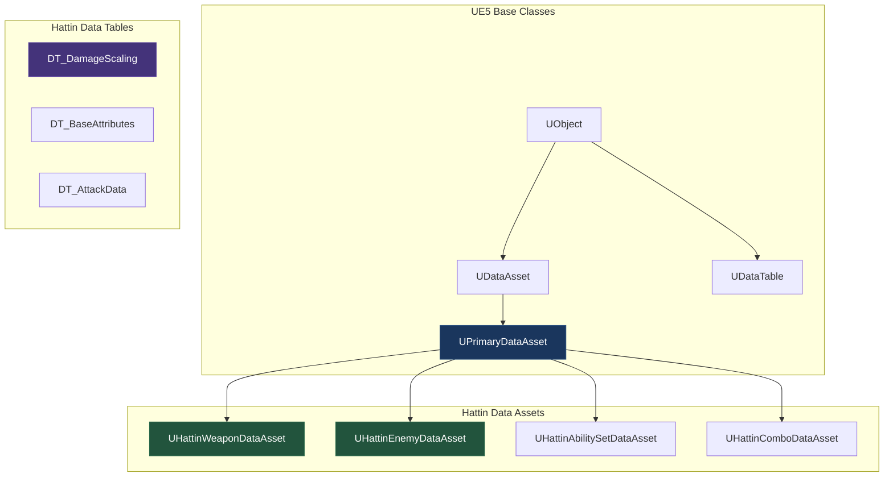
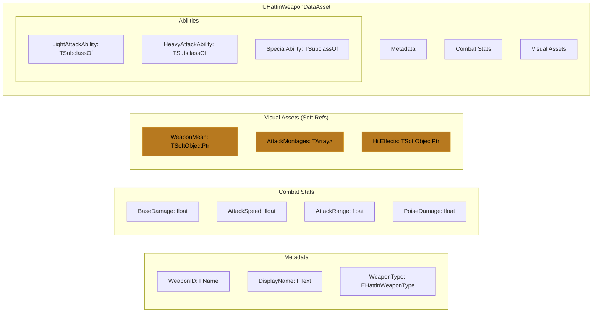
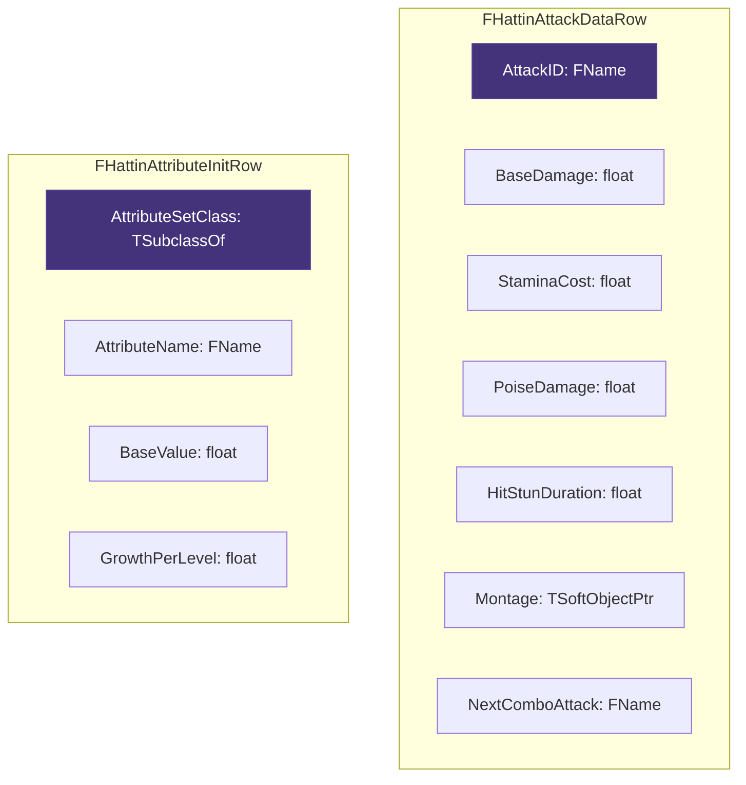
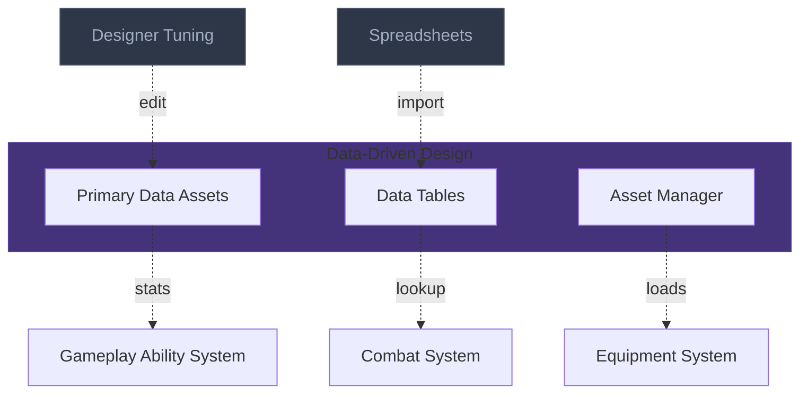

# Data-Driven Design Architecture
> The asset system that separates data from code — using DataAssets, DataTables,
> and soft references to enable rapid iteration without recompilation.

---

## 1. System Overview

Data-Driven Design solves the problem of hard-coding game values (damage, speeds, timings) into C++ or Blueprints. When data lives in assets, designers can iterate without programmer involvement, values can be hot-reloaded, and the same code can power vastly different content.

The core approach uses Primary Data Assets for complex configuration (weapon definitions, enemy archetypes), Data Tables for tabular data (damage scaling, combo strings), and Soft References to avoid loading everything at startup.

For Hattin specifically, data-driven design enables: weapon stats tuned in spreadsheets, enemy difficulty variants without code changes, combo sequences defined by designers, and runtime asset loading for modular content.

---

## 2. Core Architecture Diagram

### 2.1 Data Asset Hierarchy



### 2.2 Weapon Data Asset Structure



### 2.3 Data Table Row Structures



---

## 3. Component Specifications

### 3.1 UHattinWeaponDataAsset

```cpp
UCLASS(BlueprintType)
class HATTIN_API UHattinWeaponDataAsset : public UPrimaryDataAsset
{
    GENERATED_BODY()
    
public:
    // Primary Asset ID for asset management
    virtual FPrimaryAssetId GetPrimaryAssetId() const override;
    
    // ============================================
    // METADATA
    // ============================================
    
    UPROPERTY(EditDefaultsOnly, BlueprintReadOnly, Category = "Metadata")
    FName WeaponID;
    
    UPROPERTY(EditDefaultsOnly, BlueprintReadOnly, Category = "Metadata")
    FText DisplayName;
    
    UPROPERTY(EditDefaultsOnly, BlueprintReadOnly, Category = "Metadata")
    EHattinWeaponType WeaponType;
    
    // ============================================
    // COMBAT STATS
    // ============================================
    
    UPROPERTY(EditDefaultsOnly, BlueprintReadOnly, Category = "Combat")
    float BaseDamage = 20.f;
    
    UPROPERTY(EditDefaultsOnly, BlueprintReadOnly, Category = "Combat")
    float AttackSpeed = 1.0f;
    
    UPROPERTY(EditDefaultsOnly, BlueprintReadOnly, Category = "Combat")
    float AttackRange = 150.f;
    
    UPROPERTY(EditDefaultsOnly, BlueprintReadOnly, Category = "Combat")
    float PoiseDamage = 10.f;
    
    UPROPERTY(EditDefaultsOnly, BlueprintReadOnly, Category = "Combat")
    float StaminaCostMultiplier = 1.0f;
    
    // ============================================
    // VISUAL ASSETS (Soft References)
    // ============================================
    
    UPROPERTY(EditDefaultsOnly, BlueprintReadOnly, Category = "Visuals")
    TSoftObjectPtr<UStaticMesh> WeaponMesh;
    
    UPROPERTY(EditDefaultsOnly, BlueprintReadOnly, Category = "Visuals")
    TSoftObjectPtr<USkeletalMesh> WeaponSkeletalMesh;
    
    UPROPERTY(EditDefaultsOnly, BlueprintReadOnly, Category = "Visuals")
    TArray<TSoftObjectPtr<UAnimMontage>> AttackMontages;
    
    UPROPERTY(EditDefaultsOnly, BlueprintReadOnly, Category = "Visuals")
    TSoftObjectPtr<UNiagaraSystem> HitEffect;
    
    UPROPERTY(EditDefaultsOnly, BlueprintReadOnly, Category = "Visuals")
    TSoftObjectPtr<USoundBase> HitSound;
    
    // ============================================
    // ABILITIES
    // ============================================
    
    UPROPERTY(EditDefaultsOnly, BlueprintReadOnly, Category = "Abilities")
    TSubclassOf<UGameplayAbility> LightAttackAbility;
    
    UPROPERTY(EditDefaultsOnly, BlueprintReadOnly, Category = "Abilities")
    TSubclassOf<UGameplayAbility> HeavyAttackAbility;
    
    UPROPERTY(EditDefaultsOnly, BlueprintReadOnly, Category = "Abilities")
    TArray<TSubclassOf<UGameplayAbility>> SpecialAbilities;
    
    // ============================================
    // TRACE CONFIG
    // ============================================
    
    UPROPERTY(EditDefaultsOnly, BlueprintReadOnly, Category = "Trace")
    FHattinTraceConfig TraceConfig;
};

FPrimaryAssetId UHattinWeaponDataAsset::GetPrimaryAssetId() const
{
    return FPrimaryAssetId(TEXT("Weapon"), GetFName());
}
```

### 3.2 Attack Data Table Row

```cpp
USTRUCT(BlueprintType)
struct HATTIN_API FHattinAttackDataRow : public FTableRowBase
{
    GENERATED_BODY()
    
    UPROPERTY(EditAnywhere, BlueprintReadOnly)
    FName AttackID;
    
    UPROPERTY(EditAnywhere, BlueprintReadOnly)
    float BaseDamage = 20.f;
    
    UPROPERTY(EditAnywhere, BlueprintReadOnly)
    float StaminaCost = 15.f;
    
    UPROPERTY(EditAnywhere, BlueprintReadOnly)
    float PoiseDamage = 10.f;
    
    UPROPERTY(EditAnywhere, BlueprintReadOnly)
    float HitStunDuration = 0.3f;
    
    UPROPERTY(EditAnywhere, BlueprintReadOnly)
    float RecoveryTime = 0.4f;
    
    UPROPERTY(EditAnywhere, BlueprintReadOnly)
    TSoftObjectPtr<UAnimMontage> AttackMontage;
    
    UPROPERTY(EditAnywhere, BlueprintReadOnly)
    FName NextComboAttackID;
    
    UPROPERTY(EditAnywhere, BlueprintReadOnly)
    FGameplayTag AbilityTag;
};
```

### 3.3 Asset Manager Registration

```cpp
// DefaultGame.ini
[/Script/Engine.AssetManagerSettings]
+PrimaryAssetTypesToScan=(PrimaryAssetType="Weapon",AssetBaseClass="/Script/Hattin.HattinWeaponDataAsset",bHasBlueprintClasses=false,bIsEditorOnly=false,Directories=((Path="/Game/Hattin/Data/Weapons")))
+PrimaryAssetTypesToScan=(PrimaryAssetType="Enemy",AssetBaseClass="/Script/Hattin.HattinEnemyDataAsset",bHasBlueprintClasses=false,bIsEditorOnly=false,Directories=((Path="/Game/Hattin/Data/Enemies")))
```

---

## 4. External Interfaces

### Inputs From Other Systems

| Source System | What It Provides | Interface Point |
|--------------|------------------|-----------------|
| Asset Manager | Asset discovery and loading | `UAssetManager::Get()` |
| Save System | Equipped item IDs | Load by PrimaryAssetId |
| Spreadsheets | Exported CSV data | Import to DataTables |

### Outputs To Other Systems

| Target System | What This Provides | Interface Point |
|--------------|---------------------|-----------------|
| Equipment System | Weapon stats, mesh | `UHattinWeaponDataAsset` |
| GAS | Ability classes, damage values | Ability grants, SetByCaller |
| Animation | Montage references | Soft pointer resolution |

---

## 5. Implementation Patterns

### Pattern: Soft Reference Loading

**Problem**: Hard references load all assets at startup

**Solution**: Use `TSoftObjectPtr` and load on demand

```cpp
void UHattinEquipmentComponent::EquipWeapon(UHattinWeaponDataAsset* WeaponData)
{
    if (!WeaponData) return;
    
    // Async load the mesh
    FStreamableManager& Streamable = UAssetManager::Get().GetStreamableManager();
    
    Streamable.RequestAsyncLoad(
        WeaponData->WeaponMesh.ToSoftObjectPath(),
        FStreamableDelegate::CreateUObject(this, &ThisClass::OnWeaponMeshLoaded, WeaponData)
    );
}

void UHattinEquipmentComponent::OnWeaponMeshLoaded(UHattinWeaponDataAsset* WeaponData)
{
    if (UStaticMesh* Mesh = WeaponData->WeaponMesh.Get())
    {
        WeaponMeshComponent->SetStaticMesh(Mesh);
    }
}
```

### Pattern: DataTable Lookup

**Problem**: Need to query attack data by ID

**Solution**: Find row by name with caching

```cpp
const FHattinAttackDataRow* UHattinCombatComponent::GetAttackData(FName AttackID) const
{
    if (!AttackDataTable) return nullptr;
    
    static const FString ContextString(TEXT("AttackDataLookup"));
    return AttackDataTable->FindRow<FHattinAttackDataRow>(AttackID, ContextString);
}
```

### Pattern: SetByCaller for Damage

**Problem**: Need data-driven damage values in GameplayEffects

**Solution**: Set magnitude from DataAsset using SetByCaller tag

```cpp
void UGA_LightAttack::ApplyDamage(AActor* Target)
{
    UHattinWeaponDataAsset* WeaponData = GetEquippedWeapon();
    
    FGameplayEffectSpecHandle SpecHandle = MakeOutgoingSpec(DamageEffectClass);
    
    // Set damage from weapon data
    SpecHandle.Data->SetSetByCallerMagnitude(
        FGameplayTag::RequestGameplayTag(TEXT("Data.Damage")),
        WeaponData->BaseDamage
    );
    
    ApplyGameplayEffectSpecToTarget(SpecHandle);
}
```

---

## 6. Quick Reference Card

| Concept | UE5 Class | Hattin Class | Location |
|---------|-----------|--------------|----------|
| Weapon Data | `UPrimaryDataAsset` | `UHattinWeaponDataAsset` | `/Source/Hattin/Data/` |
| Enemy Data | `UPrimaryDataAsset` | `UHattinEnemyDataAsset` | `/Source/Hattin/Data/` |
| Attack Table | `UDataTable` | `DT_AttackData` | `/Content/Hattin/Data/` |
| Attribute Table | `UDataTable` | `DT_BaseAttributes` | `/Content/Hattin/Data/` |

**Asset Locations:**
- Weapons: `/Content/Hattin/Data/Weapons/`
- Enemies: `/Content/Hattin/Data/Enemies/`
- Tables: `/Content/Hattin/Data/Tables/`

---

## 7. Connections Map (Compact)



---

## Summary

The Data-Driven Design architecture establishes:

1. **Primary Data Assets**: Self-contained definitions for weapons, enemies, ability sets
2. **Data Tables**: Tabular data for attacks, attributes, scaling curves
3. **Soft References**: Async loading prevents bloated startup times
4. **Asset Manager**: Discovers and manages primary assets by type
5. **SetByCaller Integration**: Data values flow into GAS effects

This enables designers to tune gameplay without code changes and supports runtime asset loading.
