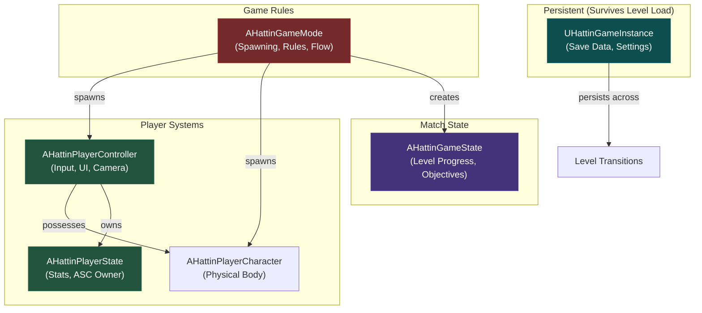
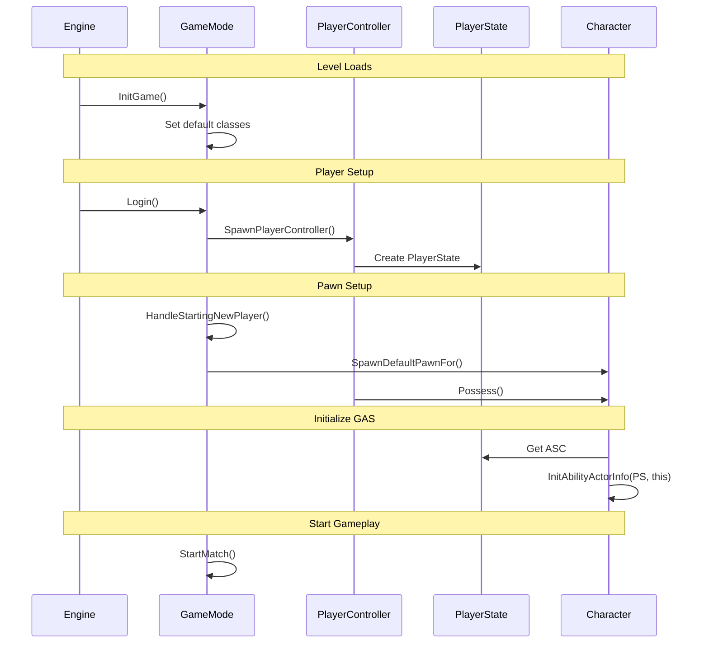
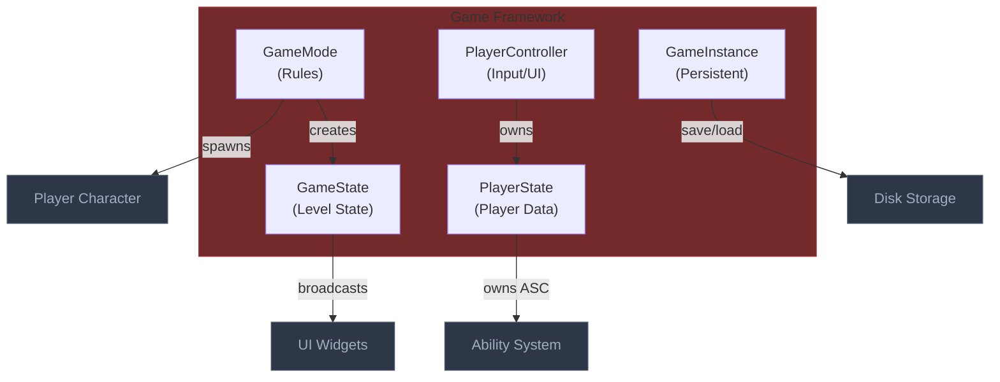
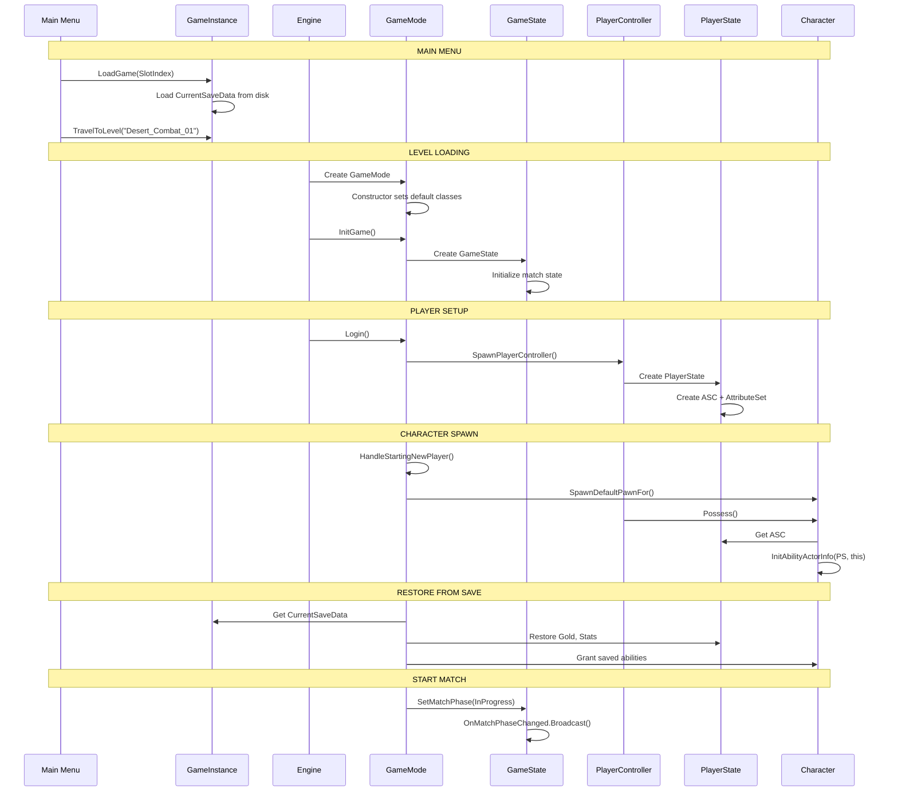
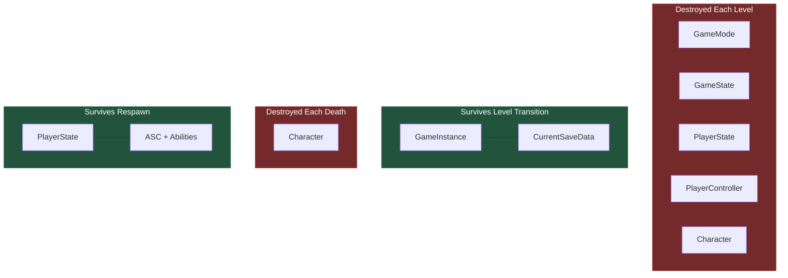

# Game Framework Architecture (Single-Player)
> The backbone classes that orchestrate gameplay — GameMode for rules,
> GameState for match state, PlayerController for input, PlayerState for
> player data, and GameInstance for persistence across levels.

---

## 1. System Overview

The Game Framework solves the problem of organizing game-wide logic: who controls spawning, where player data lives, what persists between levels, and how to manage match flow. Even for single-player games, UE5's framework classes provide clean separation of concerns.

For Hattin as a single-player game, we use a simplified framework:
- **GameMode**: Controls spawning, match rules, and game flow
- **GameState**: Holds current match/level state (enemy count, objectives)
- **PlayerState**: Stores player stats and owns the AbilitySystemComponent
- **PlayerController**: Handles input and UI
- **GameInstance**: Persists data across level transitions (save system, settings)

The key insight is that these classes exist even in single-player — they just don't replicate over the network.

---

## 2. Core Architecture Diagram

### 2.1 Framework Class Relationships



### 2.2 What Lives Where


### 2.3 Spawning Sequence



---

## 3. Component Specifications

### 3.1 AHattinGameMode

**UE Base**: `AGameModeBase` | **Your Class**: `AHattinGameMode`

```cpp
UCLASS()
class HATTIN_API AHattinGameMode : public AGameModeBase
{
    GENERATED_BODY()
    
public:
    AHattinGameMode();
    
    // Called when level loads
    virtual void InitGame(const FString& MapName, const FString& Options, 
        FString& ErrorMessage) override;
    
    // Called to spawn player's character
    virtual APawn* SpawnDefaultPawnFor_Implementation(AController* NewPlayer, 
        AActor* StartSpot) override;
    
    // Called after player controller is ready
    virtual void HandleStartingNewPlayer_Implementation(APlayerController* NewPlayer) override;
    
    // === GAME EVENTS ===
    
    UFUNCTION(BlueprintCallable, Category = "Game")
    void OnEnemyDefeated(AHattinEnemyCharacter* Enemy);
    
    UFUNCTION(BlueprintCallable, Category = "Game")
    void OnPlayerDeath();
    
    UFUNCTION(BlueprintCallable, Category = "Game")
    void RespawnPlayer();
    
    UFUNCTION(BlueprintCallable, Category = "Game")
    void OnObjectiveComplete(FName ObjectiveID);
    
    UFUNCTION(BlueprintCallable, Category = "Game")
    void TriggerLevelComplete();
    
    UFUNCTION(BlueprintCallable, Category = "Game")
    void TriggerGameOver();
    
protected:
    // Default classes (set in Blueprint or constructor)
    UPROPERTY(EditDefaultsOnly, Category = "Classes")
    TSubclassOf<AHattinPlayerCharacter> PlayerCharacterClass;
    
    UPROPERTY(EditDefaultsOnly, Category = "Spawning")
    float RespawnDelay = 2.0f;
    
    UPROPERTY(EditDefaultsOnly, Category = "Spawning")
    int32 MaxPlayerLives = 3;
    
private:
    FTimerHandle RespawnTimerHandle;
    
    AHattinPlayerController* GetHattinPlayerController() const;
    AHattinGameState* GetHattinGameState() const;
};
```

**Implementation:**
```cpp
AHattinGameMode::AHattinGameMode()
{
    // Set default framework classes
    DefaultPawnClass = AHattinPlayerCharacter::StaticClass();
    PlayerControllerClass = AHattinPlayerController::StaticClass();
    PlayerStateClass = AHattinPlayerState::StaticClass();
    GameStateClass = AHattinGameState::StaticClass();
}

void AHattinGameMode::InitGame(const FString& MapName, const FString& Options, 
    FString& ErrorMessage)
{
    Super::InitGame(MapName, Options, ErrorMessage);
    
    // Initialize level-specific settings
    UE_LOG(LogHattin, Log, TEXT("GameMode InitGame: %s"), *MapName);
}

void AHattinGameMode::OnEnemyDefeated(AHattinEnemyCharacter* Enemy)
{
    if (AHattinGameState* GS = GetHattinGameState())
    {
        GS->DecrementEnemyCount();
        
        // Check win condition
        if (GS->GetEnemiesRemaining() <= 0)
        {
            TriggerLevelComplete();
        }
    }
    
    // Update player stats
    if (AHattinPlayerController* PC = GetHattinPlayerController())
    {
        if (AHattinPlayerState* PS = PC->GetPlayerState<AHattinPlayerState>())
        {
            PS->AddEnemyDefeated();
        }
    }
}

void AHattinGameMode::OnPlayerDeath()
{
    if (AHattinPlayerState* PS = GetHattinPlayerController()->GetPlayerState<AHattinPlayerState>())
    {
        PS->AddDeath();
        
        if (PS->GetDeaths() >= MaxPlayerLives)
        {
            TriggerGameOver();
            return;
        }
    }
    
    // Schedule respawn
    GetWorldTimerManager().SetTimer(
        RespawnTimerHandle,
        this,
        &ThisClass::RespawnPlayer,
        RespawnDelay,
        false
    );
}
```

### 3.2 AHattinGameState

**UE Base**: `AGameStateBase` | **Your Class**: `AHattinGameState`

```cpp
UCLASS()
class HATTIN_API AHattinGameState : public AGameStateBase
{
    GENERATED_BODY()
    
public:
    AHattinGameState();
    
    // === MATCH STATE ===
    
    UPROPERTY(BlueprintReadOnly, Category = "Match")
    EHattinMatchPhase MatchPhase = EHattinMatchPhase::WaitingToStart;
    
    UPROPERTY(BlueprintReadOnly, Category = "Match")
    int32 EnemiesRemaining = 0;
    
    UPROPERTY(BlueprintReadOnly, Category = "Match")
    float MatchTimeElapsed = 0.f;
    
    UPROPERTY(BlueprintReadOnly, Category = "Objectives")
    TMap<FName, bool> ObjectiveStatus;
    
    // === ACCESSORS ===
    
    UFUNCTION(BlueprintCallable, Category = "Match")
    void SetMatchPhase(EHattinMatchPhase NewPhase);
    
    UFUNCTION(BlueprintPure, Category = "Match")
    int32 GetEnemiesRemaining() const { return EnemiesRemaining; }
    
    UFUNCTION(BlueprintCallable, Category = "Match")
    void SetEnemyCount(int32 Count);
    
    UFUNCTION(BlueprintCallable, Category = "Match")
    void DecrementEnemyCount();
    
    UFUNCTION(BlueprintCallable, Category = "Objectives")
    void SetObjectiveComplete(FName ObjectiveID);
    
    UFUNCTION(BlueprintPure, Category = "Objectives")
    bool IsObjectiveComplete(FName ObjectiveID) const;
    
    // === DELEGATES ===
    
    DECLARE_DYNAMIC_MULTICAST_DELEGATE_OneParam(FOnMatchPhaseChanged, EHattinMatchPhase, NewPhase);
    UPROPERTY(BlueprintAssignable)
    FOnMatchPhaseChanged OnMatchPhaseChanged;
    
    DECLARE_DYNAMIC_MULTICAST_DELEGATE_OneParam(FOnEnemyCountChanged, int32, NewCount);
    UPROPERTY(BlueprintAssignable)
    FOnEnemyCountChanged OnEnemyCountChanged;
    
protected:
    virtual void Tick(float DeltaSeconds) override;
};
```

**Implementation:**
```cpp
void AHattinGameState::SetMatchPhase(EHattinMatchPhase NewPhase)
{
    if (MatchPhase != NewPhase)
    {
        MatchPhase = NewPhase;
        OnMatchPhaseChanged.Broadcast(NewPhase);
        
        UE_LOG(LogHattin, Log, TEXT("Match phase changed to: %d"), static_cast<int32>(NewPhase));
    }
}

void AHattinGameState::DecrementEnemyCount()
{
    EnemiesRemaining = FMath::Max(0, EnemiesRemaining - 1);
    OnEnemyCountChanged.Broadcast(EnemiesRemaining);
}

void AHattinGameState::Tick(float DeltaSeconds)
{
    Super::Tick(DeltaSeconds);
    
    // Track match time when in progress
    if (MatchPhase == EHattinMatchPhase::InProgress)
    {
        MatchTimeElapsed += DeltaSeconds;
    }
}
```

### 3.3 AHattinPlayerState

**UE Base**: `APlayerState` | **Your Class**: `AHattinPlayerState`

```cpp
UCLASS()
class HATTIN_API AHattinPlayerState : public APlayerState
{
    GENERATED_BODY()
    
public:
    AHattinPlayerState();
    
    // === GAS OWNERSHIP ===
    // ASC lives here so it persists across respawns
    
    UFUNCTION(BlueprintPure, Category = "GAS")
    UAbilitySystemComponent* GetAbilitySystemComponent() const { return AbilitySystemComponent; }
    
    UFUNCTION(BlueprintPure, Category = "GAS")
    UHattinAttributeSet* GetAttributeSet() const { return AttributeSet; }
    
    // === PLAYER STATS ===
    
    UPROPERTY(BlueprintReadOnly, Category = "Stats")
    int32 EnemiesDefeated = 0;
    
    UPROPERTY(BlueprintReadOnly, Category = "Stats")
    int32 Deaths = 0;
    
    UPROPERTY(BlueprintReadOnly, Category = "Stats")
    int32 Gold = 0;
    
    // === STAT MODIFIERS ===
    
    UFUNCTION(BlueprintCallable, Category = "Stats")
    void AddEnemyDefeated() { EnemiesDefeated++; }
    
    UFUNCTION(BlueprintCallable, Category = "Stats")
    void AddDeath() { Deaths++; }
    
    UFUNCTION(BlueprintPure, Category = "Stats")
    int32 GetDeaths() const { return Deaths; }
    
    UFUNCTION(BlueprintCallable, Category = "Stats")
    void AddGold(int32 Amount) { Gold += Amount; }
    
    UFUNCTION(BlueprintCallable, Category = "Stats")
    bool SpendGold(int32 Amount);
    
protected:
    UPROPERTY(VisibleAnywhere, Category = "GAS")
    TObjectPtr<UAbilitySystemComponent> AbilitySystemComponent;
    
    UPROPERTY()
    TObjectPtr<UHattinAttributeSet> AttributeSet;
};
```

**Implementation:**
```cpp
AHattinPlayerState::AHattinPlayerState()
{
    // Create ASC on PlayerState (persists across respawns)
    AbilitySystemComponent = CreateDefaultSubobject<UAbilitySystemComponent>(TEXT("ASC"));
    
    // Create default attribute set
    AttributeSet = CreateDefaultSubobject<UHattinAttributeSet>(TEXT("Attributes"));
}

bool AHattinPlayerState::SpendGold(int32 Amount)
{
    if (Gold >= Amount)
    {
        Gold -= Amount;
        return true;
    }
    return false;
}
```

### 3.4 AHattinPlayerController

**UE Base**: `APlayerController` | **Your Class**: `AHattinPlayerController`

```cpp
UCLASS()
class HATTIN_API AHattinPlayerController : public APlayerController
{
    GENERATED_BODY()
    
public:
    AHattinPlayerController();
    
    virtual void BeginPlay() override;
    virtual void SetupInputComponent() override;
    
    // === UI ===
    
    UFUNCTION(BlueprintCallable, Category = "UI")
    void ShowPauseMenu();
    
    UFUNCTION(BlueprintCallable, Category = "UI")
    void HidePauseMenu();
    
    UFUNCTION(BlueprintCallable, Category = "UI")
    void ShowGameOverScreen();
    
    UFUNCTION(BlueprintCallable, Category = "UI")
    void ShowLevelCompleteScreen();
    
    // === INPUT MODE ===
    
    UFUNCTION(BlueprintCallable, Category = "Input")
    void SetGameInputMode();
    
    UFUNCTION(BlueprintCallable, Category = "Input")
    void SetUIInputMode();
    
protected:
    UPROPERTY(EditDefaultsOnly, Category = "UI")
    TSubclassOf<UUserWidget> PauseMenuClass;
    
    UPROPERTY(EditDefaultsOnly, Category = "UI")
    TSubclassOf<UUserWidget> GameOverClass;
    
    UPROPERTY(EditDefaultsOnly, Category = "UI")
    TSubclassOf<UUserWidget> LevelCompleteClass;
    
    UPROPERTY(EditDefaultsOnly, Category = "Input")
    TObjectPtr<UInputMappingContext> DefaultMappingContext;
    
    UPROPERTY()
    TObjectPtr<UUserWidget> CurrentMenu;
};
```

### 3.5 UHattinGameInstance

**UE Base**: `UGameInstance` | **Your Class**: `UHattinGameInstance`

```cpp
UCLASS()
class HATTIN_API UHattinGameInstance : public UGameInstance
{
    GENERATED_BODY()
    
public:
    virtual void Init() override;
    
    // === SAVE/LOAD ===
    
    UFUNCTION(BlueprintCallable, Category = "Save")
    void SaveGame(int32 SlotIndex = 0);
    
    UFUNCTION(BlueprintCallable, Category = "Save")
    bool LoadGame(int32 SlotIndex = 0);
    
    UFUNCTION(BlueprintCallable, Category = "Save")
    bool DoesSaveExist(int32 SlotIndex = 0) const;
    
    UFUNCTION(BlueprintCallable, Category = "Save")
    void DeleteSave(int32 SlotIndex = 0);
    
    // === CURRENT SAVE DATA ===
    // This persists across level transitions
    
    UPROPERTY(BlueprintReadWrite, Category = "Save")
    FHattinSaveData CurrentSaveData;
    
    // === SETTINGS ===
    
    UPROPERTY(BlueprintReadWrite, Category = "Settings")
    FHattinGameSettings GameSettings;
    
    UFUNCTION(BlueprintCallable, Category = "Settings")
    void ApplySettings();
    
    UFUNCTION(BlueprintCallable, Category = "Settings")
    void SaveSettings();
    
    UFUNCTION(BlueprintCallable, Category = "Settings")
    void LoadSettings();
    
    // === LEVEL MANAGEMENT ===
    
    UFUNCTION(BlueprintCallable, Category = "Levels")
    void TravelToLevel(FName LevelName);
    
    UFUNCTION(BlueprintCallable, Category = "Levels")
    void ReturnToMainMenu();
    
protected:
    FString GetSaveSlotName(int32 SlotIndex) const;
};
```

**Implementation:**
```cpp
void UHattinGameInstance::Init()
{
    Super::Init();
    
    // Load settings on startup
    LoadSettings();
    ApplySettings();
    
    UE_LOG(LogHattin, Log, TEXT("GameInstance initialized"));
}

void UHattinGameInstance::SaveGame(int32 SlotIndex)
{
    if (UHattinSaveGame* SaveGameObject = Cast<UHattinSaveGame>(
        UGameplayStatics::CreateSaveGameObject(UHattinSaveGame::StaticClass())))
    {
        // Copy current data to save object
        SaveGameObject->SaveData = CurrentSaveData;
        
        // Write to disk
        UGameplayStatics::SaveGameToSlot(SaveGameObject, GetSaveSlotName(SlotIndex), 0);
        
        UE_LOG(LogHattin, Log, TEXT("Game saved to slot %d"), SlotIndex);
    }
}

bool UHattinGameInstance::LoadGame(int32 SlotIndex)
{
    FString SlotName = GetSaveSlotName(SlotIndex);
    
    if (UGameplayStatics::DoesSaveGameExist(SlotName, 0))
    {
        if (UHattinSaveGame* LoadedGame = Cast<UHattinSaveGame>(
            UGameplayStatics::LoadGameFromSlot(SlotName, 0)))
        {
            CurrentSaveData = LoadedGame->SaveData;
            UE_LOG(LogHattin, Log, TEXT("Game loaded from slot %d"), SlotIndex);
            return true;
        }
    }
    
    return false;
}

void UHattinGameInstance::TravelToLevel(FName LevelName)
{
    UWorld* World = GetWorld();
    if (World)
    {
        UGameplayStatics::OpenLevel(World, LevelName);
    }
}
```

### 3.6 Supporting Structures

```cpp
// Match phases
UENUM(BlueprintType)
enum class EHattinMatchPhase : uint8
{
    WaitingToStart,
    InProgress,
    Paused,
    LevelComplete,
    GameOver
};

// Save data structure
USTRUCT(BlueprintType)
struct FHattinSaveData
{
    GENERATED_BODY()
    
    UPROPERTY(BlueprintReadWrite)
    FName CurrentLevel = NAME_None;
    
    UPROPERTY(BlueprintReadWrite)
    FTransform PlayerTransform;
    
    UPROPERTY(BlueprintReadWrite)
    int32 PlayerGold = 0;
    
    UPROPERTY(BlueprintReadWrite)
    TArray<FName> UnlockedAbilities;
    
    UPROPERTY(BlueprintReadWrite)
    TArray<FName> CompletedObjectives;
    
    UPROPERTY(BlueprintReadWrite)
    TMap<FName, int32> InventoryItems;
};

// Settings structure
USTRUCT(BlueprintType)
struct FHattinGameSettings
{
    GENERATED_BODY()
    
    UPROPERTY(BlueprintReadWrite)
    float MasterVolume = 1.0f;
    
    UPROPERTY(BlueprintReadWrite)
    float MusicVolume = 0.8f;
    
    UPROPERTY(BlueprintReadWrite)
    float SFXVolume = 1.0f;
    
    UPROPERTY(BlueprintReadWrite)
    float CameraSensitivity = 1.0f;
    
    UPROPERTY(BlueprintReadWrite)
    bool bInvertY = false;
};
```

---

## 4. External Interfaces

### Inputs From Other Systems

| Source System | What It Provides | Interface Point |
|--------------|------------------|-----------------|
| Enemy AI | Death notification | `GameMode::OnEnemyDefeated` |
| Player Character | Death event | `GameMode::OnPlayerDeath` |
| Level Blueprint | Objective triggers | `GameMode::OnObjectiveComplete` |
| UI | Save/Load requests | `GameInstance::SaveGame/LoadGame` |

### Outputs To Other Systems

| Target System | What This Provides | Interface Point |
|--------------|---------------------|-----------------|
| GAS | ASC for abilities | `PlayerState::GetAbilitySystemComponent` |
| UI | Match state, stats | `GameState/PlayerState` queries |
| Character | Spawn position | `GameMode::SpawnDefaultPawnFor` |

---

## 5. Implementation Patterns

### Pattern: ASC on PlayerState

**Problem**: Player dies and respawns, losing ability cooldowns and effects

**Solution**: ASC lives on PlayerState, which persists across respawns

```cpp
void AHattinPlayerCharacter::PossessedBy(AController* NewController)
{
    Super::PossessedBy(NewController);
    
    // Get ASC from PlayerState (not from character)
    if (AHattinPlayerState* PS = GetPlayerState<AHattinPlayerState>())
    {
        AbilitySystemComponent = PS->GetAbilitySystemComponent();
        
        // PS is Owner (data), Character is Avatar (visual representation)
        AbilitySystemComponent->InitAbilityActorInfo(PS, this);
    }
}
```

### Pattern: GameInstance for Persistence

**Problem**: Data lost when changing levels

**Solution**: Store in GameInstance, which survives level transitions

```cpp
// Before level transition - save progress
void AHattinGameMode::TriggerLevelComplete()
{
    if (UHattinGameInstance* GI = GetGameInstance<UHattinGameInstance>())
    {
        // Update persistent data
        GI->CurrentSaveData.CompletedObjectives.Add(CurrentLevelObjective);
        
        // Travel to next level (GameInstance persists!)
        GI->TravelToLevel(NextLevelName);
    }
}

// After level loads - restore progress
void AHattinGameMode::HandleStartingNewPlayer_Implementation(APlayerController* NewPlayer)
{
    Super::HandleStartingNewPlayer_Implementation(NewPlayer);
    
    if (UHattinGameInstance* GI = GetGameInstance<UHattinGameInstance>())
    {
        // Restore player gold, unlocks, etc. from persistent data
        if (AHattinPlayerState* PS = NewPlayer->GetPlayerState<AHattinPlayerState>())
        {
            PS->Gold = GI->CurrentSaveData.PlayerGold;
        }
    }
}
```

### Pattern: Delegate-Driven UI Updates

**Problem**: UI needs to react to game state changes

**Solution**: GameState broadcasts delegates, UI subscribes

```cpp
// In UI Widget
void UHattinHUDWidget::NativeConstruct()
{
    Super::NativeConstruct();
    
    if (AHattinGameState* GS = GetWorld()->GetGameState<AHattinGameState>())
    {
        GS->OnEnemyCountChanged.AddDynamic(this, &ThisClass::UpdateEnemyCounter);
        GS->OnMatchPhaseChanged.AddDynamic(this, &ThisClass::HandleMatchPhaseChange);
    }
}

void UHattinHUDWidget::UpdateEnemyCounter(int32 NewCount)
{
    EnemyCountText->SetText(FText::AsNumber(NewCount));
}
```

---

## 6. Quick Reference Card

| Class | Lifetime | Responsibility | Key Data |
|-------|----------|----------------|----------|
| `AHattinGameMode` | Per Level | Rules, spawning, flow | Spawn settings, respawn delay |
| `AHattinGameState` | Per Level | Current level state | Enemy count, objectives, timer |
| `AHattinPlayerState` | Per Level | Player session data | ASC, kills, deaths, gold |
| `AHattinPlayerController` | Per Level | Input, UI | Input mappings, menu refs |
| `UHattinGameInstance` | Entire Game | Persistent data | Save data, settings, unlocks |

**Class Assignment (in GameMode constructor or Blueprint):**
```cpp
DefaultPawnClass = AHattinPlayerCharacter::StaticClass();
PlayerControllerClass = AHattinPlayerController::StaticClass();
PlayerStateClass = AHattinPlayerState::StaticClass();
GameStateClass = AHattinGameState::StaticClass();
```

---

## 7. Connections Map (Compact)



---

## Summary

The Game Framework architecture for single-player Hattin establishes:

1. **GameMode**: Controls spawning, respawn logic, win/lose conditions
2. **GameState**: Tracks current level state (enemies, objectives, timer)
3. **PlayerState**: Owns ASC (persists across respawns), tracks stats
4. **PlayerController**: Handles input, manages UI/menus
5. **GameInstance**: Persists across levels (save system, settings, unlocks)

This separation ensures clean architecture even for single-player games.

---

---

## Bonus Section: Complete Framework Example

This section walks through a complete gameplay scenario using all framework classes — from starting a new game to completing a level.

### The Scenario

Player starts the game, loads into a combat level, defeats enemies, dies once, respawns, completes the level, and their progress is saved.

---

### High-Level Flow

```mermaid
gantt
    title Complete Gameplay Session
    dateFormat X
    axisFormat %s
    
    section Startup
    Main Menu                    :menu, 0, 5
    Load Game (GameInstance)     :load, 5, 7
    
    section Level Load
    GameMode InitGame            :init, 7, 9
    Spawn PlayerController       :spawnpc, 9, 10
    Create PlayerState + ASC     :spawnps, 10, 11
    Spawn Character              :spawnchar, 11, 13
    Start Match (GameState)      :start, 13, 15
    
    section Gameplay
    Combat Loop                  :combat, 15, 35
    Player Death                 :death, 35, 37
    Respawn                      :respawn, 37, 40
    Continue Combat              :combat2, 40, 55
    Last Enemy Defeated          :lastenemy, 55, 57
    
    section Level Complete
    Level Complete Screen        :complete, 57, 62
    Save Progress (GameInstance) :save, 62, 64
    Travel to Next Level         :travel, 64, 67
```



---

### Phase 1: Game Startup & Level Load



**Key Code - GameMode Setup:**
```cpp
void AHattinGameMode::HandleStartingNewPlayer_Implementation(APlayerController* NewPlayer)
{
    Super::HandleStartingNewPlayer_Implementation(NewPlayer);
    
    // Restore persistent data from GameInstance
    if (UHattinGameInstance* GI = GetGameInstance<UHattinGameInstance>())
    {
        if (AHattinPlayerState* PS = NewPlayer->GetPlayerState<AHattinPlayerState>())
        {
            PS->Gold = GI->CurrentSaveData.PlayerGold;
        }
        
        // Grant saved abilities to character
        if (AHattinPlayerCharacter* Char = Cast<AHattinPlayerCharacter>(NewPlayer->GetPawn()))
        {
            for (const FName& AbilityName : GI->CurrentSaveData.UnlockedAbilities)
            {
                Char->GrantAbilityByName(AbilityName);
            }
        }
    }
    
    // Initialize level enemies and start match
    if (AHattinGameState* GS = GetHattinGameState())
    {
        GS->SetEnemyCount(CountEnemiesInLevel());
        GS->SetMatchPhase(EHattinMatchPhase::InProgress);
    }
}
```

---

### Phase 2: Combat & Player Death

```mermaid
sequenceDiagram
    participant Player as Player Character
    participant Enemy as Enemy Character
    participant GM as GameMode
    participant GS as GameState
    participant PS as PlayerState
    participant UI as HUD Widget
    
    Note over Player,UI: COMBAT LOOP
    
    loop For Each Enemy
        Player->>Enemy: Attack (via GAS)
        Enemy->>Enemy: Take Damage
        
        alt Enemy Dies
            Enemy->>GM: OnEnemyDefeated(this)
            GM->>PS: AddEnemyDefeated()
            GM->>GS: DecrementEnemyCount()
            GS->>UI: OnEnemyCountChanged.Broadcast()
            UI->>UI: Update enemy counter
        end
    end
    
    Note over Player,UI: PLAYER DEATH
    
    Enemy->>Player: Attack (via GAS)
    Player->>Player: Health reaches 0
    Player->>GM: OnPlayerDeath()
    
    GM->>PS: AddDeath()
    GM->>GM: Check lives remaining
    
    alt Lives Remaining > 0
        GM->>GM: SetTimer(RespawnDelay)
        Note over GM: Wait 2 seconds...
        GM->>GM: RespawnPlayer()
        GM->>Player: SpawnDefaultPawnFor()
        GM->>Player: Possess new character
        Player->>PS: Get existing ASC (preserved!)
    else No Lives
        GM->>GS: SetMatchPhase(GameOver)
        GM->>UI: ShowGameOverScreen()
    end
```



**Key Code - Death & Respawn:**
```cpp
void AHattinGameMode::OnPlayerDeath()
{
    AHattinPlayerController* PC = GetHattinPlayerController();
    if (!PC) return;
    
    AHattinPlayerState* PS = PC->GetPlayerState<AHattinPlayerState>();
    if (!PS) return;
    
    PS->AddDeath();
    
    UE_LOG(LogHattin, Log, TEXT("Player died. Deaths: %d / %d"), 
        PS->GetDeaths(), MaxPlayerLives);
    
    if (PS->GetDeaths() >= MaxPlayerLives)
    {
        TriggerGameOver();
        return;
    }
    
    // Schedule respawn - ASC on PlayerState is preserved!
    GetWorldTimerManager().SetTimer(
        RespawnTimerHandle,
        this,
        &ThisClass::RespawnPlayer,
        RespawnDelay,
        false
    );
}

void AHattinGameMode::RespawnPlayer()
{
    AHattinPlayerController* PC = GetHattinPlayerController();
    if (!PC) return;
    
    // Find respawn point
    AActor* StartSpot = FindPlayerStart(PC);
    
    // Spawn new character (old one was destroyed)
    APawn* NewPawn = SpawnDefaultPawnFor(PC, StartSpot);
    
    // Possess - this reconnects to existing PlayerState's ASC
    PC->Possess(NewPawn);
    
    UE_LOG(LogHattin, Log, TEXT("Player respawned"));
}
```

**Key Insight:** When the player respawns, they get a NEW character but the SAME PlayerState. This means:
- ASC with all abilities, cooldowns preserved ✅
- Kill count, gold preserved ✅  
- Death count incremented ✅
- Character's health reset (new character) ✅

---

### Phase 3: Level Complete & Save

```mermaid
sequenceDiagram
    participant GM as GameMode
    participant GS as GameState
    participant PS as PlayerState
    participant GI as GameInstance
    participant PC as PlayerController
    participant UI as UI
    participant Disk as Save File
    
    Note over GM,Disk: LAST ENEMY DEFEATED
    
    GM->>GS: DecrementEnemyCount()
    GS->>GS: EnemiesRemaining = 0
    
    GM->>GM: Check win condition
    GM->>GM: TriggerLevelComplete()
    
    Note over GM,Disk: LEVEL COMPLETE
    
    GM->>GS: SetMatchPhase(LevelComplete)
    GM->>PC: ShowLevelCompleteScreen()
    PC->>UI: Create completion widget
    UI->>UI: Show stats, rewards
    
    Note over GM,Disk: SAVE PROGRESS
    
    GM->>GI: Get CurrentSaveData
    GM->>PS: Get current stats
    
    rect rgb(50, 80, 50)
        Note over GI: Update persistent data
        GI->>GI: CurrentSaveData.PlayerGold = PS->Gold
        GI->>GI: CurrentSaveData.CompletedObjectives.Add(LevelID)
        GI->>GI: CurrentSaveData.CurrentLevel = NextLevel
    end
    
    GM->>GI: SaveGame(SlotIndex)
    GI->>Disk: Write save file
    
    Note over GM,Disk: TRAVEL TO NEXT LEVEL
    
    UI->>GI: TravelToLevel(NextLevel)
    Note over GI: GameInstance survives!
    GI->>GI: OpenLevel(NextLevel)
    
    Note over GM,Disk: Old GM, GS, PS destroyed
    Note over GM,Disk: New level creates new instances
    Note over GM,Disk: GI.CurrentSaveData still has our progress!
```



**Key Code - Level Complete:**
```cpp
void AHattinGameMode::TriggerLevelComplete()
{
    UE_LOG(LogHattin, Log, TEXT("Level Complete!"));
    
    // Update game state
    if (AHattinGameState* GS = GetHattinGameState())
    {
        GS->SetMatchPhase(EHattinMatchPhase::LevelComplete);
    }
    
    // Show UI
    if (AHattinPlayerController* PC = GetHattinPlayerController())
    {
        PC->ShowLevelCompleteScreen();
    }
    
    // Save progress to GameInstance (persists across levels)
    if (UHattinGameInstance* GI = GetGameInstance<UHattinGameInstance>())
    {
        // Gather current player stats
        if (AHattinPlayerState* PS = GetHattinPlayerController()->GetPlayerState<AHattinPlayerState>())
        {
            GI->CurrentSaveData.PlayerGold = PS->Gold;
        }
        
        // Mark level complete
        GI->CurrentSaveData.CompletedObjectives.Add(CurrentLevelID);
        GI->CurrentSaveData.CurrentLevel = NextLevelName;
        
        // Write to disk
        GI->SaveGame(0);
    }
}

// Called from UI "Continue" button
void AHattinPlayerController::OnContinueToNextLevel()
{
    if (UHattinGameInstance* GI = GetGameInstance<UHattinGameInstance>())
    {
        // GameInstance survives this transition!
        GI->TravelToLevel(GI->CurrentSaveData.CurrentLevel);
    }
}
```

---

### Data Flow Summary



---

### Quick Reference: What Survives What

| Event | GameMode | GameState | PlayerState | PlayerController | Character | GameInstance |
|-------|----------|-----------|-------------|------------------|-----------|--------------|
| **Player Death** | ✅ Survives | ✅ Survives | ✅ Survives | ✅ Survives | ❌ Destroyed | ✅ Survives |
| **Level Transition** | ❌ Destroyed | ❌ Destroyed | ❌ Destroyed | ❌ Destroyed | ❌ Destroyed | ✅ Survives |
| **Quit Game** | ❌ Destroyed | ❌ Destroyed | ❌ Destroyed | ❌ Destroyed | ❌ Destroyed | ❌ Destroyed* |

*GameInstance data must be saved to disk before quitting!

---

### The Golden Rules

1. **GameMode** = "The referee" — controls rules, doesn't play the game
2. **GameState** = "The scoreboard" — everyone can see it, only GameMode changes it
3. **PlayerState** = "The player's save file for this session" — survives respawns
4. **PlayerController** = "The player's hands" — handles input, shows UI
5. **GameInstance** = "The cartridge" — survives level transitions, holds save data

**Data Placement Decision Tree:**
```
Does it need to survive level transitions?
├── YES → GameInstance.CurrentSaveData
└── NO → Does it need to survive player death?
         ├── YES → PlayerState (ASC, stats)
         └── NO → Is it about the current level?
                  ├── YES → GameState (enemies, objectives)
                  └── NO → Character (health, position, combat state)
```
